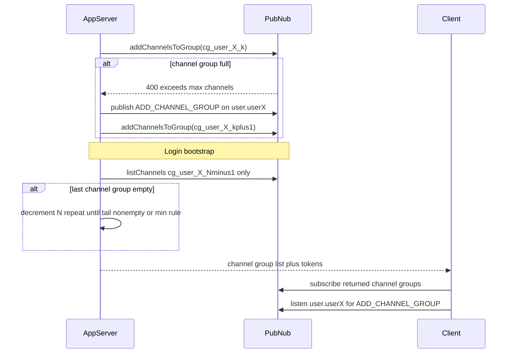

# Channel Group Management: Efficient Multiplexing and Tail Pruning

> **Version**: 1.0.0  
> **Last Updated**: 2026-03-24  
> **Pattern**: Error-driven channel group growth + login-time server reconciliation  
> **PubNub as source of truth**: Channel groups and the channels registered in each; minimal app metadata for channel group count

---

## Table of Contents

1. [Problem Statement](#1-problem-statement)
2. [Requirements](#2-requirements)
3. [Architecture](#3-architecture)
4. [Channel Topology](#4-channel-topology)
5. [Persisted channel group count](#5-persisted-channel-group-count)
6. [Event / Message Contracts](#6-event--message-contracts)
7. [Server Logic](#7-server-logic)
8. [Security (Access Manager / tokens)](#8-security-access-manager--tokens)
9. [Scaling Notes](#9-scaling-notes)
10. [Implementation Checklist](#10-implementation-checklist)
11. [Common Mistakes](#11-common-mistakes)
12. [MCP and Documentation Sources](#12-mcp-and-documentation-sources)

---

## 1. Problem Statement

Applications that aggregate **many Pub/Sub channels per user** (rooms, topics, inboxes, etc.) hit the **per–channel-group channel limit** configured on the keyset. You need to:

- **Scale beyond one channel group** without polling `listChannels` before every add to see if a channel group is full.
- **Keep PubNub as the source of truth** for which channels sit in which channel group—no parallel DB that can drift from network state.
- **Shrink** the number of active channel groups when the **highest-index channel group becomes empty** after removals—without relying on subscribe errors that **do not fire** when other channel groups in the same subscribe still have channels.

**This document** describes a **PubNub-first** approach: **optimistic add with error-driven promotion to the next channel group**, **real-time client notification** when a new channel group is allocated, and **login-time tail pruning** using **`listChannels` on the last channel group only**.

---

## 2. Requirements

### 2.1 Functional

| ID | Requirement |
|----|-------------|
| FR-1 | Server can add a data channel to the user’s current channel group without a pre-flight “is full?” listing. |
| FR-2 | When a channel group is full (per keyset limit), server allocates the next channel group, signals the client, and retries the add. |
| FR-3 | Client subscribes to all channel groups the server says are active. |
| FR-4 | Client learns about **new** channel groups in real time via a dedicated user signal channel. |
| FR-5 | When the **last** channel group is empty, the system **eventually** stops advertising that channel group (next login). |
| FR-6 | Login/session bootstrap returns the **correct** channel group list after tail pruning. |

### 2.2 Non-functional

| ID | Requirement | Target |
|----|-------------|--------|
| NFR-1 | Add path latency | No extra `listChannels` round trip on hot path |
| NFR-2 | Login pruning cost | `listChannels` is called **only on the current last channel group** (`cg_*_{N-1}`) per step; usually **once** per login if the tail is non-empty. If trailing channel groups are empty, repeat after decrementing `N`—still **never** listing non-last channel groups. |
| NFR-3 | Consistency | Persisted channel group **count** matches **trailing non-empty** channel groups after login |
| NFR-4 | Idempotency | Duplicate `ADD_CHANNEL_GROUP` signals safe; tail prune loop safe to retry |

---

## 3. Architecture

### 3.1 Diagram (text)

```
┌─────────────────────────────────────────────────────────────────────────┐
│                         APPLICATION SERVER                                 │
│  • Persisted: activeChannelGroupCount (N) per user                        │
│  • Add path: addChannelsToGroup → on “full” → publish ADD_CHANNEL_GROUP  │
│    → retry on channel group index N+1; update in-memory last-index hint   │
│  • Login path: listChannels(cg_user_{id}_{N-1}) only → while empty, N--   │
│    → return pruned channel group names + Access Manager grants             │
└───────────────────────────────┬─────────────────────────────────────────┘
                                │
                                ▼
┌─────────────────────────────────────────────────────────────────────────┐
│                              PUBNUB                                      │
│  Channel groups: cg_{userId}_0 … cg_{userId}_{N-1}                       │
│  User signal channel: user.{userId} ∈ cg_{userId}_0                      │
└───────────────────────────────┬─────────────────────────────────────────┘
                                │
                                ▼
┌─────────────────────────────────────────────────────────────────────────┐
│                            CLIENT                                        │
│  • Subscribe to channel groups from login response                        │
│  • On ADD_CHANNEL_GROUP: add channel group to subscription + refresh token │
└─────────────────────────────────────────────────────────────────────────┘
```

### 3.2 Mermaid (add path + login)



### 3.3 Components

| Component | Responsibility |
|-----------|----------------|
| App server | `addChannelsToGroup` / `removeChannelsFromGroup`, persist `N`, login tail prune, mint tokens |
| PubNub | Stores channel groups and which channels are in each; delivers messages |
| Client | Subscribe set from server; react to `ADD_CHANNEL_GROUP` |
| User signal channel | Carries signals when a new channel group is added; must be inside `cg_{userId}_0` |

---

## 4. Channel Topology

### 4.1 Channel group naming

- Use **underscores only** as delimiters in **channel group names**. Do **not** use dots inside the channel group identifier.
- Example pattern: `cg_{userId}_0`, `cg_{userId}_1`, … (ASCII `userId`).

Regular **channel** names (not channel group names) may follow your global convention (for example `type.entityId` with a dot after the type prefix) where that helps wildcards or Functions—this rule applies to **channel group** strings in Channel Group APIs and subscribe.

### 4.2 User signal channel

- Name example: `user.{userId}` (type prefix + dot, then user id).
- **Must** be a member of **`cg_{userId}_0`** so every session that subscribes to channel group `0` receives **scaling signals** without an extra bootstrap subscription.

### 4.3 Multiplexing and capacity

| Concept | Notes |
|---------|--------|
| Channel group index | `0 … N-1` for `N` active channel groups |
| Channels per channel group | Keyset setting (see below) |
| Max channels per user | `N × (channels per channel group)` |

### 4.4 Keyset limit: channels per channel group

The **maximum channels per channel group** is **configurable on the PubNub keyset**.

| Setting | Typical use |
|---------|-------------|
| **Default (~100)** | Small fan-in per user |
| **Raised toward maximum (e.g. 2000)** | When a single user can have hundreds or thousands of logical subscriptions |

**Design goal:** use **as few channel groups per client** as possible. Configure the keyset toward the **real maximum** when your app needs more than the default per channel group; add `_1`, `_2`, … only when one channel group is full.

Confirm the **live** value for your keyset in the PubNub dashboard, current product documentation, or read-only tooling (for example PubNub MCP `user-pubnub`).

### 4.5 Channel groups per client connection

A client may **subscribe to at most 10 channel groups** per subscriber connection. That is a **fixed product limit**, not a tunable default. A design that uses **10 indexed channel groups** (`_0`…`_9`) uses the entire allowance—plan multiplexing and keyset **channels per channel group** so you stay within **10** subscribe operations on channel groups.

### 4.6 User signal channel and how data channels use channel groups

- **User signal channel** is one channel per user; keep payloads small (see §6).
- **Data channels** are registered into the **current** channel group until that channel group is **full** (keyset limit); then the server uses the **next** indexed channel group and continues adding there (see §7.1). This is **fill-then-advance**, not spreading traffic across channel groups for load balancing.

---

## 5. Persisted channel group count

PubNub channel groups hold **which channels** belong to each indexed channel group. Do **not** mirror that full channel list in a separate database; PubNub remains the registry for channel-to-channel-group assignment.

The only value you must persist per user (in **your application’s database or other server-side user store**) is how many indexed channel groups are active for that user:

| Field | Purpose |
|-------|---------|
| `activeChannelGroupCount` (or `maxAllocatedChannelGroupIndex + 1`) | How many channel groups `0…N-1` the user may use; **authoritative for bootstrap** after login prune |

**Where data lives**

| Data | Store |
|------|--------|
| Channel group count `N` (after prune) | Application database (or equivalent user record) |
| Which channels are in which channel group | **PubNub only** (via server `add`/`remove`) |
| Audit of channel group changes | Optional append-only log or metrics |

---

## 6. Event / Message Contracts

### 6.1 Control message: new channel group (`ADD_CHANNEL_GROUP`)

Published to **`user.{userId}`** by the **server** when the client must subscribe to an additional channel group.

This doc uses a **minimal** control shape (low volume, server-origin only). Broader project guidance often adds `schemaVersion`, `eventId` or `requestId`, and `ts` on every message; you may append those fields here for **history replay dedupe** or **audit**—minimal clients can ignore them.

| Field | Type | Notes |
|-------|------|--------|
| `type` | string | `ADD_CHANNEL_GROUP` |
| `cg` | string | Full channel group name (e.g. `cg_alice_3`) to subscribe and to include on the next token refresh |

**Example**

```json
{
  "type": "ADD_CHANNEL_GROUP",
  "cg": "cg_user123_2"
}
```

### 6.2 Idempotency and replay

- **Primary:** Treat **`cg` as the idempotency key**. Subscribing to the same `cg` again (duplicate delivery or replay) should be a **no-op** on the client subscription set.
- **Optional:** If you persist messages on `user.{userId}` and replay from **Message Persistence**, add **`eventId`** (or `requestId`) and dedupe on that in addition to the no-op behavior above.

### 6.3 Payload size

Keep control messages **small** (well under typical realtime payload guidance). No large arrays in the signal.

---

## 7. Server Logic

### 7.1 Add channel (optimistic, error-driven)

1. Choose starting channel group index from the **in-memory** last channel group index hint (maintained in step 4), or if none yet use `0` or another persisted hint.
2. Call **`addChannelsToGroup`** for `cg_{userId}_k` with the new channel name(s).
3. If PubNub returns **400** indicating the channel group **exceeds the maximum number of channels** for that keyset:
   - Increment `k` (and persist **`activeChannelGroupCount`** if this allocates a new highest-index channel group).
   - **Publish** `ADD_CHANNEL_GROUP` to `user.{userId}` with the new channel group name in **`cg`**.
   - **Retry** `addChannelsToGroup` on the new channel group.
4. On success, **update** the in-memory last channel group index hint (required so the next add starts from the correct channel group).

**No** `listChannels` on the add path for fullness checks—errors drive scaling.

### 7.2 Remove channel

- Call **`removeChannelsFromGroup`** as needed (blind remove is fine). Empty **tail** channel groups are OK until the next login prune.

### 7.3 Login-time tail pruning (authoritative)

When the user **logs in** or you issue a **new session**:

1. Load **`N = activeChannelGroupCount`** from your store.
2. With **server credentials**, **`listChannels`** on **`cg_{userId}_{N-1}`** only.
3. If the result is **empty** (zero channels in that channel group):
   - Decrement **`N`** (respect a **minimum** rule, e.g. always keep **`N >= 1`** so `cg_{userId}_0` remains for the signal channel).
   - Persist **`N`**.
   - **Repeat** from step 2 with the new last channel group until the tail is non-empty or you hit the minimum.
4. Build the channel group list **`cg_{userId}_0` … `cg_{userId}_{N-1}`**.
5. Mint **Access Manager** grants for exactly those channel groups (and needed channels).
6. Return that channel group list and tokens to the client.

### 7.4 Why not prune using subscribe errors?

If **every** channel group in a subscribe has **zero** channels, PubSub can return **400** with:

```json
{"status":400,"service":"PubSub","error":true,"message":"Channel group or groups result in empty subscription set"}
```

**Critical:** If **at least one** subscribed channel group still has **≥1** channel, **this error does not occur**. A **dead empty tail** channel group co-subscribed with populated channel groups therefore **does not** produce 400. **Do not** rely on this to detect or remove a single empty channel group.

Use this 400 only as a **diagnostic** for misconfiguration (e.g. bootstrap returned wrong list), not as the main pruning mechanism.

---

## 8. Security (Access Manager / tokens)

- Use **Access Manager** grants (never use the legacy acronym “PAM” in customer-facing docs).
- **Clients must not** call Channel Group registration APIs with secrets; only the **server** adds/removes channels from channel groups.
- Token must allow **subscribe** to:
  - `user.{userId}` (or ensure it is received via a channel group that includes it—typically channel group `0`),
  - every **`cg_{userId}_i`** returned at login and any channel group added via `ADD_CHANNEL_GROUP` (refresh token after signal).
- **Least privilege:** grant only the channel groups and channels required for that user.
- **Bootstrap integrity:** return channel group names and capabilities only from **authenticated** login; clients must not invent extra channel groups.

---

## 9. Scaling Notes

- **Add path:** O(1) API calls per attempt; occasional extra attempts when channel groups fill.
- **Login path:** Each iteration calls `listChannels` **only** on the **last** channel group for the current `N`. Typical login: **one** call. Worst case: one call per trailing empty channel group you collapse (still never scanning earlier channel groups).
- Prefer a **high channels per channel group** keyset limit to **minimize** channel group count and subscribe fan-in.
- Stay within the **10 channel group subscribes per client** cap (see §4.5).

---

## 10. Implementation Checklist

- [ ] Keyset **channels per channel group** set for expected per-user load (default vs raised maximum).
- [ ] Channel group names use **underscores** only (no dots in channel group identifiers).
- [ ] `user.{userId}` included in **`cg_{userId}_0`**.
- [ ] Server: optimistic add + error-driven next channel group + `ADD_CHANNEL_GROUP` publish.
- [ ] Server: login **`listChannels` tail prune** + persist `N` + return pruned channel group list.
- [ ] Client: subscribe **only** to server-provided channel groups; handle `ADD_CHANNEL_GROUP` + token refresh.
- [ ] Client: idempotent handling by **`cg`** (and optionally dedupe by `eventId` if you add it).
- [ ] Access Manager: grants for all active channel groups and signal path.
- [ ] Documented minimum channel group count rule (e.g. `N >= 1`).

---

## 11. Common Mistakes

| Mistake | Why it hurts |
|---------|----------------|
| Relying on 400 “empty subscription set” to drop one empty channel group among many | Error does not fire if any other channel group has channels |
| Skipping login `listChannels` tail check | `N` stays inflated; tokens and UX wrong |
| Client chooses channel group list without server | Security and consistency break |
| Dots inside channel group names | Conflicts with naming conventions and mental model for this pattern |
| Forgetting Access Manager for new channel group after signal | Silent loss of messages on new channel group |
| Low keyset **channels per channel group** + many channel groups | Needing more than **10** channel group subscribes exceeds the per-client cap |

---

## 12. MCP and Documentation Sources

- Use PubNub MCP servers (for example **`user-pubnub`**) as **read-only** confirmation of **limits**, SDK patterns, and documentation links when aligning numbers with the current product.
- Application logic (channel group count, prune loop, add-until-fail) stays in **your** services; MCP helps avoid stale hardcoded limits.

---

## See also

- [Channel patterns / channel groups](../../training/subscribe/02-channel-patterns.md) (training)
