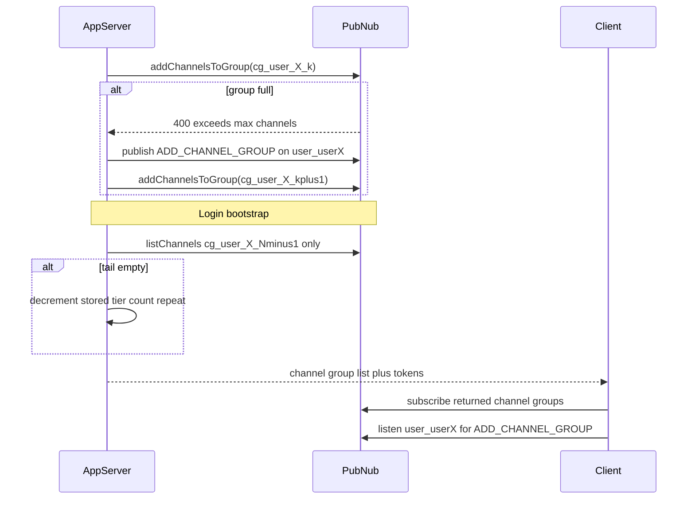

# Channel group efficiency best practice (plan)

Keep in sync with `.cursor/plans/channel_group_best_practice_5105b2c1.plan.md` (workspace copy per project rules).

## Context

- The path `[best-practices/channel-group-management](best-practices/channel-group-management)` does **not** exist yet; it should be created with a primary `[README.md](best-practices/channel-group-management/README.md)`, following the depth and tone of `[best-practices/voting/README.md](best-practices/voting/README.md)` / `[best-practices/friends-online/README.md](best-practices/friends-online/README.md)` but scoped as a **cross-cutting pattern** (not a full vertical use case). A shorter TOC is fine if every CLAUDE-required theme is still covered in substance.
- **Multiplexed channel groups** (`cg_*_0` …), **optimistic `addChannelsToGroup` with error-driven shard advance**, and **`ADD_CHANNEL_GROUP` on a per-user channel** remain core. **Tier pruning is server-side on login**, not driven by client subscribe errors or a client REST “decrement” in the steady state.

## Authoritative limits and doc hygiene (must resolve in prose)

- **Per-group channel cap (keyset configuration)**: The maximum channels per channel group is **configurable on the PubNub keyset**. **100 is the default**; if the app needs more than 100 channels in the aggregated set, **raise the keyset to the real maximum (2000)** so one group carries more load. **Design goal: use as few channel groups per client as possible**—multiplexing (`_0`, `_1`, …) is only for when a single group at the configured max is still not enough. Pattern logic (shard on “group full” error) is unchanged; the numeric threshold comes from the keyset. Still recommend one line to **confirm the active configured limit** in dashboard / docs / MCP (`user-pubnub`) when writing runbooks.
- **Channel groups per client**: Document the **subscribe-side limit on how many channel groups one client may attach** (per product defaults and tier configuration). A **10-tier** multiplexing scheme may sit at the default cap—call this out and recommend verifying `uuid` / subscribe configuration supports the needed group count for your app tier. Fewer tiers needed when each group allows 2000 channels.
- **PubSub 400 “empty subscription set” (not used for per-tier pruning)**: If the subscribe request’s channel groups **collectively** yield **no** channels, PubSub returns **400** with JSON such as:
  ```json
  {"status":400,"service":"PubSub","error":true,"message":"Channel group or groups result in empty subscription set"}
  ```
  **Critical:** As long as **at least one** subscribed channel group still has **≥1** channel, **this 400 does not occur**—so a **dead empty tail tier** co-subscribed with populated tiers produces **no** error. **Do not rely on this response to detect or remove an individual empty channel group.** Normal operation: **leave empty tiers harmless** on the wire; **prune only at login on the server** (below). Optionally document the 400 for the rare case where **every** group in the subscribe is empty (e.g. misconfigured bootstrap), as a diagnostic—not the main reconciliation loop.
- **Login-time tail pruning (server, authoritative)**: On user login (or session bootstrap), the server uses the stored **channel-group tier count** `N` and, with **server credentials**, calls **`listChannels` only on the last tier** `cg_userId_{N-1}`. If that group has **0** channels, **decrement** the user’s stored tier index / count, then **repeat** (re-check the new last tier) until the tail is non-empty or you hit your **minimum tier rule** (e.g. always retain `cg_userId_0`). Return the **final** list of channel group names (and Access Manager grants) for the client to subscribe to. **No client REST call** is required for this decrement; the client simply **subscribes to whatever the server returns** each login. This keeps reconciliation **O(tiers)** in list calls at login, not on every add/remove.

## Naming and topology

- **Channel group names: use underscores only as delimiters**—do **not** use dots inside channel group identifiers (e.g. `cg_userId_0`, `cg_userId_1`, not `cg.userId.0`). Prefer **ASCII** throughout. (Regular Pub/Sub **channel** names in the app may still follow your global channel naming rules; this rule targets **channel group** strings passed to Channel Group APIs and subscribe.)
- State explicitly that the **user signal channel** (where `ADD_CHANNEL_GROUP` is received)—e.g. `user_userId` (underscore form for the literal channel name)—**must be a member of the first tier group** `cg_userId_0` so new sessions always receive **scaling signals** without a separate bootstrap subscription.

## Server design (integrate your additions)



- **Persistent metadata (minimal, not a mirror of membership)**  
  - Store **`activeGroupTierCount`** (or **`maxAllocatedTierIndex + 1`**) per user in your DB / App Context custom field—name and semantics should be fixed in the doc.  
  - **On login / token issue**: run **tail pruning** (list last tier only; while empty, decrement and repeat), then return the **pruned** list `cg_userId_0` … `cg_userId_(N-1)` and matching **Access Manager** grants.  
  - **Optional in-memory cache** of “last successful tier index” for hot paths on the **add** path; **login** path should trust persisted `N` after prune. Document cold-start for app servers.
- **Why not client-side prune via subscribe**  
  - Empty tail tiers **cannot** be inferred from subscribe success/failure when other tiers carry channels. **ADD_CHANNEL_GROUP** still grows the client’s live subscription set mid-session; **shrinking** dead tiers is corrected **next login** via server list + persisted `N` (client may temporarily subscribe to an empty tier until reconnect—acceptable if harmless).
- **Races / idempotency**  
  - **Concurrent login + add** to a pruned tier: server should **increment** `N` again on successful `addChannelsToGroup` to a new tier as today; tail prune only collapses **trailing** empty groups. Document ordering: prune then issue tokens, or re-fetch `N` after prune before minting grants.

## Message contract (`ADD_CHANNEL_GROUP`) — approved minimal shape

**Canonical payload** on the user signal channel (e.g. `user_userId`):

```json
{
  "type": "ADD_CHANNEL_GROUP",
  "cg": "cg_user123_2"
}
```

- **`type`**: dispatch / filtering (e.g. Functions or client switch).
- **`cg`**: full channel group name to subscribe (and to include on the next **Access Manager** token refresh). **Idempotency:** applying the same `cg` twice is a **no-op** on the subscription set.

**Tradeoff vs full project envelope** (CLAUDE.md: `schemaVersion`, `eventId` or `requestId`, `ts`, nested payload): this pattern is intentionally minimal for **low-volume, server-published control** traffic. **Dedupe / replay:** rely on **idempotent handling by `cg`** (duplicate deliveries are harmless). If you need **history replay dedupe** or **audit correlation**, add optional fields (e.g. `eventId`, `ts`, `schemaVersion`) in a backward-compatible way—minimal clients can ignore them.

**Doc sync (when executing):** update [best-practices/channel-group-management/README.md](best-practices/channel-group-management/README.md) §6.1 example and field table to match this contract; adjust §6.2 idempotency wording to emphasize `cg`-based no-op as primary, `eventId` as optional enhancement.

## Security (Access Manager)

- Use **Access Manager** terminology only (never “PAM”)—fix this if any copy is borrowed from older docs.  
- Grants must cover: **user channel** subscribe, **each channel group tier** the user may use, and **publish** only where appropriate (usually server publishes control messages).  
- When tier count grows, **token minting** must include **all active tiers** or use a pattern the product supports; if wildcards do not apply to channel groups, document **token refresh** when `ADD_CHANNEL_GROUP` fires.

## Document sections (README outline)

1. **Problem statement** — scale past single-group channel cap; avoid `listChannels` preflight on every add.
2. **Requirements** — functional + NFR (latency, consistency, reconnect).
3. **Architecture** — text diagram + flow above.
4. **Channel / group topology** — underscore-only channel group names; user signal channel inside `cg_userId_0`; multiplex only when one group at keyset max is insufficient; total capacity ≈ *number of tiers × configured channels-per-group* (prefer 2000 keyset limit to **minimize tier count**).
5. **Server workflows** — add-until-fail, signal, optional cache; **login tail prune** via `listChannels` on last tier only; return pruned group list + tokens.
6. **Client library behavior** — subscribe **exactly** the groups the server returned; listen for `ADD_CHANNEL_GROUP` to **add** tiers mid-session; do **not** depend on 400 for pruning (optional handling if **all** groups empty).
7. **Correctness** — idempotency, dedupe (`eventId`), replay (client may see duplicate signals).
8. **Failure modes** — full shard, token missing new tier after `ADD_CHANNEL_GROUP`, **stale client** holding extra empty tier until next login, `listChannels` failure during login prune (retry/fail closed policy), PubNub API retries on add path.
9. **Scaling & cost** — API calls saved vs reconciliation cost; fan-out of control messages (single user channel).
10. **Observability** — metrics: shard overflows on add, **login tail prunes** (how many tiers removed), token refresh rate after `ADD_CHANNEL_GROUP`.
11. **Testing** — unit (tail prune loop, min tier clamp), integration (login with empty last tier → returned list shrinks), add path still bumps tier on full error; optional: all-empty subscribe → 400.
12. **Checklist + common mistakes** — relying on 400 to drop one empty tier among many; skipping login `listChannels` tail check; client inventing tier list instead of server; forgetting Access Manager for new tier after signal.

## MCP

- Short subsection: limits and subscribe constraints **should be confirmed** via `user-pubnub` (`how_to` / SDK docs tools) when finalizing numbers; treat MCP as read-only truth for limits.

## Files to add

| Action | Path |
| ------ | ---- |
| Create | `[best-practices/channel-group-management/README.md](best-practices/channel-group-management/README.md)` |

Optional follow-up (out of scope unless you want it): a one-line “See also” from `[best-practices/friends-online/README.md](best-practices/friends-online/README.md)` §4.5 to this new doc.

## Implementation note

No code changes required unless you later add samples under `functions/` or `training/`; this task is documentation-only once you approve the plan.
