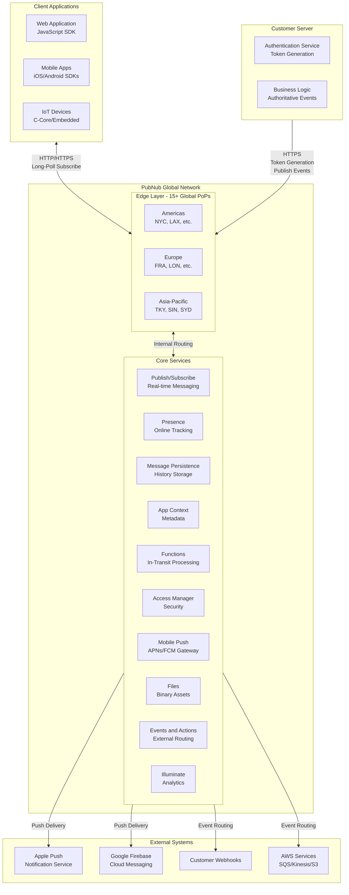
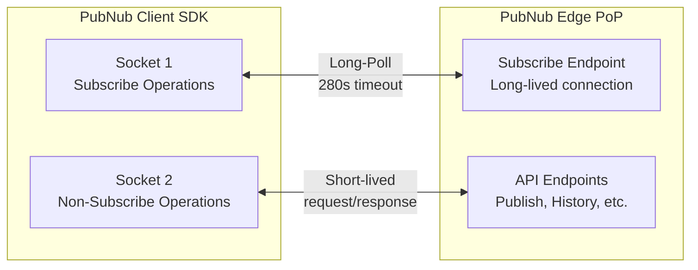
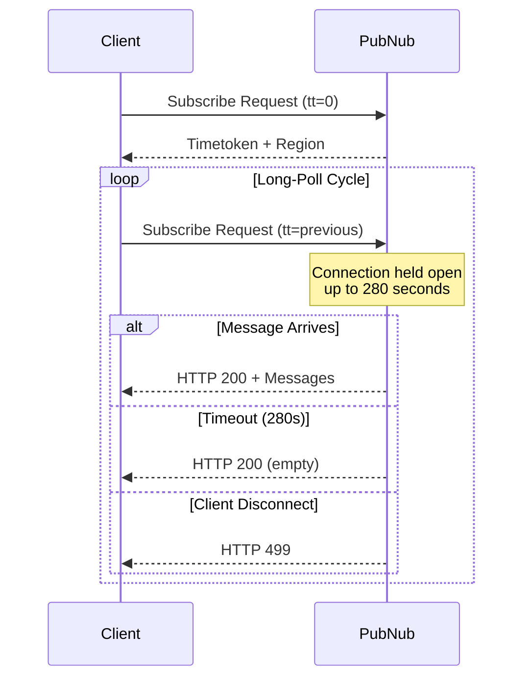
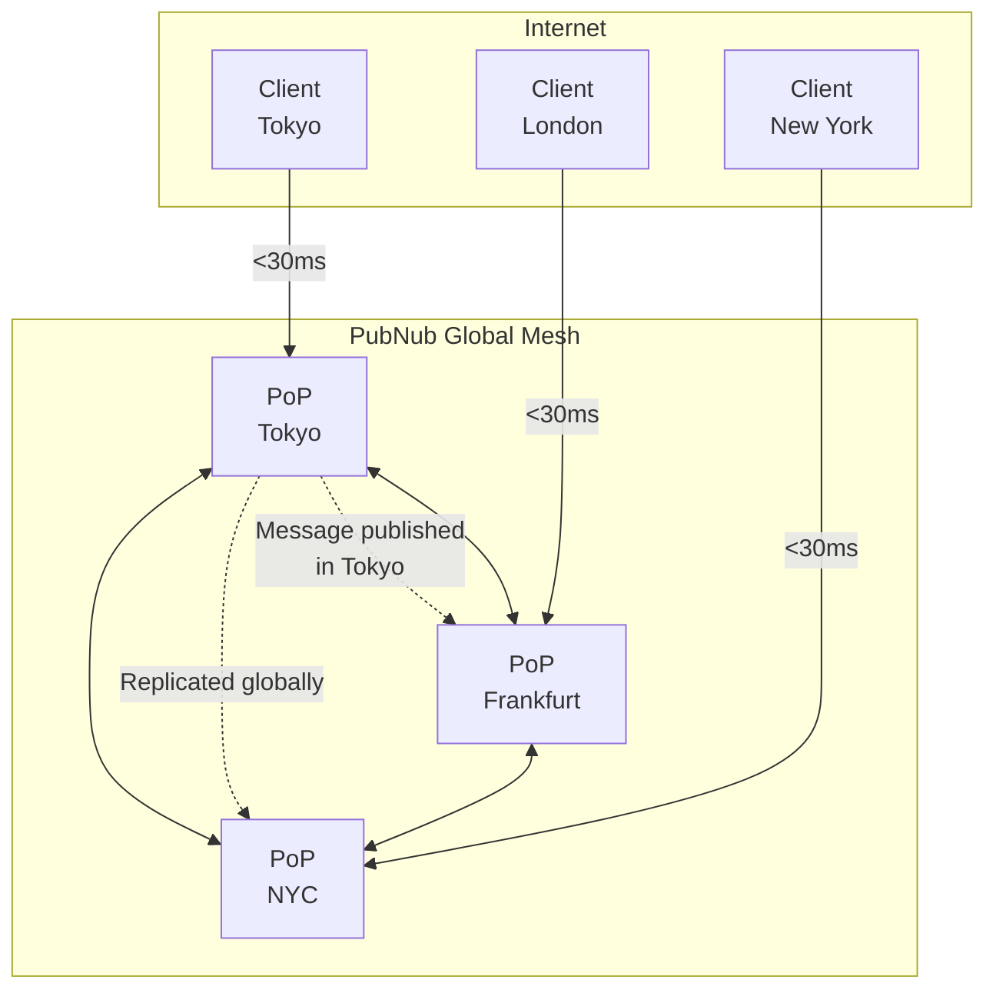

# Platform Architecture

## Introduction

PubNub is a globally distributed, real-time communication platform that enables developers to build scalable, interactive applications without managing infrastructure. This document provides a high-level architectural overview of how PubNub operates and how customer applications integrate with the platform.

## High-Level Architecture

The PubNub platform consists of three primary layers:

1. **Client Applications** - Web, mobile, IoT devices running PubNub SDKs
2. **Customer Servers** - Backend systems handling authentication and business logic
3. **PubNub Network** - Global edge infrastructure and services



## PubNub Edge Network

### Global Points of Presence (PoPs)

PubNub operates **15+ data centers** distributed globally across:

| Region | Example Locations |
|--------|-------------------|
| **North America** | New York, Los Angeles, Dallas, Toronto |
| **South America** | São Paulo |
| **Europe** | Frankfurt, London, Amsterdam, Dublin |
| **Asia-Pacific** | Tokyo, Singapore, Sydney, Mumbai |
| **Middle East** | Bahrain |

### Performance Characteristics

| Metric | Value | Notes |
|--------|-------|-------|
| **Global Average Latency** | ~30ms | From client to nearest PoP |
| **Nearby Client Latency** | <30ms | Same region |
| **Cross-Region Latency** | 50-150ms | Depends on distance |
| **SLA Uptime** | 99.999% | Five nines reliability |
| **Maximum Concurrent Connections** | 25M+ | Proven at scale |
| **Message Throughput** | Millions/sec | Per keyset |

### Data Residency Options

- **Default**: Global distribution for optimal performance
- **US-Only**: Lock data to US data centers (GDPR/compliance)
- **Regional Pinning**: Available for specific compliance requirements

### Edge Network Features

**Distributed Caching**
- Messages are cached at edge PoPs for fast delivery
- Subscribers connect to their nearest PoP
- Automatic failover to alternate PoPs

**Zero-Trust Security**
- TLS 1.2+ encryption for all connections
- AES-256 encryption for payloads (optional)
- Token-based authorization on every request

**Compliance**
- GDPR, HIPAA, SOC 2 Type 2, ISO 27001
- Data processing agreements available
- Regional data residency controls

## Connection Model

### Two TCP Sockets Per Client

Every PubNub SDK maintains **two persistent TCP connections**:



| Socket | Purpose | Characteristics |
|--------|---------|-----------------|
| **Socket 1** | Subscribe operations | Long-lived, maintained for session duration |
| **Socket 2** | Publish, History, Presence queries, etc. | Short-lived, created per request |

### Subscribe Long-Poll Protocol

PubNub uses **HTTP long-polling** for Subscribe operations to ensure maximum compatibility and reliability.

**How Long-Poll Works:**

1. Client SDK sends Subscribe request to PubNub
2. Server holds the connection open, waiting for messages
3. When messages arrive: Server responds immediately with HTTP 200 + message data
4. If no messages arrive within **280 seconds**: Server responds with HTTP 200 (empty response)
5. SDK immediately sends the next Subscribe request
6. This cycle continues indefinitely



**Subscribe Transaction Types** (MCP-verified):

| Type | Description | HTTP Response |
|------|-------------|---------------|
| **Init** | First subscribe with timetoken 0 | 200 (returns initial timetoken + region) |
| **Long-Poll Expiration** | 280-second timeout with no messages | 200 (empty response) |
| **Client Disconnect** | Client canceled request (network change, app background) | 499 |
| **Message Received** | Successful data delivery | 200 (with message payload) |

**Why Long-Poll?**
- Works in environments without WebSocket support
- Firewall and proxy-friendly (standard HTTP/HTTPS)
- Automatic reconnection on network changes
- Built-in backpressure management

### Configurable Subscribe Timeout

- **Default**: 310 seconds (configurable via SDK `subscribeTimeout` parameter)
- **Server long-poll**: 280 seconds (fixed)
- **Recommended**: Leave at default unless specific requirements

## Client Application Integration

### SDK-Based Integration

**Supported Platforms:**
- **Web**: JavaScript, TypeScript
- **Mobile**: Swift (iOS), Kotlin (Android), React Native, Flutter
- **Server**: Node.js, Python, Java, Go, C#, Ruby, PHP, Rust
- **IoT**: C-Core, Arduino, Embedded C
- **Gaming**: Unity, Unreal Engine

**Basic Client Initialization:**

```javascript
// JavaScript SDK example
const pubnub = new PubNub({
  publishKey: 'pub-c-xxxxxxxx',
  subscribeKey: 'sub-c-xxxxxxxx',
  userId: 'user_12345',          // Required: unique user identifier
  authKey: 'token_from_server'    // Optional: Access Manager token
});
```

### REST API Integration

For platforms without native SDKs:

**Subscribe REST Endpoint:**
```
GET https://ps.pndsn.com/v2/subscribe/{sub_key}/{channels}/0
  ?uuid={user_id}
  &tt={timetoken}
  &tr={region}
  &auth={token}
```

**Publish REST Endpoint:**
```
GET https://ps.pndsn.com/publish/{pub_key}/{sub_key}/0/{channel}/0/{message}
  ?uuid={user_id}
  &auth={token}
```

## Customer Server Integration

### Server-Side Responsibilities

Customer servers typically handle:

1. **User Authentication** - Validate user credentials
2. **Token Generation** - Create PubNub Access Manager tokens with appropriate permissions
3. **Authoritative Publishing** - Send server-validated events (votes, payments, game state)
4. **Metadata Management** - Set App Context user and channel metadata

### Server SDK with Secret Key

**Critical Security Rule**: The `secretKey` must **NEVER** be exposed to clients.

```javascript
// Server-side initialization (Node.js example)
const pubnub = new PubNub({
  publishKey: 'pub-c-xxxxxxxx',
  subscribeKey: 'sub-c-xxxxxxxx',
  secretKey: 'sec-c-xxxxxxxx',   // NEVER expose to clients!
  userId: 'server-backend'
});

// Generate token for client
const token = await pubnub.grantToken({
  ttl: 60,  // 60 minutes
  authorized_uuid: 'user_12345',
  resources: {
    channels: {
      'chat.room1': { read: true, write: true }
    }
  }
});

// Return token to client
res.json({ token: token });
```

## Service Layer Overview

The PubNub Network provides 11 core services that work together to enable real-time applications:

### Core Services

| Service | Category | Purpose |
|---------|----------|---------|
| **Publish** | Messaging | Send messages to channels |
| **Subscribe** | Messaging | Receive messages from channels |
| **Presence** | Awareness | Track online users and occupancy |
| **Message Persistence** | Storage | Store and retrieve message history |
| **Access Manager** | Security | Token-based authorization |

### Extended Services

| Service | Category | Purpose |
|---------|----------|---------|
| **App Context** | Metadata | User, channel, and membership metadata |
| **Functions** | Compute | In-transit message processing and integrations |
| **Mobile Push** | Delivery | Native push notifications via APNs/FCM |
| **Files** | Storage | Binary file sharing through channels |
| **Events and Actions** | Integration | Route events to webhooks, AWS, Kafka |
| **Illuminate** | Analytics | Real-time analytics and decision automation |

**Note**: Each service is covered in detail in [02-service-catalog.md](./02-service-catalog.md).

## Key Architectural Principles

### 1. Ephemeral by Default
- Pub/Sub messages are **not stored** by default
- Enable Message Persistence explicitly if history is needed
- Presence state is session-based, not permanent

### 2. Security-First Design
- Access Manager enforces token validation on **every request**
- Tokens are cryptographic, time-limited, and resource-scoped
- Never trust client-side decisions for authoritative actions

### 3. Horizontal Scalability
- Add channels dynamically without provisioning
- No channel limits (within reasonable usage patterns)
- Automatic load balancing across PoPs

### 4. Service Composition
- Services work together: Subscribe + Presence, Publish + History, Functions + App Context
- Design for the combination of services your use case needs

### 5. Edge Processing
- Functions run at the edge (low latency)
- Validation and enrichment before messages reach subscribers
- Reduce client-side complexity

## Network Topology



**Key Points:**
- Clients connect to their **nearest PoP** for minimum latency
- Messages are **replicated globally** across the mesh
- Subscribers receive messages from their **local PoP**
- Automatic failover if a PoP becomes unavailable

## Summary

The PubNub platform provides a globally distributed, real-time communication infrastructure with:

- **15+ global Points of Presence** for low-latency connectivity
- **Two-socket connection model** optimized for real-time and request/response patterns
- **280-second long-poll protocol** for reliable Subscribe operations
- **11 integrated services** for messaging, presence, storage, security, and analytics
- **Token-based security** enforced at the edge on every request
- **99.999% uptime SLA** with automatic failover
- **Client and server SDKs** for all major platforms

In the next section, we'll explore each service in detail, including their capabilities, limits, and best practices.

---

**MCP Verification**: Technical details in this document (280s timeout, 15+ PoPs, two TCP sockets, long-poll protocol) have been verified against PubNub's official documentation via MCP servers.
