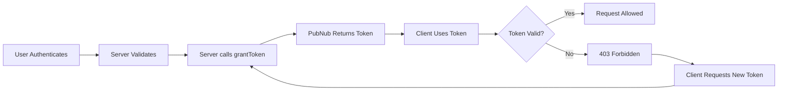
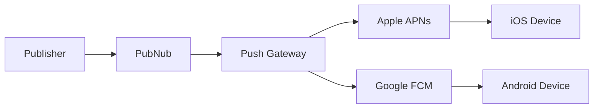

# Service Catalog

## Overview

PubNub provides 11 core services that work together to enable real-time applications. This catalog provides a comprehensive reference for each service, including purpose, configuration options, limits, and use cases.

## Service Summary Table

| Service | Purpose | Data Lifetime | Key Limits |
|---------|---------|---------------|------------|
| **Publish** | Send messages to channels | Ephemeral (in-transit) | 32 KiB payload |
| **Subscribe** | Receive real-time messages | Ephemeral | 280s long-poll |
| **Presence** | Track online users | Session-based | announce_max: 20 |
| **Message Persistence** | Store message history | 1 day - unlimited | 100 msgs/fetch |
| **Access Manager** | Secure all operations | Token TTL: up to 30 days | 7 permission types |
| **App Context** | User/Channel metadata | Persistent | 1M records |
| **Functions** | In-transit processing | None (compute only) | 4 event types |
| **Mobile Push** | Native push notifications | Delivery only | APNs: 2KB, FCM: 4KB |
| **Files** | Binary asset sharing | Configurable | 5 MB max |
| **Events and Actions** | Route to external systems | Routing only | Webhooks/SQS/Kinesis |
| **Illuminate** | Real-time analytics | Metrics retention | 10M+ users |

---

## 1. Publish

### What It Is

Publish is the core service for sending messages to channels in real-time. Messages are distributed instantly to all subscribers of a channel through PubNub's global edge network.

### When to Use It

- Real-time chat and messaging
- Live event broadcasting
- IoT device command and control
- Multiplayer game state updates
- Collaborative application updates

### Key Configuration Options

| Option | Values | Description |
|--------|--------|-------------|
| `store` | `0` or `1` | Whether to persist message in history |
| `ttl` | `0` to `∞` hours | Per-message retention period |
| `meta` | JSON object | Metadata for filtering (stays unencrypted) |
| `norep` | `true` or `false` | Fire mode - no replication or subscriber delivery |

### Message Structure Requirements

Every message **MUST** include:

```json
{
  "type": "message.type",        // Required: message purpose
  "schemaVersion": "1.0",         // Required: version identifier
  "eventId": "evt_abc123",        // Required: for deduplication
  "ts": 1706889600000,            // Required: timestamp
  "payload": {                    // Application-specific data
    "key": "value"
  }
}
```

### Technical Limits (MCP-Verified)

| Limit | Value | Notes |
|-------|-------|-------|
| **Max payload size** | 32 KiB | Includes channel name, metadata, encoding overhead |
| **Recommended safe size** | <30 KiB | Leaves room for headers and envelope |
| **Per-channel rate** | 10-15 msg/sec | Safe baseline; higher with HTTP pipelining |
| **Max channel name length** | 2,048 characters | Hard limit |
| **Max UUID length** | 92 characters | Hard limit |

### Common Use Cases

- **Chat applications**: User messages, typing indicators
- **Live sports**: Score updates, play-by-play commentary
- **Financial tickers**: Stock prices, trade notifications
- **IoT control**: Device commands, configuration updates

---

## 2. Subscribe

### What It Is

Subscribe is the core service for receiving messages from channels in real-time. It uses HTTP long-polling to maintain persistent connections with automatic reconnection.

### When to Use It

- Receive real-time messages from channels
- Listen for user presence events
- Monitor channel activity
- Build reactive, event-driven UIs

### Key Features

**Multiplexing**
- Subscribe to multiple channels over a single connection
- 100-message buffer shared across all channels
- Recommended: 10-50 channels per subscribe request

**Channel Groups**
- Subscribe to up to 100 channels as a single unit
- Up to 10 channel groups per client
- Managed server-side, clients stay in sync automatically

**Wildcard Subscribe**
- Pattern: `channelName.*` (2-level depth maximum)
- Cannot publish to wildcard patterns
- Requires Stream Controller add-on

### Technical Limits (MCP-Verified)

| Limit | Value | Notes |
|-------|-------|-------|
| **Long-poll timeout** | 280 seconds | Server-side timeout |
| **SDK subscribe timeout** | 310 seconds | Configurable via `subscribeTimeout` |
| **Message buffer** | 100 messages | Across all subscribed channels |
| **Recommended channels** | 10-50 | Per subscribe request |
| **Channel Groups per client** | 10 | Default, configurable up to 2,000 channels |
| **Channels per Channel Group** | 100 | Hard limit |
| **Wildcard depth** | 2 levels | `a.*` and `a.b.*` valid, `a.b.c.*` invalid |

### Subscribe Transaction Types

| Type | Trigger | HTTP Status |
|------|---------|-------------|
| **Init** | First subscribe with `tt=0` | 200 (returns timetoken + region) |
| **Long-Poll Expiration** | 280s with no messages | 200 (empty response) |
| **Client Disconnect** | Client canceled request | 499 |
| **Message Received** | Data delivery | 200 (with messages) |

### Common Use Cases

- **Chat clients**: Receive messages, presence events
- **Live dashboards**: Monitor real-time metrics
- **Collaborative editing**: Receive document changes
- **Multiplayer games**: Receive game state updates

---

## 3. Presence

### What It Is

Presence tracks which users are currently subscribed to channels (online/offline status) and provides occupancy counts. It piggybacks on the Subscribe connection without requiring additional connections.

### When to Use It

- Display "who's online" lists
- Track active users in chat rooms
- Monitor game lobby occupancy
- Detect when users go offline

### Key Configuration Options

| Option | Default | Description |
|--------|---------|-------------|
| **Announce Max** | 20 | Occupancy threshold for Interval Mode |
| **Presence Timeout** | ~300s | Inactivity period before timeout event |
| **Presence Deltas** | Disabled | Include join/leave/timeout arrays in interval events |

### Presence Events

| Event | Trigger |
|-------|---------|
| **join** | User subscribes to channel |
| **leave** | User explicitly unsubscribes |
| **timeout** | User inactive for timeout period (treat same as leave) |
| **state-change** | User updates presence state |
| **interval** | Periodic summary (high-occupancy channels) |

### Interval Mode

When channel occupancy exceeds `announce_max`, Presence switches to **Interval Mode**:

- Individual join/leave/timeout events are batched
- Periodic interval updates sent instead
- Includes `occupancy` count
- With Presence Deltas: includes `join[]`, `leave[]`, `timeout[]` arrays

### Technical Limits (MCP-Verified)

| Limit | Value | Notes |
|-------|-------|-------|
| **Announce Max default** | 20 | Threshold for Interval Mode |
| **Announce Max range** | 0-100 | Contact support for higher |
| **Presence Deltas payload** | 32 KiB | If exceeded, `hereNowRefresh: true` flag set |
| **Presence Timeout** | Configurable | Per keyset setting |

### Common Use Cases

- **Chat rooms**: Display active participants
- **Gaming lobbies**: Show available players
- **Collaborative tools**: Show who's editing
- **Customer support**: Show agent availability

### Important Notes

- **Never treat Presence as authoritative identity source** - Use App Context for canonical user data
- **Always handle timeout same as leave** - Timeout means user is disconnected
- **Presence state is per-channel** - For global status, use App Context UUID metadata

---

## 4. Message Persistence (History)

### What It Is

Message Persistence stores published messages for later retrieval via the Fetch or History APIs. It provides short- to medium-term message storage and replay capabilities.

### When to Use It

- Display message history when users join channels
- Support offline message catch-up
- Provide audit trails and compliance logging
- Enable message search and retrieval

### Retention Options (MCP-Verified)

| Duration | Availability |
|----------|--------------|
| 1 day | Free tier |
| 7 days | Free tier (default for test keysets) |
| 30 days | Paid accounts |
| 3 months | Paid accounts |
| 6 months | Paid accounts |
| 1 year | Paid accounts |
| Unlimited | Paid accounts |

**Important**: Retention settings are **immutable per message**. Existing messages retain their original retention period when settings change.

### Retrieval APIs

| Method | Limit | Use Case |
|--------|-------|----------|
| `fetchMessages()` | 100 messages per single channel | Single-channel history |
| `fetchMessages()` | 25 messages per channel across up to 500 channels | Multi-channel retrieval |
| `messageCounts()` | Up to 100 channels | Get unread message counts |

### Delete Operations

| Type | Method | Behavior | Recommendation |
|------|--------|----------|----------------|
| **Soft Delete** | `addMessageAction()` with "deleted" flag | Message remains, marked deleted; reversible | Recommended |
| **Hard Delete** | `deleteMessages()` API | Permanently removed; irreversible | Not recommended for heavy use |

**Hard Delete Requirements**:
- Enable "Delete-From-History" in Admin Portal
- Requires SDK initialization with `secretKey`
- Server-side operation only

### Message Types Stored

| Type | Stored? |
|------|---------|
| Regular messages (type 0) | Yes |
| Signals (type 1) | No |
| App Context events (type 2) | No |
| Message Actions (type 3) | Yes |
| File messages (type 4) | Yes |

### Technical Limits (MCP-Verified)

| Limit | Value |
|-------|-------|
| **Fetch limit (single channel)** | 100 messages |
| **Fetch limit (multi-channel)** | 25 messages per channel, 500 channels max |
| **Timetoken precision** | 17 digits (10 nanoseconds) |
| **Message Counts limit** | 100 channels per call |

### Common Use Cases

- **Chat history**: Load previous messages when joining
- **Audit logs**: Compliance and security logging
- **Offline sync**: Catch up on missed messages
- **Message search**: Find historical content

---

## 5. Access Manager

### What It Is

Access Manager (referred to only as "Access Manager", never "PAM") is PubNub's token-based authorization system. It validates permissions on every API request to ensure secure access to channels, channel groups, and metadata.

### When to Use It

**Always.** Access Manager should be enabled for all production applications to enforce:
- Channel read/write permissions
- Metadata access control
- Time-limited access (tokens with TTL)
- User-specific permissions

### Token Lifecycle



### Permission Types

| Permission | Applies To | Operations |
|------------|-----------|------------|
| `read` | Channels | Subscribe, Fetch History |
| `write` | Channels | Publish, Signal |
| `get` | Channels, UUIDs | Get metadata |
| `update` | Channels, UUIDs | Update metadata |
| `manage` | Channel Groups | Add/remove channels |
| `delete` | Channels | Delete messages |
| `join` | Channels | Membership operations |

### Technical Limits (MCP-Verified)

| Limit | Value | Notes |
|-------|-------|-------|
| **TTL range** | 1 - 43,200 minutes | 1 minute to 30 days |
| **Recommended TTL** | 10-60 minutes | For security |
| **Token size limit** | 32 KiB | Total HTTP request size |
| **Revocation time** | Up to 1 minute | Propagation delay |
| **Revocable token TTL** | ≤ 30 days | Only tokens ≤30 days can be revoked |

### Token Structure

Tokens are PubNub-generated cryptographic tokens (not JWTs) containing:
- Version (currently v2)
- Timestamp
- TTL
- Authorized UUID (optional)
- Resource permissions (channels, groups, UUIDs)
- Pattern permissions (RegEx-based)

### Common Use Cases

- **Chat applications**: Per-room read/write permissions
- **Multi-tenant systems**: Isolate customer data
- **Admin vs user roles**: Different permission sets
- **Time-limited access**: Expire guest tokens

### Security Best Practices

1. **Never expose `secretKey` to clients**
2. **Use short TTLs** (10-60 minutes) for security
3. **Implement token refresh** before expiration
4. **Use `authorized_uuid`** to bind tokens to specific users
5. **Prefer RegEx patterns** over long resource lists

---

## 6. App Context

### What It Is

App Context (also called Objects) provides persistent, queryable metadata storage for users, channels, and their relationships (memberships). It serves as the canonical source of truth for identity and metadata.

### When to Use It

- Store user profiles (name, email, avatar)
- Store channel metadata (room name, description)
- Track user-channel memberships
- Enable searchable, structured metadata

### Object Types

| Object | Purpose | Key Fields |
|--------|---------|------------|
| **User Metadata (UUID)** | User identity and profile | `id`, `name`, `email`, `externalId`, `profileUrl`, `custom` |
| **Channel Metadata** | Channel configuration | `id`, `name`, `description`, `custom` |
| **Membership** | User-channel associations | References to user + channel, `custom` |

### Schema Limits (MCP-Verified)

| Field | Hard Limit |
|-------|------------|
| `name` | 2,048 characters |
| `externalId` | 2,048 characters |
| `profileUrl` | 2,048 characters |
| `email` | 320 characters |
| `description` | 2,048 characters |
| `type` / `status` | 50 characters (alphanumeric + period) |
| **Record size** | 32 KiB (including custom fields) |

### Capacity Limits (MCP-Verified)

| Limit | Value |
|-------|-------|
| **Max user metadata records** | 1 million |
| **Max channel metadata records** | 1 million |
| **Members per channel** | 5,000 |
| **Memberships per user** | 50,000 |
| **Members per transaction** | 20 |

### Management Methods

1. **SDKs** - Real-time programmatic management
2. **REST API** - Server-to-server operations
3. **BizOps Workspace** - GUI in Admin Portal

### Real-Time Events

When enabled, App Context generates events for:
- User Metadata Set / Deleted
- Channel Metadata Set / Deleted
- User Added to Channel / Removed from Channel

### Common Use Cases

- **User profiles**: Store names, avatars, status messages
- **Channel directories**: Searchable room lists
- **Access control**: Query memberships for authorization
- **Friend lists**: Track user relationships

### App Context vs Presence

| Feature | App Context | Presence |
|---------|-------------|----------|
| **Lifetime** | Persistent | Session-based |
| **Use Case** | Identity, profiles | Online/offline status |
| **Storage** | Server-side database | In-memory |
| **Queryable** | Yes | Limited |
| **Best For** | "Who this user is" | "Is this user online now" |

---

## 7. Functions

### What It Is

Functions is an edge computing service that executes JavaScript code in response to PubNub events. Functions run at the edge (low latency) and can intercept messages in-transit, perform validation, enrichment, or route to external systems.

### When to Use It

- Validate messages before delivery
- Enrich messages with server data
- Filter or block inappropriate content
- Route messages to external webhooks
- Implement business logic at the edge

### Event Types (MCP-Verified)

| Event Type | Timing | Use Cases |
|------------|--------|-----------|
| **Before Publish** | Before message reaches subscribers | Validation, filtering, rate limiting, enrichment |
| **After Publish** | After message delivered to subscribers | Side effects, logging, notifications |
| **After Presence** | After presence event fires | Status updates, room management |
| **On Request** | HTTP endpoint invocation | REST API, webhooks, external integrations |

### Function Capabilities

**KV Store Operations**:
- `kvstore.get(key)` - Retrieve value
- `kvstore.set(key, value, ttl)` - Store value with TTL
- `kvstore.remove(key)` - Delete key
- `kvstore.incrCounter(key, amount)` - Atomic counter

**Message Control (Before Publish only)**:
- `request.ok()` - Allow message
- `request.abort({ error: 'reason' })` - Block message
- Mutate `request.message` - Modify message

**External Integration**:
- `xhr` module for HTTP requests
- Call webhooks, databases, third-party APIs

### Technical Limits

| Limit | Value | Notes |
|-------|-------|-------|
| **Wildcard binding depth** | Second level only | `foo.*` works, `foo.bar.*` does NOT |
| **Execution timeout** | Configurable | Keep Functions fast |
| **KV Store TTL** | Seconds | Set with `kvstore.set()` |

### Common Use Cases

- **Content moderation**: Filter profanity before delivery
- **Message enrichment**: Add server timestamps, user data
- **Deduplication**: Check KV store for duplicate `eventId`
- **Rate limiting**: Track and limit message frequency
- **External notifications**: Send emails, SMS, Slack alerts

### Design Principles

1. **Idempotent** - Use `requestId` to handle retries
2. **Deterministic** - Same input = same output
3. **Fast** - Avoid heavy computation or latency-sensitive work
4. **Fail-safe** - Abort on validation failure
5. **Bounded** - No infinite loops, use timeouts

---

## 8. Mobile Push

### What It Is

Mobile Push bridges PubNub messages to native push notification services (Apple Push Notification service and Google Firebase Cloud Messaging). It enables messages to reach users even when the app is backgrounded or closed.

### When to Use It

- Deliver notifications when app is closed
- Alert users to new messages or events
- Re-engage inactive users
- Comply with mobile OS background restrictions

### Supported Providers (MCP-Verified)

| Provider | Configuration Required | Max Payload |
|----------|------------------------|-------------|
| **Apple APNs** | Team ID, Auth Key ID, Token file (.p8) | 2 KB |
| **Google FCM** | Private key file from Firebase | 4 KB |

**Limit**: 1 APNs certificate + 1 FCM key per keyset

### Push Gateway Architecture



### Message Structure

```json
{
  "message": "Hello",
  "pn_apns": {
    "aps": {
      "alert": "New message",
      "sound": "default",
      "badge": 1
    }
  },
  "pn_fcm": {
    "notification": {
      "title": "New Message",
      "body": "Hello"
    }
  }
}
```

### Device Registration

Devices register push tokens for specific channels:
- `addPushNotificationsOnChannels()` - Register device token
- `removePushNotificationsFromChannels()` - Unregister
- **Channel Groups NOT supported** for push registration

### Troubleshooting

**Debug Channel**: Subscribe to `{channelName}-pndebug` to inspect push errors.

**Common Issues**:
1. Verify correct API keys (publish/subscribe)
2. Confirm Mobile Push enabled in Admin Portal
3. Validate device tokens are current
4. Check payload format matches provider requirements
5. Add `"pn_debug": true` to message for detailed logs

### Common Use Cases

- **Chat notifications**: Alert users to new messages
- **Event reminders**: Notify about upcoming events
- **Breaking news**: Push urgent updates
- **Transaction alerts**: Notify payment confirmations

---

## 9. Files

### What It Is

Files enables binary asset sharing through PubNub channels. It provides upload/download capabilities with automatic file event publishing to notify subscribers.

### When to Use It

- Share images in chat applications
- Send PDFs, documents, attachments
- Share voice messages or audio clips
- Distribute files to channel subscribers

### Upload/Download Flow (MCP-Verified)

**Upload (two-step)**:
1. `sendFile()` - Generates upload request
2. SDK uploads file to PubNub cloud storage
3. `publishFile()` - Automatically sends file event to channel

**Download (two-step)**:
1. `downloadFile()` - Receives time-limited redirect URL
2. Download file from URL

**Alternative**: `getFileUrl()` - Returns direct download URL without API call (no decryption)

### Technical Limits (MCP-Verified)

| Limit | Value |
|-------|-------|
| **Max file size** | 5 MB |
| **File retention** | 1, 3, 7, 15, 30 days, or Unlimited |

### Supported File Types

| Environment | Supported Formats |
|-------------|-------------------|
| **Node.js** | `Readable` stream, `Buffer` |
| **Browsers** | `File`, `string`, `ArrayBuffer` |
| **React/React Native** | URI object with `name` and `mimeType` |

### File Event Structure

Subscribers receive file events containing:
- `id` - Unique file identifier
- `name` - Filename
- `description` - Optional description
- `customMessageType` - Optional custom type

### Common Use Cases

- **Chat image sharing**: Upload and share photos
- **Document collaboration**: Share PDFs, presentations
- **Voice messages**: Upload audio clips
- **Profile pictures**: Share avatars, images

---

## 10. Events and Actions

### What It Is

Events and Actions is a serverless event routing platform that declaratively routes PubNub events to external systems like webhooks, AWS SQS, Kinesis, and Kafka.

### When to Use It

- Route PubNub events to external analytics
- Trigger webhooks on specific events
- Send data to AWS for processing
- Integrate with third-party services (Slack, email, etc.)

### Event Sources

Events and Actions can listen to:
- Messages published to channels
- Messages from specific User IDs/UUIDs
- Message metadata matching patterns
- User connections, disconnections, subscriptions
- File uploads
- Mobile push notifications

### Filtering (MCP-Verified)

| Filter Type | Description |
|-------------|-------------|
| **No Filter** | Triggers for all events |
| **Basic Filters** | Dropdown conditions (channel, sender ID) |
| **Advanced JSONPath** | Complex payload inspection |

**JSONPath Example**:
```javascript
// Match specific user and channel
$.[?(@.uuid == 'user_id' && @.channel == 'channel_name')]

// Filter on message content
$.message[?(@.text contains 'temperature')]
```

### Supported Actions

- **Webhooks** (HTTPS endpoints)
- **Amazon SQS**
- **Amazon Kinesis**
- **Amazon S3**
- **Apache Kafka**
- **AMQP**
- **IFTTT**

### Tier Limits

| Tier | Max Events | Listeners | Actions per Listener |
|------|------------|-----------|----------------------|
| Free | 10K | 1 | 1 |
| Intro | 2M | Unlimited | 3 |
| Tier 1-4 | 4M-200M | Unlimited | 3 |
| Tier 5-6 | 500M-Unlimited | Unlimited | Unlimited |

### Common Use Cases

- **Analytics ingestion**: Route events to data warehouse
- **Slack notifications**: Alert team on key events
- **Email triggers**: Send emails via webhooks
- **Data lake routing**: Send to AWS S3 or Kinesis

---

## 11. Illuminate

### What It Is

Illuminate is PubNub's real-time analytics and decision automation platform. It provides Business Objects for data ingestion, Decisions for rule-based automation, and Dashboards for visualization.

### When to Use It

- Real-time engagement analytics
- Automated moderation decisions
- A/B testing and experimentation
- Fraud detection and alerting
- Live metrics dashboards

### Three Core Modules

| Module | Purpose |
|--------|---------|
| **Business Objects** | Data ingestion, field definition, metric creation |
| **Decisions** | Rule-based automation with conditions and actions |
| **Dashboards** | Real-time visualization of metrics and actions |

### Capabilities (MCP-Verified)

| Feature | Value |
|---------|-------|
| **Scale** | 10M+ users |
| **Latency** | <100ms |
| **Concurrent connections** | 25M+ |
| **Chart types** | Bar, Stacked Bar, Line |

### Decision Components

- **Rules** - Named conditions with actions
- **Conditions** - Metric thresholds evaluated in real-time
- **Actions** - Automated responses when conditions met

**Example Decision**: Send discount to user when message count exceeds 100 over 30 minutes.

### Data Flow

```
PubNub Events → Business Objects → Metrics → Decisions → Actions
                       ↓                          ↓
                   Dashboards ←──────────────────┘
```

### Common Use Cases

- **User engagement metrics**: Track active users, message volume
- **Automated promotions**: Trigger offers based on activity
- **Content moderation**: Auto-flag suspicious behavior
- **Performance monitoring**: Real-time system health

### Availability

- Two-week free trial
- Sales contact required for upgrades

---

## Summary

PubNub's 11 core services work together to provide a complete real-time application platform:

1. **Publish/Subscribe** - Core real-time messaging
2. **Presence** - Online user tracking
3. **Message Persistence** - History storage and replay
4. **Access Manager** - Token-based security
5. **App Context** - User and channel metadata
6. **Functions** - Edge computing and integrations
7. **Mobile Push** - Native push notifications
8. **Files** - Binary asset sharing
9. **Events and Actions** - External system routing
10. **Illuminate** - Real-time analytics and decisions

Each service is designed to work independently or in combination, enabling developers to compose the exact capabilities their applications need.

---

**MCP Verification**: All technical limits and specifications in this document have been verified against PubNub's official documentation via MCP servers.
