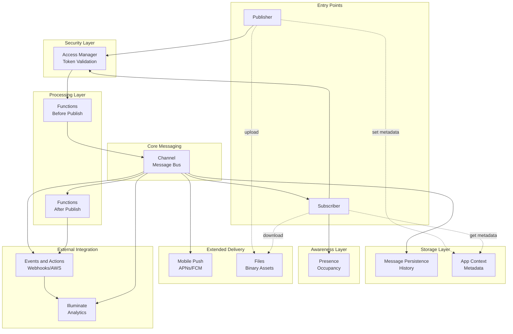
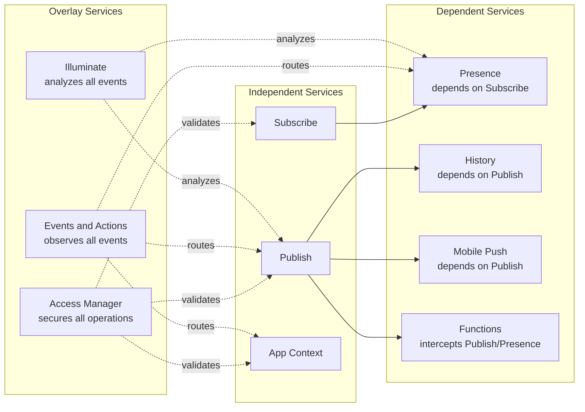
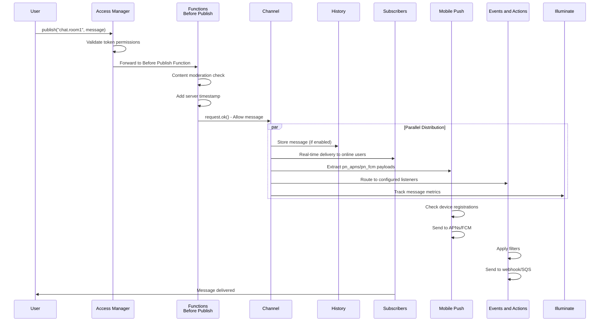
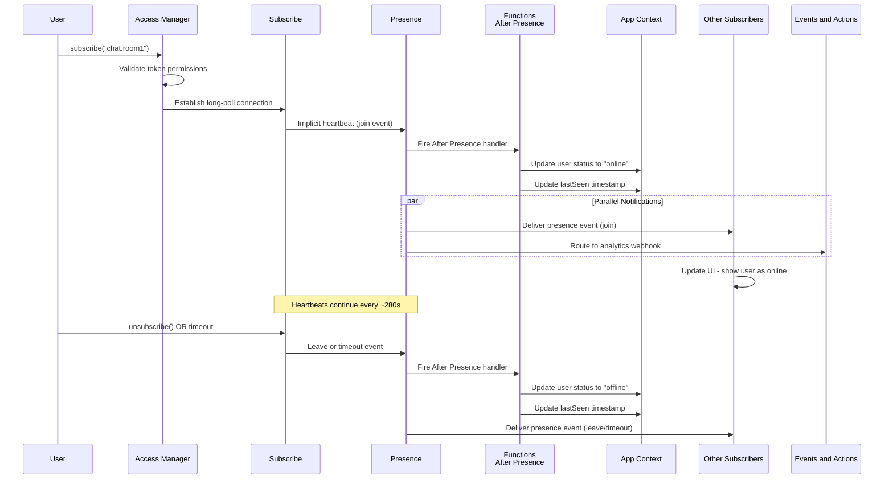
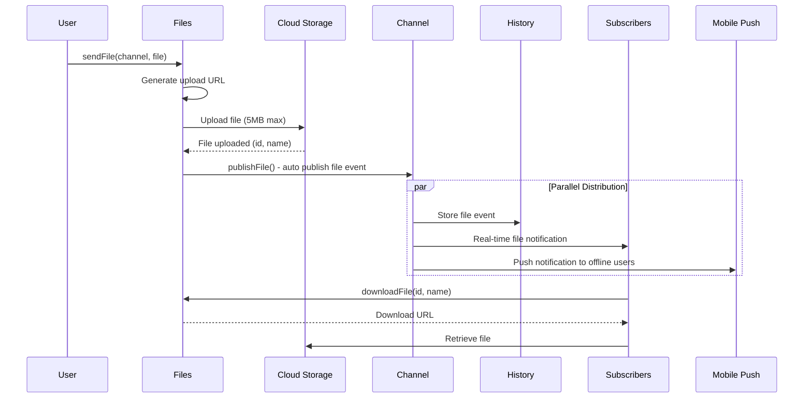
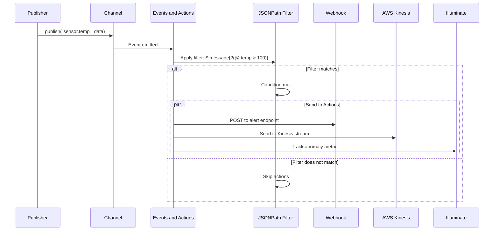
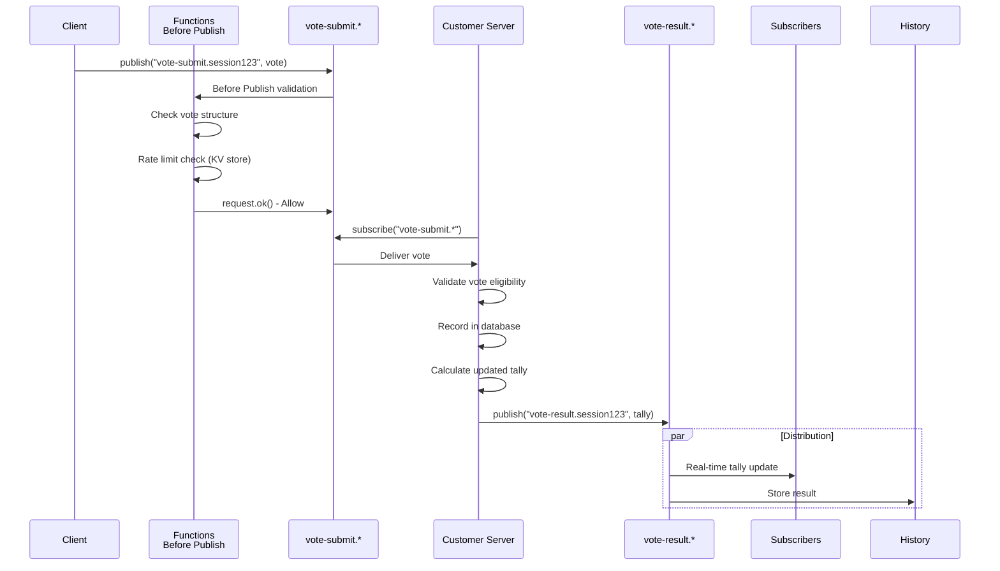

# Service Interactions

## Overview

PubNub services are designed to work together seamlessly. Understanding how services interact is critical for designing robust, scalable real-time applications. This document explores the relationships between services and common data flow patterns.

## Core Data Flow Diagram



## Service Relationship Matrix

### Complete Interaction Table

| From Service | To Service | Relationship | Direction |
|--------------|-----------|--------------|-----------|
| **Publish** | Access Manager | Token validation before publish | Sequential |
| **Publish** | Functions (Before) | Message interception and validation | Sequential |
| **Publish** | History | Automatic storage if enabled | Parallel |
| **Publish** | Mobile Push | Push payload extraction and routing | Parallel |
| **Publish** | Events and Actions | Event routing on publish | Parallel |
| **Publish** | Illuminate | Analytics ingestion | Parallel |
| **Subscribe** | Access Manager | Token validation on connect | Sequential |
| **Subscribe** | Presence | Implicit heartbeat mechanism | Automatic |
| **Subscribe** | History | Fetch messages on demand | On-demand |
| **Functions (After)** | Events and Actions | Side-effect routing | Sequential |
| **Functions (After)** | App Context | Metadata updates | On-demand |
| **Presence** | Functions (After) | Presence event handling | Sequential |
| **Presence** | App Context | Status synchronization | Via Functions |
| **All Events** | Events and Actions | Declarative event routing | Parallel |
| **All Events** | Illuminate | Real-time analytics | Parallel |

### Service Dependencies



## Common Data Flow Scenarios

### Scenario 1: Chat Message Flow (Complete)

This scenario demonstrates how a chat message flows through the entire PubNub platform.



**Step-by-Step Breakdown**:

1. **User publishes message** with Access Manager token
2. **Access Manager validates** token has `write` permission for channel
3. **Before Publish Function** intercepts message:
   - Checks content for profanity
   - Adds server timestamp
   - Returns `request.ok()` to allow or `request.abort()` to block
4. **Parallel distribution** occurs simultaneously:
   - **History**: Message stored with timetoken
   - **Subscribers**: Real-time delivery to all subscribed clients
   - **Mobile Push**: Push payloads sent to offline users via APNs/FCM
   - **Events and Actions**: Message routed to webhooks, AWS, etc.
   - **Illuminate**: Message tracked in analytics
5. **User receives confirmation** with timetoken

### Scenario 2: User Comes Online (Presence + App Context)

This scenario shows how Presence and App Context work together to track user status.



**Key Points**:

- **Presence piggybacks on Subscribe** - No separate connection required
- **After Presence Function** bridges ephemeral Presence to persistent App Context
- **App Context stores canonical status** - Source of truth for user state
- **Other users receive presence events** in real-time
- **Timeout handled same as leave** - Always treat timeout as offline

### Scenario 3: File Sharing with Notifications



**Key Points**:

- **Two-step upload**: Generate URL, then upload
- **Automatic file event**: `publishFile()` sends notification to channel
- **File metadata in History**: Event stored like regular message
- **Push notifications**: Offline users alerted to new files

### Scenario 4: External Integration via Events and Actions



**Key Points**:

- **Declarative routing**: No code required in application
- **JSONPath filtering**: Complex conditions on message payload
- **Multiple actions**: Send to multiple destinations simultaneously
- **Illuminate integration**: Analytics automatically tracked

### Scenario 5: Server-Authoritative Voting

This scenario demonstrates a hybrid architecture where clients submit votes but server validates and publishes results.



**Key Points**:

- **Client submits** to `vote-submit.*` channel
- **Function validates structure** before delivery
- **Server subscribes** to `vote-submit.*` (wildcard)
- **Server publishes authoritative results** to `vote-result.*`
- **Clear separation**: Submission vs results channels

## Service Composition Patterns

### Pattern 1: Ephemeral + Persistent (Presence + App Context)

**Use Case**: Track online users with persistent profile data

```
Presence (ephemeral)           App Context (persistent)
├─ join/leave/timeout events   ├─ User profiles (name, avatar)
├─ Current occupancy count     ├─ Channel metadata
└─ Session-based state         └─ Membership relationships

Integration via Functions After Presence
```

**When to use**:
- Chat applications (online status + profiles)
- Multiplayer games (players online + stats)
- Collaborative tools (editors online + permissions)

### Pattern 2: Real-Time + History (Publish/Subscribe + Persistence)

**Use Case**: Live messaging with catch-up capability

```
Publish/Subscribe (real-time)  Message Persistence (history)
├─ Instant delivery            ├─ Store last N messages
├─ Sub-30ms latency            ├─ Fetch on join
└─ Ephemeral in-transit        └─ Configurable retention

Automatically integrated via store=1 flag
```

**When to use**:
- Chat (live messages + history on join)
- Live blogs (real-time updates + archive)
- IoT monitoring (current readings + historical trends)

### Pattern 3: Client + Server Validation (Functions + Access Manager)

**Use Case**: Secure user-generated content

```
Access Manager (authentication)  Functions (validation)
├─ Token-based authorization     ├─ Content moderation
├─ Read/write permissions       ├─ Rate limiting
└─ Time-limited access           └─ Schema validation

Sequential: Token check → Function intercept → Delivery
```

**When to use**:
- Public chat rooms (authenticated + moderated)
- User-submitted content (authorized + validated)
- Rate-limited APIs (token + quota check)

### Pattern 4: PubNub + External Systems (Events and Actions + Illuminate)

**Use Case**: Real-time events with external processing

```
Events and Actions (routing)    Illuminate (analytics)
├─ Route to webhooks            ├─ Business metrics
├─ Send to AWS SQS/Kinesis     ├─ Decision automation
└─ Integrate with Kafka         └─ Real-time dashboards

Both observe the same event stream in parallel
```

**When to use**:
- Analytics pipelines (PubNub → Data warehouse)
- Multi-system integration (PubNub → Email/SMS/Slack)
- Decision automation (metrics → triggers → actions)

## Cross-Service Data Synchronization

### App Context ↔ Presence Synchronization

**Challenge**: Presence is ephemeral, App Context is persistent. How to keep them in sync?

**Solution**: Use Functions After Presence handler

```javascript
// Function: presence-to-appcontext
// Trigger: After Presence on channels.*

export default async (request) => {
  const { action, uuid, timestamp } = request.message;
  
  if (!['join', 'leave', 'timeout'].includes(action)) {
    return request.ok();
  }
  
  const isOnline = action === 'join';
  
  // Update App Context
  await pubnub.objects.setUUIDMetadata({
    uuid: uuid,
    data: {
      custom: {
        online: isOnline,
        lastSeen: timestamp
      }
    }
  });
  
  return request.ok();
};
```

### History ↔ External Database Synchronization

**Challenge**: PubNub History has retention limits. How to achieve unlimited history?

**Solution**: Use Events and Actions or Functions to route to external database

```javascript
// Function: archive-to-database
// Trigger: After Publish on archive.*

export default async (request) => {
  const message = request.message;
  
  // Send to external database via webhook
  await xhr.fetch('https://api.yourcompany.com/archive', {
    method: 'POST',
    headers: { 'Content-Type': 'application/json' },
    body: JSON.stringify({
      channel: message.channel,
      timetoken: message.timetoken,
      publisher: message.publisher,
      message: message.message
    })
  });
  
  return request.ok();
};
```

## Service Interaction Best Practices

### 1. Always Validate Before Storage

```
Publish → Access Manager → Functions (Before) → History

Never store invalid or malicious content
```

### 2. Use Presence for Ephemeral, App Context for Canonical

```
Presence: "Is user online RIGHT NOW?"
App Context: "Who IS this user?" (name, email, profile)
```

### 3. Separate Submission and Result Channels

```
Clients publish to: vote-submit.*
Clients subscribe to: vote-result.*

Server controls authoritative results
```

### 4. Bridge PubNub to External Systems Asynchronously

```
After Publish Function → Webhook (non-blocking)
Events and Actions → AWS SQS → Lambda

Don't slow down real-time delivery
```

### 5. Use Illuminate for PubNub-Native Analytics

```
PubNub Events → Illuminate Business Objects → Metrics → Decisions

No custom analytics infrastructure needed
```

## Performance Considerations

### Service Latency Impact

| Service Combination | Added Latency | Notes |
|---------------------|---------------|-------|
| Publish only | 0ms baseline | Direct delivery |
| + Access Manager | <5ms | Token validation |
| + Functions (Before) | 10-50ms | Depends on Function logic |
| + History | 0ms | Parallel, non-blocking |
| + Mobile Push | 0ms | Parallel, non-blocking |
| + Events and Actions | 0ms | Parallel, non-blocking |

**Key Insight**: Most services run in parallel and don't add latency to the critical path. Only Access Manager and Functions (Before Publish) are sequential.

### Fanout Considerations

**Problem**: Publishing to channels with many subscribers

| Subscribers | Fanout Strategy |
|-------------|-----------------|
| 1-1,000 | Direct publish to channel |
| 1,000-10,000 | Consider channel sharding |
| 10,000+ | Use presence Interval Mode, shard channels |

**Mitigation**:
- Shard channels: `chat.room1.shard-0`, `chat.room1.shard-1`, etc.
- Use Signals (64 bytes) for high-frequency, low-payload events
- Enable Presence Interval Mode for high-occupancy channels

## Summary

PubNub services interact in well-defined patterns:

1. **Sequential**: Access Manager → Functions (Before) → Channel
2. **Parallel**: Channel → History + Subscribers + Mobile Push + Events and Actions + Illuminate
3. **Piggybacking**: Subscribe → Presence (automatic heartbeat)
4. **Bridging**: Functions connect ephemeral services (Presence) to persistent services (App Context)
5. **Observing**: Events and Actions and Illuminate observe all events without blocking

Understanding these interaction patterns enables you to design robust, scalable real-time applications that leverage the full power of the PubNub platform.

---

**Next**: [04. Integration Patterns](./04-integration-patterns.md) - Learn how to integrate client applications and servers with PubNub.
