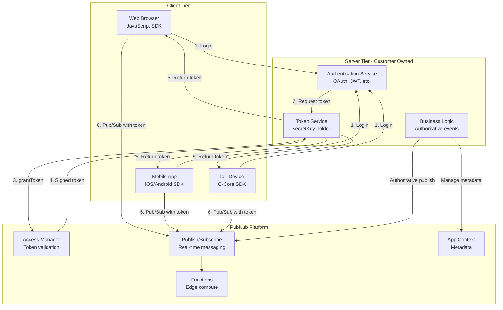
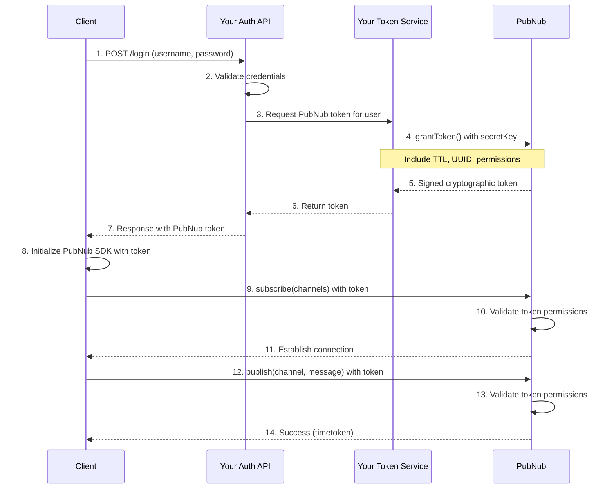
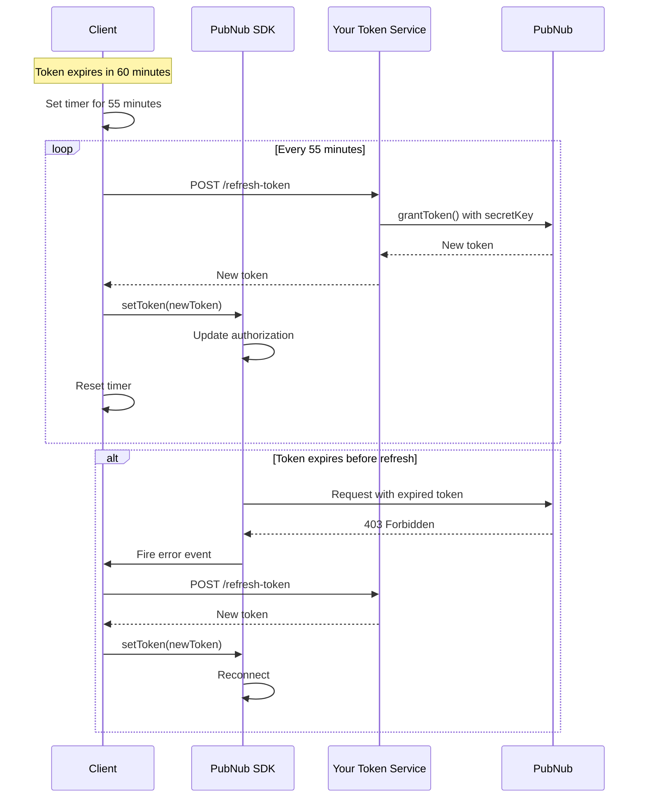
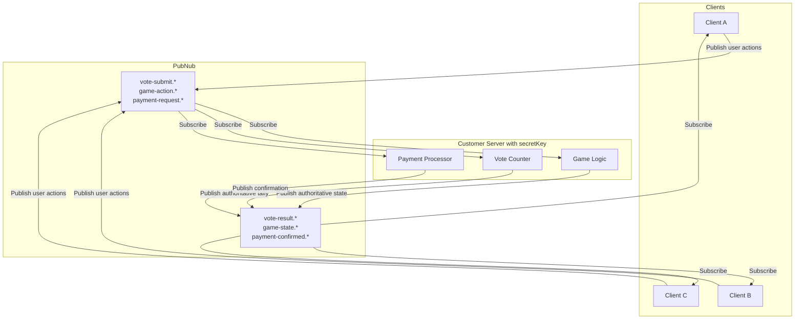
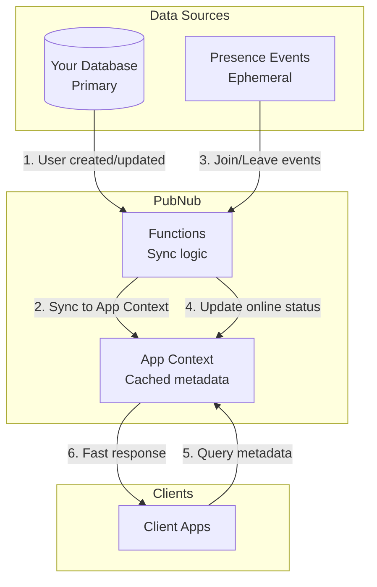

# Integration Patterns

## Overview

This document provides detailed integration patterns for connecting client applications and customer servers with PubNub. Understanding these patterns is essential for architecting secure, scalable real-time applications.

## Three-Tier Integration Architecture



---

## Pattern 1: Client Integration with Token Authentication

### Overview

Clients authenticate with your server, receive PubNub tokens, then connect to PubNub with those tokens. This pattern ensures secure, time-limited access without exposing credentials.

### Architecture Diagram



### Implementation Steps

#### Step 1: Client Authentication

**Client-Side Code (JavaScript)**:

```javascript
// User logs in via your authentication system
async function login(username, password) {
  const response = await fetch('https://api.yourapp.com/login', {
    method: 'POST',
    headers: { 'Content-Type': 'application/json' },
    body: JSON.stringify({ username, password })
  });
  
  const data = await response.json();
  
  return {
    userId: data.userId,
    pubnubToken: data.pubnubToken  // Token from your server
  };
}
```

#### Step 2: Server Generates Token

**Server-Side Code (Node.js)**:

```javascript
// Server endpoint: POST /login
const PubNub = require('pubnub');

const pubnub = new PubNub({
  publishKey: process.env.PUBNUB_PUBLISH_KEY,
  subscribeKey: process.env.PUBNUB_SUBSCRIBE_KEY,
  secretKey: process.env.PUBNUB_SECRET_KEY,  // NEVER expose to clients!
  userId: 'server-backend'
});

app.post('/login', async (req, res) => {
  // 1. Validate user credentials
  const user = await validateCredentials(req.body.username, req.body.password);
  if (!user) {
    return res.status(401).json({ error: 'Invalid credentials' });
  }
  
  // 2. Determine permissions based on user role
  const channels = getUserChannels(user);
  const permissions = getUserPermissions(user);
  
  // 3. Generate PubNub token
  const token = await pubnub.grantToken({
    ttl: 60,  // 60 minutes
    authorized_uuid: user.id,  // Bind token to this user
    resources: {
      channels: channels.reduce((acc, channel) => {
        acc[channel] = permissions;  // { read: true, write: true, ... }
        return acc;
      }, {})
    }
  });
  
  // 4. Return token to client
  res.json({
    userId: user.id,
    pubnubToken: token
  });
});

function getUserChannels(user) {
  // Example: User can access their inbox and public channels
  return [
    `inbox.${user.id}`,
    'public.lobby',
    `team.${user.teamId}`
  ];
}

function getUserPermissions(user) {
  // Example: Standard users can read and write
  return {
    read: true,
    write: true,
    get: true,
    update: false,
    manage: false,
    delete: false,
    join: true
  };
}
```

#### Step 3: Client Initializes PubNub

**Client-Side Code (JavaScript)**:

```javascript
async function initializePubNub(userId, token) {
  const pubnub = new PubNub({
    publishKey: 'pub-c-xxxxxxxx',
    subscribeKey: 'sub-c-xxxxxxxx',
    userId: userId,
    authKey: token  // Token from your server
  });
  
  // Subscribe to channels
  pubnub.subscribe({
    channels: ['public.lobby', `inbox.${userId}`]
  });
  
  // Set up message listener
  pubnub.addListener({
    message: (event) => {
      console.log('Received:', event.message);
    }
  });
  
  return pubnub;
}

// Usage
const { userId, pubnubToken } = await login('user@example.com', 'password123');
const pubnub = await initializePubNub(userId, pubnubToken);
```

### Token Refresh Pattern



**Client-Side Token Refresh (JavaScript)**:

```javascript
class PubNubClient {
  constructor(userId, initialToken) {
    this.userId = userId;
    this.pubnub = new PubNub({
      publishKey: 'pub-c-xxxxxxxx',
      subscribeKey: 'sub-c-xxxxxxxx',
      userId: userId,
      authKey: initialToken
    });
    
    // Set up automatic token refresh
    this.startTokenRefresh(60); // Token expires in 60 minutes
    
    // Handle 403 errors (token expired)
    this.pubnub.addListener({
      status: (event) => {
        if (event.statusCode === 403) {
          console.warn('Token expired, refreshing...');
          this.refreshToken();
        }
      }
    });
  }
  
  startTokenRefresh(ttlMinutes) {
    // Refresh 5 minutes before expiration
    const refreshInterval = (ttlMinutes - 5) * 60 * 1000;
    
    this.refreshTimer = setInterval(async () => {
      await this.refreshToken();
    }, refreshInterval);
  }
  
  async refreshToken() {
    try {
      const response = await fetch('https://api.yourapp.com/refresh-token', {
        method: 'POST',
        headers: { 'Content-Type': 'application/json' },
        body: JSON.stringify({ userId: this.userId })
      });
      
      const data = await response.json();
      
      // Update SDK with new token
      this.pubnub.setToken(data.pubnubToken);
      
      console.log('Token refreshed successfully');
    } catch (error) {
      console.error('Token refresh failed:', error);
    }
  }
  
  destroy() {
    clearInterval(this.refreshTimer);
    this.pubnub.unsubscribeAll();
  }
}

// Usage
const client = new PubNubClient(userId, initialToken);
```

---

## Pattern 2: Server-Side Integration for Authoritative Events

### Overview

Customer servers publish authoritative events (game results, payment confirmations, vote tallies) using the `secretKey`. This ensures clients cannot forge critical business events.

### Architecture Diagram



### Implementation: Voting System

#### Server-Side Code (Node.js)

```javascript
const PubNub = require('pubnub');

// Server SDK with secretKey
const pubnub = new PubNub({
  publishKey: process.env.PUBNUB_PUBLISH_KEY,
  subscribeKey: process.env.PUBNUB_SUBSCRIBE_KEY,
  secretKey: process.env.PUBNUB_SECRET_KEY,  // Enables admin operations
  userId: 'vote-server'
});

// In-memory vote tracking
const sessions = new Map();

// Subscribe to vote submissions
pubnub.subscribe({
  channels: ['vote-submit.*'],
  channelGroups: [],
  withPresence: false
});

// Handle incoming votes
pubnub.addListener({
  message: async (event) => {
    const { channel, message, timetoken, publisher } = event;
    
    // Extract session ID from channel (vote-submit.session123)
    const sessionId = channel.split('.')[1];
    
    // Validate vote structure
    if (!isValidVote(message)) {
      console.warn('Invalid vote structure:', message);
      return;
    }
    
    // Record vote
    const voteRecord = {
      sessionId,
      userId: publisher,
      optionId: message.payload.optionId,
      timestamp: timetoken,
      eventId: message.eventId
    };
    
    // Check for duplicate (idempotency)
    if (await isDuplicateVote(voteRecord)) {
      console.log('Duplicate vote ignored:', voteRecord.eventId);
      return;
    }
    
    // Save to database
    await saveVote(voteRecord);
    
    // Update tally
    const tally = await calculateTally(sessionId);
    
    // Publish authoritative result
    await pubnub.publish({
      channel: `vote-result.${sessionId}`,
      message: {
        type: 'vote.tally',
        schemaVersion: '1.0',
        eventId: `tally_${Date.now()}`,
        ts: Date.now(),
        payload: {
          sessionId,
          options: tally,
          totalVotes: tally.reduce((sum, opt) => sum + opt.count, 0)
        }
      }
    });
  }
});

function isValidVote(message) {
  return message &&
    message.type === 'vote.submit' &&
    message.schemaVersion &&
    message.eventId &&
    message.payload &&
    message.payload.optionId;
}

async function isDuplicateVote(voteRecord) {
  // Check database for existing vote with same eventId
  // Implementation depends on your database
  return false;
}

async function saveVote(voteRecord) {
  // Save to database
  // Implementation depends on your database
}

async function calculateTally(sessionId) {
  // Query database for vote counts
  // Return array of { optionId, count }
  return [
    { optionId: 'option_1', count: 42 },
    { optionId: 'option_2', count: 38 },
    { optionId: 'option_3', count: 20 }
  ];
}

console.log('Vote server listening on vote-submit.*');
```

#### Client-Side Code (JavaScript)

```javascript
// Client publishes votes
async function submitVote(sessionId, optionId) {
  await pubnub.publish({
    channel: `vote-submit.${sessionId}`,
    message: {
      type: 'vote.submit',
      schemaVersion: '1.0',
      eventId: `vote_${Date.now()}_${Math.random()}`,  // Unique ID
      ts: Date.now(),
      payload: {
        optionId: optionId
      }
    }
  });
}

// Client subscribes to results
pubnub.subscribe({
  channels: [`vote-result.${sessionId}`]
});

pubnub.addListener({
  message: (event) => {
    if (event.message.type === 'vote.tally') {
      updateUI(event.message.payload.options);
    }
  }
});
```

---

## Pattern 3: Hybrid Architecture (Client + Server Publishing)

### Overview

Both clients and servers publish, but to different channels. Clients publish user-generated content (chat, comments) while servers publish authoritative events (payments, game results).

### Channel Strategy

```
Client publishes to:
  - chat.room.*          (user messages)
  - comment.post.*       (user comments)
  - typing.room.*        (typing indicators)

Server publishes to:
  - system.announcement  (system messages)
  - payment.confirmed.*  (payment results)
  - game.state.*         (authoritative game state)
  - moderation.action.*  (moderation decisions)
```

### Access Manager Configuration

```javascript
// Generate token for regular user
const userToken = await pubnub.grantToken({
  ttl: 60,
  authorized_uuid: userId,
  resources: {
    channels: {
      // User can read and write to chat
      [`chat.room.${roomId}`]: { read: true, write: true },
      
      // User can read system announcements (no write)
      'system.announcement': { read: true, write: false },
      
      // User can read game state (no write)
      [`game.state.${gameId}`]: { read: true, write: false },
      
      // User can read their inbox
      [`inbox.${userId}`]: { read: true, write: false }
    }
  }
});

// Server uses secretKey (unrestricted access)
const serverPubNub = new PubNub({
  publishKey: process.env.PUBNUB_PUBLISH_KEY,
  subscribeKey: process.env.PUBNUB_SUBSCRIBE_KEY,
  secretKey: process.env.PUBNUB_SECRET_KEY,
  userId: 'server-backend'
});
```

---

## Pattern 4: Metadata Synchronization

### Overview

Use App Context as the source of truth for user and channel metadata. Keep it synchronized with your database and Presence events.

### Architecture



### Implementation

**Server-Side: Sync Database to App Context**

```javascript
// When user profile updated in your database
async function syncUserToAppContext(user) {
  await pubnub.objects.setUUIDMetadata({
    uuid: user.id,
    data: {
      name: user.name,
      email: user.email,
      profileUrl: user.avatarUrl,
      externalId: user.id,
      custom: {
        role: user.role,
        teamId: user.teamId,
        online: false,  // Will be updated by Presence
        lastSeen: null
      }
    }
  });
}

// When channel created in your database
async function syncChannelToAppContext(channel) {
  await pubnub.objects.setChannelMetadata({
    channel: channel.id,
    data: {
      name: channel.name,
      description: channel.description,
      custom: {
        ownerId: channel.ownerId,
        isPrivate: channel.isPrivate,
        createdAt: channel.createdAt
      }
    }
  });
}
```

**Functions: Sync Presence to App Context**

```javascript
// Function: presence-to-appcontext
// Trigger: After Presence on *

export default async (request) => {
  const { action, uuid, timestamp } = request.message;
  
  // Only handle join/leave/timeout
  if (!['join', 'leave', 'timeout'].includes(action)) {
    return request.ok();
  }
  
  const isOnline = action === 'join';
  
  // Update App Context with online status
  await pubnub.objects.setUUIDMetadata({
    uuid: uuid,
    data: {
      custom: {
        online: isOnline,
        lastSeen: timestamp
      }
    }
  });
  
  return request.ok();
};
```

**Client-Side: Query App Context**

```javascript
// Get user metadata
async function getUserProfile(userId) {
  const response = await pubnub.objects.getUUIDMetadata({
    uuid: userId
  });
  
  return {
    id: response.data.id,
    name: response.data.name,
    email: response.data.email,
    avatar: response.data.profileUrl,
    online: response.data.custom?.online || false,
    lastSeen: response.data.custom?.lastSeen
  };
}

// Get channel metadata
async function getChannelInfo(channelId) {
  const response = await pubnub.objects.getChannelMetadata({
    channel: channelId
  });
  
  return {
    id: response.data.id,
    name: response.data.name,
    description: response.data.description,
    isPrivate: response.data.custom?.isPrivate || false
  };
}

// Get channel members
async function getChannelMembers(channelId) {
  const response = await pubnub.objects.getChannelMembers({
    channel: channelId,
    limit: 100
  });
  
  return response.data.map(member => ({
    userId: member.uuid.id,
    name: member.uuid.name,
    avatar: member.uuid.profileUrl,
    online: member.uuid.custom?.online || false
  }));
}
```

---

## Pattern 5: Functions as Middleware

### Overview

Use Functions to implement middleware logic between clients and channels: validation, enrichment, rate limiting, and routing.

### Before Publish: Validation and Enrichment

```javascript
// Function: chat-message-handler
// Trigger: Before Publish on chat.*

export default (request) => {
  const message = request.message;
  
  // 1. Validate message structure
  if (!message.type || !message.payload || !message.payload.text) {
    return request.abort({
      error: 'invalid_message',
      message: 'Message must include type and payload.text'
    });
  }
  
  // 2. Content moderation (simple profanity filter)
  if (containsProfanity(message.payload.text)) {
    return request.abort({
      error: 'inappropriate_content',
      message: 'Message contains inappropriate content'
    });
  }
  
  // 3. Rate limiting check (using KV store)
  const userId = request.publisher;
  const rateLimitKey = `ratelimit:${userId}`;
  
  const lastMessage = kvstore.get(rateLimitKey);
  if (lastMessage && Date.now() - lastMessage.timestamp < 1000) {
    // Less than 1 second since last message
    return request.abort({
      error: 'rate_limit_exceeded',
      message: 'Please wait before sending another message'
    });
  }
  
  // 4. Update rate limit tracker
  kvstore.set(rateLimitKey, { timestamp: Date.now() }, 60);
  
  // 5. Enrich message with server data
  message.serverTimestamp = new Date().toISOString();
  message.enriched = true;
  
  // 6. Allow message
  return request.ok();
};

function containsProfanity(text) {
  const profanityList = ['badword1', 'badword2'];
  return profanityList.some(word => text.toLowerCase().includes(word));
}
```

### After Publish: Side Effects

```javascript
// Function: notification-sender
// Trigger: After Publish on mention.*

export default async (request) => {
  const message = request.message;
  const xhr = require('xhr');
  
  // Extract mentioned user IDs
  const mentionedUsers = message.payload.mentions || [];
  
  // Send notification to each mentioned user
  for (const userId of mentionedUsers) {
    // Send to your notification service
    await xhr.fetch('https://api.yourapp.com/notifications', {
      method: 'POST',
      headers: { 'Content-Type': 'application/json' },
      body: JSON.stringify({
        userId: userId,
        type: 'mention',
        message: `You were mentioned by ${message.publisher}`,
        link: message.payload.link
      })
    });
  }
  
  return request.ok();
};
```

---

## Integration Best Practices

### 1. Security Principles

| Principle | Implementation |
|-----------|----------------|
| **Never expose secretKey** | Keep on server only, never in client code or repos |
| **Use short TTLs** | 10-60 minute tokens for security |
| **Bind tokens to users** | Always set `authorized_uuid` |
| **Principle of least privilege** | Grant only required permissions |
| **Separate submission/result channels** | Clients submit, server publishes results |

### 2. Token Management

| Best Practice | Rationale |
|---------------|-----------|
| **Refresh before expiration** | Avoid 403 errors and reconnections |
| **Handle 403 gracefully** | Auto-refresh on token expiration |
| **Store tokens securely** | Use secure storage (keychain, encrypted storage) |
| **Revoke on logout** | Call `revokeToken()` when user logs out |

### 3. Channel Design

| Pattern | Use Case |
|---------|----------|
| `inbox.{userId}` | User-specific private channels |
| `chat.room.{roomId}` | Multi-user chat rooms |
| `vote-submit.{sessionId}` | Client submissions |
| `vote-result.{sessionId}` | Server results |
| `presence.shard-{N}` | High-occupancy presence sharding |

### 4. Error Handling

```javascript
// Robust PubNub client with error handling
class RobustPubNubClient {
  constructor(config) {
    this.config = config;
    this.pubnub = null;
    this.reconnectAttempts = 0;
    this.maxReconnectAttempts = 5;
  }
  
  async initialize(token) {
    this.pubnub = new PubNub({
      ...this.config,
      authKey: token
    });
    
    this.pubnub.addListener({
      status: (event) => this.handleStatus(event),
      message: (event) => this.handleMessage(event)
    });
  }
  
  handleStatus(event) {
    const { category, statusCode } = event;
    
    switch (category) {
      case 'PNConnectedCategory':
        console.log('Connected to PubNub');
        this.reconnectAttempts = 0;
        break;
        
      case 'PNNetworkIssuesCategory':
        console.warn('Network issues detected');
        this.attemptReconnect();
        break;
        
      case 'PNAccessDeniedCategory':
        if (statusCode === 403) {
          console.warn('Token expired, refreshing...');
          this.refreshToken();
        }
        break;
        
      case 'PNTimeoutCategory':
        console.warn('Request timeout');
        break;
    }
  }
  
  async attemptReconnect() {
    if (this.reconnectAttempts >= this.maxReconnectAttempts) {
      console.error('Max reconnect attempts reached');
      this.emit('fatal_error', 'Unable to reconnect');
      return;
    }
    
    this.reconnectAttempts++;
    const delay = Math.min(1000 * Math.pow(2, this.reconnectAttempts), 30000);
    
    console.log(`Reconnecting in ${delay}ms (attempt ${this.reconnectAttempts})`);
    
    setTimeout(() => {
      this.pubnub.reconnect();
    }, delay);
  }
  
  async refreshToken() {
    try {
      const newToken = await this.fetchTokenFromServer();
      this.pubnub.setToken(newToken);
      this.pubnub.reconnect();
    } catch (error) {
      console.error('Token refresh failed:', error);
    }
  }
  
  async fetchTokenFromServer() {
    // Implementation depends on your server API
    const response = await fetch('/api/refresh-token');
    const data = await response.json();
    return data.token;
  }
}
```

---

## Summary

Successful PubNub integration follows these key patterns:

1. **Token-Based Authentication**: Server generates tokens, clients use tokens
2. **Server-Authoritative Events**: Server publishes critical business events with `secretKey`
3. **Hybrid Architecture**: Clients publish user content, server publishes authoritative state
4. **Metadata Synchronization**: App Context as cached layer, database as source of truth
5. **Functions as Middleware**: Validate, enrich, and route at the edge

These patterns ensure secure, scalable, and maintainable real-time applications.

---

**MCP Verification**: Integration patterns and security recommendations have been validated against PubNub best practices and official documentation.
