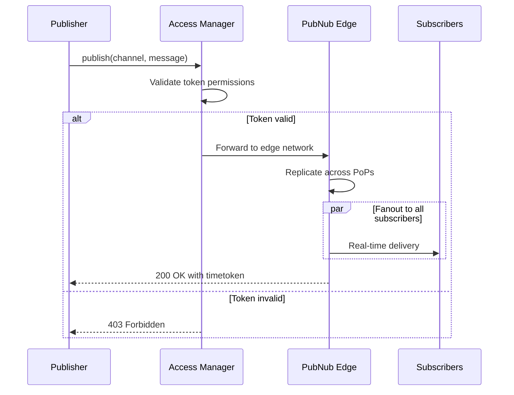

# Publish Fundamentals

## Introduction

The Publish service is the core mechanism for sending real-time messages to channels in PubNub. Understanding how Publish works, its capabilities, and limitations is fundamental to building reliable real-time applications.

This document covers the essential concepts every Solution Architect needs to know about publishing messages.

## What is Publish?

**Publish** sends a message to a specific channel, which is then distributed in real-time to all subscribers of that channel through PubNub's global edge network.

### Key Characteristics

| Characteristic | Description |
|----------------|-------------|
| **Real-time delivery** | Messages delivered to subscribers in <30ms globally |
| **Fanout** | Single publish reaches all channel subscribers simultaneously |
| **Ephemeral by default** | Messages are not stored unless explicitly configured |
| **Global replication** | Messages replicated across all Points of Presence |
| **Ordered** | Messages maintain publish order (per publisher) |

### When to Use Publish

Use Publish when you need to:

- Send real-time messages (chat, notifications, alerts)
- Broadcast events to multiple recipients (live scores, prices)
- Trigger client-side updates (UI changes, state sync)
- Coordinate between users (multiplayer games, collaboration)
- Command IoT devices (control signals, configuration)

### When NOT to Use Publish

Don't use Publish for:

- **Large file transfers** - Use the Files service instead (5 MB limit)
- **Request-response patterns** - Use Functions On Request or direct HTTP APIs
- **Database writes** - Use your database; publish events after writes
- **Long-running operations** - Use webhooks or background jobs

## Publish API Mechanics

### SDK Method (Recommended)

```javascript
// JavaScript SDK example
const result = await pubnub.publish({
  channel: 'chat.room123',
  message: {
    type: 'chat.message',
    schemaVersion: '1.0',
    eventId: 'msg_abc123',
    ts: Date.now(),
    payload: {
      text: 'Hello World!',
      userId: 'user456'
    }
  }
});

console.log('Published at timetoken:', result.timetoken);
```

**SDK Parameters:**

| Parameter | Required | Type | Description |
|-----------|----------|------|-------------|
| `channel` | Yes | string | Channel name (max 2,048 chars) |
| `message` | Yes | any | Message payload (serialized to JSON) |
| `storeInHistory` | No | boolean | Store in History (default: true if enabled) |
| `meta` | No | object | Metadata for filtering (not stored) |
| `ttl` | No | number | Per-message retention in minutes |

### REST API Reference

For platforms without SDKs or when you need direct HTTP access, use the Publish REST API.

#### Endpoint Structure

```
https://ps.pndsn.com/publish/{pub_key}/{sub_key}/{signature}/{channel}/{callback}/{message}
       |_____________|       |______|  |______|  |_______|  |_______|  |______| |_______|
            Host              Path Parameters (6 required components)
```

**Host Options:**
- `ps.pndsn.com` - Standard global endpoint (recommended)
- `{origin}.pndsn.com` - Custom origin (if configured in Admin Portal)

#### Path Parameters

| Position | Parameter | Required | Description | Example Value |
|----------|-----------|----------|-------------|---------------|
| 1 | `pub_key` | Yes | Publish key from Admin Portal | `pub-c-abc123...` |
| 2 | `sub_key` | Yes | Subscribe key from Admin Portal | `sub-c-xyz789...` |
| 3 | `signature` | Yes | HMAC signature for admin operations, or `0` | `0` |
| 4 | `channel` | Yes | Channel name (URL-encoded if contains special chars) | `chat.room123` |
| 5 | `callback` | Yes | JSONP callback name, or `0` for JSON | `0` |
| 6 | `message` | Yes | URL-encoded JSON message payload | `%7B%22text%22%3A%22Hello%22%7D` |

**Notes:**
- Position 3 (`signature`): Use `0` for standard publishes. Only required for admin operations with secret key.
- Position 5 (`callback`): Use `0` for standard JSON responses. JSONP is rarely needed in modern applications.
- Position 6 (`message`): Must be valid JSON, URL-encoded. Max size: 32 KiB (after encoding).

#### Query Parameters

| Parameter | Required | Type | Default | Description |
|-----------|----------|------|---------|-------------|
| `uuid` | **Yes** | string | N/A | Client identifier (max 92 characters) |
| `auth` | Conditional | string | none | Access Manager token (required if Access Manager enabled) |
| `store` | No | `0` or `1` | keyset default | `0` = don't store, `1` = store in History |
| `ttl` | No | number | keyset default | Message retention in minutes (e.g., `60` for 1 hour) |
| `meta` | No | string | none | URL-encoded JSON metadata for filtering |
| `norep` | No | `true` | false | Fire mode: no replication, Functions/Illuminate only |
| `seqn` | No | number | none | Sequence number for message ordering |
| `timestamp` | No | number | none | Unix timestamp (for signature-based requests) |

#### URL Encoding Reference

Common characters that must be URL-encoded in the message payload:

| Character | Encoded | Character | Encoded |
|-----------|---------|-----------|---------|
| `{` | `%7B` | `}` | `%7D` |
| `"` | `%22` | `'` | `%27` |
| `:` | `%3A` | `,` | `%2C` |
| `[` | `%5B` | `]` | `%5D` |
| space | `%20` | `/` | `%2F` |

**Example:**
- Original: `{"text":"Hello World"}`
- Encoded: `%7B%22text%22%3A%22Hello%20World%22%7D`

#### Annotated URL Examples

**Example 1: Basic Publish (Minimum Required)**

```
https://ps.pndsn.com/publish/pub-c-abc123/sub-c-xyz789/0/chat.room123/0/%7B%22text%22%3A%22Hello%22%7D?uuid=user123
                              |__________|  |_________|  | |___________|  |__________________________| |__________|
                               pub_key      sub_key      | channel         URL-encoded message         uuid (required)
                                                         signature=0       {"text":"Hello"}
```

**Decoded message**: `{"text":"Hello"}`

---

**Example 2: With Access Manager Token**

```
https://ps.pndsn.com/publish/pub-c-abc123/sub-c-xyz789/0/chat.room123/0/%7B%22text%22%3A%22Hello%22%7D?uuid=user123&auth=p0F2AkF0GlNECg...
                                                                                                                     |___________________|
                                                                                                                     Access Manager token
```

**Use case**: When Access Manager is enabled, token grants `write` permission.

---

**Example 3: Fire Mode (No Replication)**

```
https://ps.pndsn.com/publish/pub-c-abc123/sub-c-xyz789/0/analytics.events/0/%7B%22event%22%3A%22pageview%22%7D?uuid=server&norep=true
                                                                                                                              |_________|
                                                                                                                              Fire mode
```

**Decoded message**: `{"event":"pageview"}`
**Use case**: Send to Functions/Illuminate only, no subscriber delivery, lowest latency.

---

**Example 4: With Storage and TTL Override**

```
https://ps.pndsn.com/publish/pub-c-abc123/sub-c-xyz789/0/chat.room123/0/%7B%22text%22%3A%22Hello%22%7D?uuid=user123&store=1&ttl=1440
                                                                                                                     |_____| |________|
                                                                                                                     store   1440 min (24h)
```

**Use case**: Ensure message is stored for 24 hours regardless of keyset default.

---

**Example 5: With Metadata for Subscriber Filtering**

```
https://ps.pndsn.com/publish/pub-c-abc123/sub-c-xyz789/0/events.room123/0/%7B%22type%22%3A%22bid%22%7D?uuid=user123&meta=%7B%22priority%22%3A%22high%22%7D
                                                                                                                   |__________________________________|
                                                                                                                   Metadata: {"priority":"high"}
```

**Decoded metadata**: `{"priority":"high"}`
**Use case**: Subscribers can filter on `meta.priority == 'high'`.

---

**Example 6: Complete Message with All Required Fields**

```
https://ps.pndsn.com/publish/pub-c-abc123/sub-c-xyz789/0/vote-submit.session123/0/%7B%22type%22%3A%22vote.submit%22%2C%22schemaVersion%22%3A%221.0%22%2C%22eventId%22%3A%22evt_123%22%2C%22ts%22%3A1706889600000%2C%22payload%22%3A%7B%22optionId%22%3A%22A%22%7D%7D?uuid=user456
```

**Decoded message**:
```json
{
  "type": "vote.submit",
  "schemaVersion": "1.0",
  "eventId": "evt_123",
  "ts": 1706889600000,
  "payload": {
    "optionId": "A"
  }
}
```

**Use case**: Production-ready message with all required fields.

#### HTTP Methods

**GET Method (Default)**
- Message in URL path (position 6)
- Simple, works everywhere
- Limited by URL length (~2KB practical limit)

```bash
curl "https://ps.pndsn.com/publish/pub-c-xxx/sub-c-xxx/0/chat.room123/0/%7B%22text%22%3A%22Hello%22%7D?uuid=user123"
```

**POST Method (For Larger Payloads)**
- Message in request body
- Supports up to 32 KiB payloads
- Use `0` for message position in URL

```bash
curl -X POST "https://ps.pndsn.com/publish/pub-c-xxx/sub-c-xxx/0/chat.room123/0?uuid=user123" \
  -H "Content-Type: application/json" \
  -d '{"type":"chat.message","schemaVersion":"1.0","eventId":"msg_123","ts":1706889600000,"payload":{"text":"Hello World"}}'
```

#### curl Command Examples

**Basic Publish (GET)**
```bash
curl "https://ps.pndsn.com/publish/pub-c-xxx/sub-c-xxx/0/test.channel/0/%7B%22text%22%3A%22Hello%22%7D?uuid=user123"
```

**Basic Publish (POST)**
```bash
curl -X POST "https://ps.pndsn.com/publish/pub-c-xxx/sub-c-xxx/0/test.channel/0?uuid=user123" \
  -H "Content-Type: application/json" \
  -d '{"text":"Hello World"}'
```

**With Access Manager Token**
```bash
curl "https://ps.pndsn.com/publish/pub-c-xxx/sub-c-xxx/0/chat.room123/0/%7B%22text%22%3A%22Hello%22%7D?uuid=user123&auth=YOUR_TOKEN_HERE"
```

**Fire Mode (Analytics)**
```bash
curl "https://ps.pndsn.com/publish/pub-c-xxx/sub-c-xxx/0/analytics.events/0/%7B%22event%22%3A%22click%22%7D?uuid=user123&norep=true"
```

**With Storage and TTL**
```bash
curl "https://ps.pndsn.com/publish/pub-c-xxx/sub-c-xxx/0/chat.room123/0/%7B%22text%22%3A%22Hello%22%7D?uuid=user123&store=1&ttl=60"
```

**With Metadata**
```bash
curl "https://ps.pndsn.com/publish/pub-c-xxx/sub-c-xxx/0/events.room123/0/%7B%22type%22%3A%22bid%22%7D?uuid=user123&meta=%7B%22priority%22%3A%22high%22%7D"
```

**Production-Ready Message (POST)**
```bash
curl -X POST "https://ps.pndsn.com/publish/pub-c-xxx/sub-c-xxx/0/vote-submit.session123/0?uuid=user456" \
  -H "Content-Type: application/json" \
  -d '{
    "type": "vote.submit",
    "schemaVersion": "1.0",
    "eventId": "evt_'$(date +%s)'_'$RANDOM'",
    "ts": '$(date +%s000)',
    "payload": {
      "sessionId": "session123",
      "optionId": "option_A",
      "voterId": "user456"
    }
  }'
```

#### Response Format

**Success (HTTP 200)**
```json
[1, "Sent", "17069876543210000"]
```
- `[0]` = `1` (success)
- `[1]` = `"Sent"` (status message)
- `[2]` = `"17069876543210000"` (timetoken)

**Failure (HTTP 200 with error)**
```json
[0, "Message Too Large", ""]
```
- `[0]` = `0` (failure)
- `[1]` = Error description
- `[2]` = Empty string (no timetoken)

**HTTP Error Codes**
- `400` - Bad Request (malformed URL or message)
- `403` - Forbidden (invalid Access Manager token)
- `413` - Payload Too Large (>32 KiB)
- `414` - URI Too Long (URL exceeds limit)

#### REST API Best Practices

1. **Use POST for messages >1KB** - Avoid URL length limits
2. **Always URL-encode the message** - Especially quotes, braces, colons
3. **Include all required message fields** - `type`, `schemaVersion`, `eventId`, `ts`
4. **Use `store=1` for persistent data** - Chat, votes, audit trails
5. **Use `norep=true` (Fire) for analytics** - No subscriber delivery needed
6. **Always include `uuid` parameter** - Required for all requests
7. **Use `auth` parameter when Access Manager enabled** - Get token from your server

### Publish Flow Diagram



## Response Format

### Success Response

When a publish succeeds, PubNub returns:

```json
[1, "Sent", "17069876543210000"]
```

**Response Array:**

| Index | Type | Description |
|-------|------|-------------|
| `[0]` | number | Status: `1` = success, `0` = failure |
| `[1]` | string | Status message ("Sent" or error description) |
| `[2]` | string | Timetoken (17-digit precision timestamp) |

**Timetoken Details:**

- **Format**: 17 digits representing time in 10-nanosecond intervals
- **Example**: `17069876543210000` = `1706987654.321` seconds since Unix epoch
- **Use cases**: Ordering messages, fetching history, auditing

### Failure Response

```json
[0, "Message Too Large", ""]
```

- `[0]` is `0` indicating failure
- `[1]` contains error description
- `[2]` is empty (no timetoken)

### SDK Response Object

```javascript
{
  timetoken: '17069876543210000'
}
```

## HTTP Status Codes

Understanding HTTP status codes is critical for proper error handling.

### Success Codes

| Code | Meaning | Action |
|------|---------|--------|
| **200 OK** | Publish successful | Process timetoken, continue |

### Client Error Codes

| Code | Meaning | Cause | Solution |
|------|---------|-------|----------|
| **400 Bad Request** | Malformed request | Invalid channel name, malformed JSON | Validate input, check message format |
| **402 Payment Required** | Quota exceeded | Monthly message limit reached | Upgrade plan or wait for reset |
| **403 Forbidden** | Access denied | Invalid/expired token, insufficient permissions | Refresh token, check grants |
| **413 Payload Too Large** | Message exceeds limit | Payload > 32 KiB | Reduce message size, use Files service |
| **414 URI Too Long** | URL exceeds limit | REST API with large message in URL | Use POST instead of GET |

### Rate Limiting

| Code | Meaning | Cause | Solution |
|------|---------|-------|----------|
| **429 Too Many Requests** | Rate limited | Exceeded publish rate limit | Implement exponential backoff |

### Server Error Codes

| Code | Meaning | Cause | Solution |
|------|---------|-------|----------|
| **500 Internal Server Error** | Server error | Temporary PubNub issue | Retry with exponential backoff |
| **503 Service Unavailable** | Service degraded | Temporary capacity issue | Retry with exponential backoff |

## Payload Size Limits

### Size Limits (MCP-Verified)

| Limit | Value | Notes |
|-------|-------|-------|
| **Maximum payload** | 32 KiB (32,768 bytes) | Hard limit, HTTP 413 if exceeded | 2MB limit (coming soon)
| **Recommended maximum** | 25 KiB | Leave room for headers and encoding |
| **Optimal size** | <2 KiB | Best balance of latency and throughput  and costs (1 transaction) |

### How Size is Calculated

The 32 KiB limit includes:

1. **Serialized JSON message** - All keys and values
2. **Channel name** - Included in total calculation
3. **Metadata** - Counted separately, does NOT count toward 32 KiB
4. **URL encoding overhead** - For REST API (GET requests)

**Example Calculation:**

```javascript
const message = {
  type: 'chat.message',
  schemaVersion: '1.0',
  eventId: 'msg_123',
  ts: 1706889600000,
  payload: {
    text: 'Hello World!'
  }
};

// Serialized size
const serialized = JSON.stringify(message);
console.log('Size:', serialized.length, 'bytes');  // ~150 bytes

// Channel name adds to total
const channelName = 'chat.room123';
console.log('Channel:', channelName.length, 'bytes');  // 13 bytes

// Total: ~163 bytes (well under 32 KiB)
```

### Exceeding Size Limits

If your data exceeds 25 KiB:

**Option 1: Reference Large Data**
```javascript
// ❌ WRONG: Embed large data
await pubnub.publish({
  channel: 'data.updates',
  message: { data: largeArrayWith50000Items }  // Will fail
});

// ✅ CORRECT: Publish reference
await pubnub.publish({
  channel: 'data.updates',
  message: {
    type: 'data.available',
    eventId: 'data_123',
    payload: {
      downloadUrl: 'https://storage.example.com/data_123.json',
      recordCount: 50000
    }
  }
});
```

**Option 2: Use Files Service**
```javascript
// For binary files or large assets (up to 5 MB)
await pubnub.sendFile({
  channel: 'attachments.room123',
  file: fileObject  // Automatically publishes file event
});
```

**Option 3: Client-Side Compression**
```javascript
// Compress before publish, decompress on receive
const compressed = LZString.compress(JSON.stringify(largeData));
await pubnub.publish({
  channel: 'data.compressed',
  message: {
    type: 'data.compressed',
    payload: { compressed }
  }
});
```

## Store vs Fire

### Store (Default Behavior)

When `store` is true (or `storeInHistory: true` in SDK):

- Message is **replicated** across all PubNub Points of Presence
- Message is **delivered** to all active subscribers
- Message is **stored** in History (if Message Persistence enabled on keyset)
- Message can be **retrieved** later via Fetch/History API

**Use Store for:**
- Chat messages (history on join)
- Notifications (catch-up on reconnect)
- Vote submissions (audit trail)
- Any data users might need to see after joining

### Fire (norep: true)

When `norep` is true (Fire mode):

- Message sent to **nearest PoP only** (no global replication)
- Message **NOT stored** in History
- Message **NOT delivered** to regular subscribers
- **Only** Functions event handlers and Illuminate receive the message

**Use Fire for:**
- Server-to-Function communication
- Analytics events (Illuminate ingestion)
- Ephemeral data that doesn't need real-time fanout
- Lowest possible latency (no replication overhead)

### Comparison Table

| Feature | Store (Default) | Fire (norep: true) |
|---------|----------------|--------------------|
| **Replication** | Global (all PoPs) | Single PoP |
| **Subscriber delivery** | Yes | No (Functions/Illuminate only) |
| **History storage** | Optional | Never |
| **Latency** | ~30ms | ~10-20ms (no replication) |
| **Use case** | User-facing messages | Backend processing, analytics |

### Fire Example

```javascript
// Fire: Send to Functions/Illuminate only
await pubnub.fire({
  channel: 'analytics.events',
  message: {
    type: 'analytics.pageview',
    eventId: 'view_123',
    payload: {
      page: '/products',
      userId: 'user456',
      timestamp: Date.now()
    }
  }
});
```

**REST API Fire:**
```
GET https://ps.pndsn.com/publish/{pub_key}/{sub_key}/0/{channel}/0/{message}?norep=true
```

## Error Handling Patterns

### Basic Error Handling

```javascript
async function publishMessage(channel, message) {
  try {
    const result = await pubnub.publish({ channel, message });
    console.log('Success:', result.timetoken);
    return result;
  } catch (error) {
    console.error('Publish failed:', error);
    throw error;
  }
}
```

### Robust Error Handling

```javascript
async function publishWithRetry(channel, message, maxRetries = 3) {
  for (let attempt = 1; attempt <= maxRetries; attempt++) {
    try {
      const result = await pubnub.publish({ channel, message });
      console.log(`Published successfully (attempt ${attempt})`);
      return result;
      
    } catch (error) {
      const statusCode = error.status?.statusCode;
      
      // Handle specific error codes
      if (statusCode === 403) {
        console.warn('Token expired, refreshing...');
        await refreshToken();
        // Retry after token refresh
        continue;
        
      } else if (statusCode === 413) {
        console.error('Message too large, cannot retry');
        throw new Error('Message exceeds 32 KiB limit');
        
      } else if (statusCode === 429) {
        // Exponential backoff for rate limiting
        const backoffMs = Math.min(1000 * Math.pow(2, attempt), 30000);
        console.warn(`Rate limited, backing off ${backoffMs}ms`);
        // In production: implement delay with setTimeout callback or message queue
        continue;
        
      } else if (statusCode >= 500) {
        // Server error - retry with backoff
        const backoffMs = Math.min(500 * Math.pow(2, attempt), 10000);
        console.warn(`Server error, retrying in ${backoffMs}ms`);
        // In production: implement delay with setTimeout callback or message queue
        continue;
        
      } else {
        // Permanent error - don't retry
        console.error('Permanent error:', statusCode);
        throw error;
      }
    }
  }
  
  throw new Error(`Failed to publish after ${maxRetries} attempts`);
}
```

**Note:** The delay implementation is omitted for simplicity. In production, implement delays using setTimeout with callbacks or a message queue to avoid blocking.

### Error Handling Best Practices

| Error Type | Retry Strategy | Additional Actions |
|------------|---------------|-------------------|
| **403 Forbidden** | Refresh token, then retry | Check Access Manager grants |
| **413 Too Large** | Don't retry | Reduce message size or use Files |
| **429 Rate Limit** | Exponential backoff | Implement message queue |
| **500/503 Server** | Exponential backoff | Alert monitoring system |
| **Network timeout** | Linear backoff | Check connectivity |

### Exponential Backoff Implementation

```javascript
async function exponentialBackoff(fn, maxAttempts = 5) {
  let lastError;
  
  for (let attempt = 0; attempt < maxAttempts; attempt++) {
    try {
      return await fn();
    } catch (error) {
      lastError = error;
      
      // Don't retry on certain errors
      const statusCode = error.status?.statusCode;
      if (statusCode === 403 || statusCode === 413) {
        throw error;
      }
      
      // Calculate backoff delay
      const baseDelay = 1000;  // 1 second
      const maxDelay = 30000;   // 30 seconds
      const delay = Math.min(baseDelay * Math.pow(2, attempt), maxDelay);
      
      // Add jitter to prevent thundering herd
      const jitter = Math.random() * 200;
      const totalDelay = delay + jitter;
      
      console.log(`Attempt ${attempt + 1} failed, would retry in ${totalDelay}ms`);
      
      // In production: implement delay with setTimeout callback or message queue
      // Example: await new Promise(resolve => setTimeout(resolve, totalDelay));
    }
  }
  
  throw lastError;
}

// Usage
await exponentialBackoff(() => 
  pubnub.publish({ channel: 'chat.room123', message: data })
);
```

**Note:** Actual delay implementation is shown in comments. For production systems, use a message queue or event-driven architecture to handle retries without blocking.

## Performance Considerations

### Publish Latency

| Scenario | Typical Latency |
|----------|-----------------|
| **Store (default)** | 20-50ms |
| **Fire (norep)** | 10-20ms |
| **With encryption** | +5-10ms |
| **Large payloads (>10KB)** | +10-50ms |
| **Cross-region** | +50-150ms (replication) |

### Optimization Tips

1. **Keep payloads small** - <5 KiB for optimal performance
2. **Use Fire for analytics** - No replication overhead
3. **Batch when possible** - Queue messages and publish in bursts
4. **Avoid synchronous publish** - Use async/promises
5. **Reuse connections** - Let SDK manage connection pooling

### Rate Limits

- **Typical limit**: 100-1,000+ messages/sec (varies by plan)
- **Monitor for 429 errors** - Implement backoff
- **Use message queuing** - Control publish rate
- **Consider sharding** - Distribute load across channels

## Common Mistakes

### 1. Not Handling Errors

```javascript
// ❌ WRONG: Fire and forget
pubnub.publish({ channel: 'chat.room123', message: data });

// ✅ CORRECT: Handle success and failure
try {
  const result = await pubnub.publish({ channel: 'chat.room123', message: data });
  markAsSent(result.timetoken);
} catch (error) {
  handleError(error);
}
```

### 2. Ignoring Payload Size

```javascript
// ❌ WRONG: No size check
await pubnub.publish({ 
  channel: 'data', 
  message: { data: possiblyHugeArray } 
});

// ✅ CORRECT: Check size
const serialized = JSON.stringify(message);
if (serialized.length > 30000) {  // 30 KB threshold
  throw new Error('Message too large');
}
await pubnub.publish({ channel: 'data', message });
```

### 3. Blocking UI on Publish

```javascript
// ❌ WRONG: Synchronous blocking
function sendMessage(text) {
  pubnub.publish({ channel: 'chat', message: { text } });  // Blocks
  updateUI();
}

// ✅ CORRECT: Async non-blocking
async function sendMessage(text) {
  updateUI();  // Update immediately
  try {
    await pubnub.publish({ channel: 'chat', message: { text } });
    markAsDelivered();
  } catch (error) {
    markAsFailed();
  }
}
```

## Summary

Key takeaways from Publish Fundamentals:

- **Publish** sends messages to channels for real-time fanout
- **32 KiB** maximum payload size (recommended <30 KiB)
- **Timetoken** returned on success for ordering and history
- **Store vs Fire**: Store for users, Fire for backend
- **Error handling**: Implement retry with exponential backoff
- **Status codes**: 403 (token), 413 (size), 429 (rate limit)

---

**Next**: [02. Message Design](./02-message-design.md) - Learn how to structure messages properly with required fields, schema versioning, and channel naming conventions.

**Lab**: [Lab 1: Basic Publish](./labs/lab-01-basic-publish.md) - Practice publishing with error handling.
