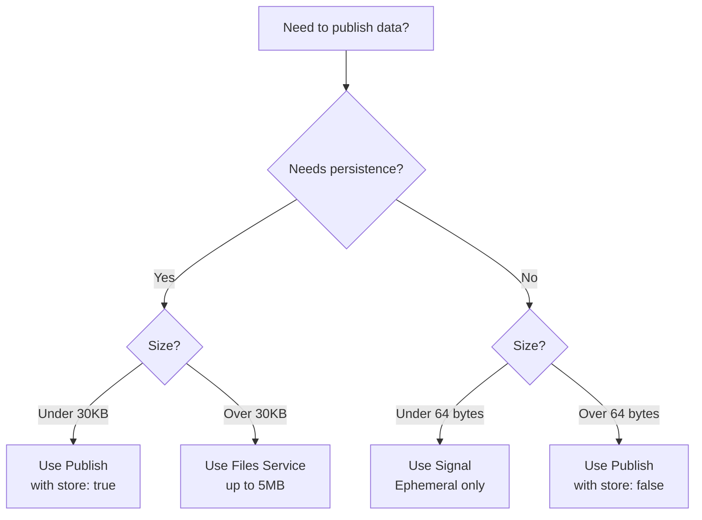
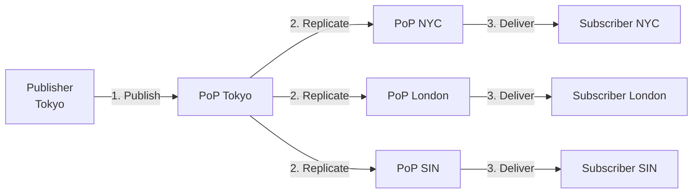
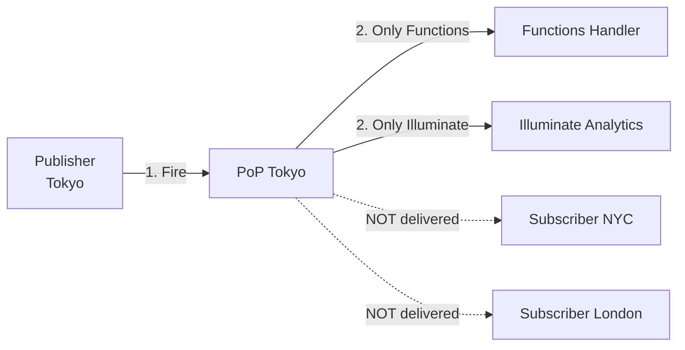

# Advanced Publish

## Introduction

This document covers advanced Publish topics including rate limits, performance optimization, Signals, encryption, replication behavior, and troubleshooting strategies. These concepts are essential for building high-performance, secure real-time applications at scale.

## Publish Rate Limits and Throttling

### Understanding Rate Limits

PubNub enforces rate limits to ensure platform stability and fair resource allocation. Rate limits vary by:

- **Plan tier** (Free, Intro, Pro, Enterprise)
- **Keyset configuration**
- **Account-level quotas**

**Typical Limits**:
- Free tier: 100-200 messages/second
- Paid tiers: 1,000-10,000+ messages/second
- Enterprise: Custom limits

### HTTP 429: Too Many Requests

When you exceed rate limits, PubNub returns HTTP 429:

```json
[0, "Rate Limit Exceeded", ""]
```

**Response Characteristics**:
- Status code: `429`
- Response message indicates throttling
- No timetoken returned

### Detecting Rate Limits

```javascript
try {
  await pubnub.publish({ channel, message });
} catch (error) {
  if (error.status?.statusCode === 429) {
    console.warn('Rate limited!');
    // Implement backoff strategy
  }
}
```

### Exponential Backoff Strategy

```javascript
async function publishWithBackoff(channel, message, maxAttempts = 5) {
  for (let attempt = 0; attempt < maxAttempts; attempt++) {
    try {
      return await pubnub.publish({ channel, message });
      
    } catch (error) {
      if (error.status?.statusCode === 429) {
        // Calculate exponential backoff
        const baseDelay = 1000;  // 1 second
        const maxDelay = 32000;   // 32 seconds
        const delay = Math.min(baseDelay * Math.pow(2, attempt), maxDelay);
        
        // Add jitter to prevent thundering herd
        const jitter = Math.random() * 1000;
        const totalDelay = delay + jitter;
        
        console.log(`Rate limited, backing off ${totalDelay}ms (attempt ${attempt + 1})`);
        await sleep(totalDelay);
        continue;
      }
      
      throw error;  // Re-throw non-429 errors
    }
  }
  
  throw new Error('Failed after max retry attempts');
}
```

### Message Queue Implementation

For high-volume publishing, implement a queue to control rate:

```javascript
class PublishQueue {
  constructor(pubnub, messagesPerSecond = 100) {
    this.pubnub = pubnub;
    this.queue = [];
    this.interval = 1000 / messagesPerSecond;  // ms between messages
    this.processing = false;
  }
  
  enqueue(channel, message) {
    return new Promise((resolve, reject) => {
      this.queue.push({ channel, message, resolve, reject });
      this.process();
    });
  }
  
  async process() {
    if (this.processing || this.queue.length === 0) return;
    
    this.processing = true;
    
    while (this.queue.length > 0) {
      const item = this.queue.shift();
      
      try {
        const result = await this.pubnub.publish({
          channel: item.channel,
          message: item.message
        });
        item.resolve(result);
      } catch (error) {
        item.reject(error);
      }
      
      // Wait before next publish
      if (this.queue.length > 0) {
        await sleep(this.interval);
      }
    }
    
    this.processing = false;
  }
  
  size() {
    return this.queue.length;
  }
}

// Usage
const queue = new PublishQueue(pubnub, 100);  // 100 msg/sec

// Enqueue publishes
await queue.enqueue('chat.room123', message1);
await queue.enqueue('chat.room123', message2);
```

### Rate Limit Monitoring

```javascript
class RateLimitMonitor {
  constructor() {
    this.publishes = [];
    this.throttleCount = 0;
  }
  
  recordPublish() {
    const now = Date.now();
    this.publishes.push(now);
    
    // Keep only last 60 seconds
    this.publishes = this.publishes.filter(t => now - t < 60000);
  }
  
  recordThrottle() {
    this.throttleCount++;
  }
  
  getRate() {
    return this.publishes.length / 60;  // Messages per second (60s window)
  }
  
  getThrottleCount() {
    return this.throttleCount;
  }
  
  getMetrics() {
    return {
      messagesPerSecond: this.getRate(),
      throttleCount: this.throttleCount,
      recentPublishes: this.publishes.length
    };
  }
}

// Usage with monitoring
const monitor = new RateLimitMonitor();

async function monitoredPublish(channel, message) {
  try {
    const result = await pubnub.publish({ channel, message });
    monitor.recordPublish();
    return result;
  } catch (error) {
    if (error.status?.statusCode === 429) {
      monitor.recordThrottle();
    }
    throw error;
  }
}
```

## HTTP Pipelining and Connection Reuse

### Connection Pooling

PubNub SDKs automatically manage connection pooling:

- **HTTP Keep-Alive** - Reuses TCP connections
- **Connection Pooling** - Multiple concurrent requests
- **Automatic Reconnection** - Handles network disruptions

### Optimizing for High Throughput

```javascript
// ✅ GOOD: Parallel publishes (SDK handles pooling)
const publishPromises = messages.map(msg => 
  pubnub.publish({ channel: msg.channel, message: msg.data })
);

const results = await Promise.all(publishPromises);

// ❌ BAD: Sequential publishes (slower)
for (const msg of messages) {
  await pubnub.publish({ channel: msg.channel, message: msg.data });
}
```

### Batch Publishing Pattern

```javascript
async function batchPublish(messages, batchSize = 10) {
  const results = [];
  
  for (let i = 0; i < messages.length; i += batchSize) {
    const batch = messages.slice(i, i + batchSize);
    
    const batchResults = await Promise.all(
      batch.map(msg => 
        pubnub.publish({ channel: msg.channel, message: msg.data })
      )
    );
    
    results.push(...batchResults);
    
    // Optional: Delay between batches to avoid throttling
    if (i + batchSize < messages.length) {
      await sleep(100);  // 100ms between batches
    }
  }
  
  return results;
}

// Usage
const messages = [
  { channel: 'chat.room1', data: { text: 'Hello' } },
  { channel: 'chat.room2', data: { text: 'World' } },
  // ... 100 more messages
];

await batchPublish(messages, 20);  // 20 messages per batch
```

## Publish with Metadata (meta parameter)

### What is Metadata?

The `meta` parameter allows you to attach metadata to messages without increasing the message payload size. Metadata enables subscriber-side filtering.

**Key Properties**:
- Does NOT count toward 32 KiB payload limit
- NOT stored in Message Persistence
- Available for subscriber filtering
- Remains unencrypted (even with cipher key)

### Use Cases

| Use Case | Metadata Fields |
|----------|----------------|
| **Priority filtering** | `priority: "high"` |
| **Regional routing** | `region: "us-west"` |
| **Feature flags** | `beta: true` |
| **Content tags** | `tags: ["sports", "live"]` |
| **User segments** | `segment: "premium"` |

### Publishing with Metadata

```javascript
await pubnub.publish({
  channel: 'events.room123',
  message: {
    type: 'event.bid',
    eventId: 'bid_123',
    ts: Date.now(),
    payload: {
      amount: 500,
      itemId: 'item_789'
    }
  },
  meta: {
    priority: 'high',
    region: 'us-west',
    tags: ['auction', 'live']
  }
});
```

### Subscriber-Side Filtering

```javascript
// Subscribe with filter expression
pubnub.subscribe({
  channels: ['events.room123'],
  filterExpression: "meta.priority == 'high' && meta.region == 'us-west'"
});

// Only receives messages matching filter
pubnub.addListener({
  message: (event) => {
    console.log('High-priority US-West event:', event.message);
    console.log('Metadata:', event.userMetadata);
  }
});
```

## Per-Message TTL Configuration

### TTL (Time-To-Live)

TTL controls how long a message is retained in Message Persistence, overriding the keyset default.

**TTL Parameter**:
- **Unit**: Minutes
- **Value**: `0` to unlimited (integer or float)
- **Only applies if**: `storeInHistory: true`

### TTL Examples

```javascript
// Short-lived message (1 hour)
await pubnub.publish({
  channel: 'alerts.user123',
  message: { text: 'Session expiring soon' },
  storeInHistory: true,
  ttl: 60  // 60 minutes = 1 hour
});

// Medium-lived message (24 hours)
await pubnub.publish({
  channel: 'chat.room123',
  message: { text: 'Hello!' },
  storeInHistory: true,
  ttl: 1440  // 1440 minutes = 24 hours
});

// Use keyset default retention
await pubnub.publish({
  channel: 'chat.room123',
  message: { text: 'Persisted' },
  storeInHistory: true,
  ttl: 0  // 0 = use keyset default
});

// Ephemeral (not stored)
await pubnub.publish({
  channel: 'typing.room123',
  message: { typing: true },
  storeInHistory: false
  // ttl ignored when storeInHistory is false
});
```

### TTL Use Cases

| Use Case | TTL | Rationale |
|----------|-----|-----------|
| **Typing indicators** | N/A (don't store) | Ephemeral only |
| **Session alerts** | 60 min | Valid for session |
| **Chat messages** | 24-168 hours | Recent history |
| **Audit logs** | Unlimited | Compliance |
| **Temporary codes** | 5-15 min | Security (2FA, OTP) |

## Signals vs Messages

### Comparison Table

| Feature | Message (Publish) | Signal |
|---------|-------------------|--------|
| **Max size** | 32 KiB | **64 bytes** |
| **Persistence** | Optional (storeInHistory) | **Never stored** |
| **Replication** | Yes (global) | Yes (global) |
| **Mobile Push** | Supported (pn_apns/pn_fcm) | **NOT supported** |
| **History** | Yes (if enabled) | **No** |
| **Billing** | Standard transaction | Lower cost |
| **Latency** | 20-50ms | 10-30ms |

### When to Use Signals

Use Signals for:
- **Typing indicators** (`{ typing: true }`)
- **Read receipts** (`{ read: true }`)
- **Cursor positions** (`{ x: 100, y: 200 }`)
- **Presence-like events** (`{ status: "online" }`)
- **Real-time indicators** (any ephemeral, small data)

**DO NOT use Signals for**:
- Messages that need persistence
- Messages that trigger push notifications
- Payloads > 64 bytes
- Critical business events (use regular Publish)

### Signal API

```javascript
// Send signal
await pubnub.signal({
  channel: 'typing.room123',
  message: { typing: true }
});

// Receive signals
pubnub.addListener({
  signal: (event) => {
    console.log('Signal:', event.message);
  }
});
```

### Size Decision Tree



## Encryption with Cipher Key

### AES-256-CBC Encryption

PubNub supports end-to-end encryption using AES-256-CBC:

- **Algorithm**: AES-256-CBC
- **Cipher key**: Never sent to PubNub
- **Encrypted payload**: Base64 encoded (~33% size increase)

### Configuring Encryption

```javascript
// Initialize with cipher key
const pubnub = new PubNub({
  publishKey: 'pub-c-xxx',
  subscribeKey: 'sub-c-xxx',
  userId: 'user123',
  cipherKey: 'my-secret-cipher-key'  // Enables encryption
});

// All publishes are automatically encrypted
await pubnub.publish({
  channel: 'secure.room123',
  message: { sensitiveData: 'encrypted!' }
});

// All subscribes are automatically decrypted
pubnub.subscribe({ channels: ['secure.room123'] });

pubnub.addListener({
  message: (event) => {
    console.log('Decrypted:', event.message);  // Automatically decrypted
  }
});
```

### Per-Channel Encryption

```javascript
// Different cipher keys for different security zones
const publicPubNub = new PubNub({
  publishKey, subscribeKey, userId,
  // No cipher key - messages sent in plaintext
});

const securePubNub = new PubNub({
  publishKey, subscribeKey, userId,
  cipherKey: 'secure-channel-key'
});

// Public channel (no encryption)
await publicPubNub.publish({
  channel: 'public.lobby',
  message: { text: 'Hello all!' }
});

// Secure channel (encrypted)
await securePubNub.publish({
  channel: 'secure.payments',
  message: { amount: 99.99, card: '4111...' }
});
```

### Encryption Considerations

| Consideration | Impact |
|---------------|--------|
| **Payload size** | +33% due to Base64 encoding (effective limit ~24 KiB) |
| **Performance** | +5-10ms latency for encrypt/decrypt |
| **Key management** | Securely distribute cipher keys to clients |
| **Metadata** | `meta` parameter stays unencrypted |
| **Functions** | Cannot read encrypted payloads (no key) |

### Encryption Best Practices

1. **Use strong keys** - At least 32 characters, random
2. **Rotate keys** - Periodically update cipher keys
3. **Key distribution** - Use secure channel (TLS/HTTPS)
4. **Different keys per security zone** - Public vs private channels
5. **Consider metadata** - Use for unencrypted routing info

## Replication Behavior Across PoPs

### Global Replication (Default)

When you publish with `store: true`:

1. Message sent to nearest Point of Presence (PoP)
2. PoP acknowledges (returns timetoken)
3. Message replicated to all other PoPs globally
4. Subscribers receive from their nearest PoP



**Replication Timing**:
- Local delivery: 10-30ms
- Global replication: 50-150ms
- Cross-region delivery: 50-200ms

### Fire (No Replication)

When you publish with `norep: true` (Fire):

- Message sent to nearest PoP only
- NO global replication
- Functions and Illuminate receive message
- Regular subscribers do NOT receive message



## Transaction Classification and Billing

### Publish Transaction Types

| Operation | Transaction Count | Replication Billed? |
|-----------|-------------------|---------------------|
| **Publish (store: true)** | 1 transaction | No (included) |
| **Publish (store: false)** | 1 transaction | No (included) |
| **Fire (norep: true)** | 1 transaction | N/A (no replication) |
| **Signal** | 1 transaction (lower rate) | No (included) |
| **Publish to N channels** | N transactions | No |

### Billing Optimization

**Use Fire for**:
- Server-to-Function communication (no subscribers needed)
- Analytics ingestion (Illuminate only)
- Backend events (no real-time fanout)

**Use Signals for**:
- High-frequency indicators (typing, cursor)
- Lower cost per transaction

**Use store: false for**:
- Ephemeral events that don't need history
- Saves on storage costs

## Performance Optimization Techniques

### 1. Keep Payloads Small

```javascript
// ✅ GOOD: Minimal payload (~200 bytes)
{
  type: 'vote.submit',
  eventId: 'vote_123',
  ts: 1706889600000,
  payload: {
    optionId: 'A'
  }
}

// ❌ BAD: Bloated payload (~15 KB)
{
  type: 'vote.submit',
  eventId: 'vote_123',
  ts: 1706889600000,
  payload: {
    optionId: 'A',
    allOptions: [/* large array */],
    sessionDetails: {/* redundant */},
    userProfile: {/* unnecessary */}
  }
}
```

**Impact**: Smaller payloads = lower latency, higher throughput

### 2. Use Async Publishing

```javascript
// ✅ GOOD: Non-blocking
async function sendMessages() {
  updateUI();  // Don't block UI
  
  try {
    await pubnub.publish({ channel, message });
    markAsDelivered();
  } catch (error) {
    markAsFailed();
  }
}

// ❌ BAD: Blocking (if using sync API)
function sendMessages() {
  pubnub.publish({ channel, message });  // Blocks execution
  updateUI();  // Delayed
}
```

### 3. Batch Multiple Publishes

```javascript
// ✅ GOOD: Parallel batch
const promises = messages.map(msg => 
  pubnub.publish({ channel: msg.channel, message: msg.data })
);
await Promise.all(promises);

// ❌ BAD: Sequential
for (const msg of messages) {
  await pubnub.publish({ channel: msg.channel, message: msg.data });
}
```

### 4. Shard High-Traffic Channels

```javascript
// ✅ GOOD: Sharded by user
function getShardedChannel(baseChannel, userId, shardCount = 100) {
  const shard = hash(userId) % shardCount;
  return `${baseChannel}.shard-${shard}`;
}

const channel = getShardedChannel('notifications', userId, 100);
await pubnub.publish({ channel, message });

// ❌ BAD: Single hot channel
await pubnub.publish({
  channel: 'notifications.all',  // 100K+ subscribers
  message
});
```

### 5. Use Fire for Backend Events

```javascript
// ✅ GOOD: Fire for Functions/Illuminate only
await pubnub.fire({
  channel: 'analytics.events',
  message: analyticsData
});

// ❌ BAD: Regular publish when no subscribers needed
await pubnub.publish({
  channel: 'analytics.events',
  message: analyticsData  // Unnecessary replication
});
```

### 6. Client-Side Compression

```javascript
import LZString from 'lz-string';

// Compress large payloads
const compressed = LZString.compress(JSON.stringify(largeData));

await pubnub.publish({
  channel: 'data.compressed',
  message: {
    type: 'data.compressed',
    payload: { compressed }
  }
});

// Decompress on receive
pubnub.addListener({
  message: (event) => {
    if (event.message.type === 'data.compressed') {
      const decompressed = LZString.decompress(event.message.payload.compressed);
      const data = JSON.parse(decompressed);
      handleData(data);
    }
  }
});
```

## Common Failure Modes and Troubleshooting

### Troubleshooting Matrix

| Symptom | Possible Cause | Solution |
|---------|---------------|----------|
| **403 errors** | Token expired/invalid | Refresh token, check grants |
| **413 errors** | Payload too large | Reduce size, use Files |
| **429 errors** | Rate limited | Implement backoff, queue |
| **Duplicate messages** | Retry without dedup | Include `eventId`, dedupe on receive |
| **Out-of-order** | Network timing | Order by timetoken or client `ts` |
| **Dropped messages** | Network failure | Implement retry with exponential backoff |
| **Slow publish** | Large payload | Reduce size, compress, shard |
| **High latency** | Cross-region | Publish from region nearest to subscribers |

### Diagnostic Checklist

When troubleshooting publish issues:

1. **Check SDK version** - Update to latest
2. **Verify token permissions** - Ensure `write` permission
3. **Measure payload size** - Keep under 30 KiB
4. **Monitor rate limits** - Track 429 responses
5. **Check network connectivity** - Test with curl/Postman
6. **Review error logs** - Capture full error objects
7. **Test with REST API** - Isolate SDK vs service issues
8. **Verify keyset settings** - Check Admin Portal configuration

### Debug Logging

```javascript
// Enable SDK debug logging
const pubnub = new PubNub({
  publishKey, subscribeKey, userId,
  logVerbosity: true  // Verbose logging
});

// Log all publish attempts
async function debugPublish(channel, message) {
  console.log('[PUBLISH]', {
    channel,
    message,
    size: JSON.stringify(message).length,
    timestamp: Date.now()
  });
  
  try {
    const result = await pubnub.publish({ channel, message });
    console.log('[SUCCESS]', {
      timetoken: result.timetoken,
      latency: Date.now() - message.ts
    });
    return result;
  } catch (error) {
    console.error('[FAILURE]', {
      statusCode: error.status?.statusCode,
      category: error.status?.category,
      message: error.message
    });
    throw error;
  }
}
```

## Summary

Key takeaways from Advanced Publish:

- **Rate limits**: Implement exponential backoff and message queuing
- **Metadata**: Use `meta` for filtering (doesn't count toward size limit)
- **TTL**: Control per-message retention (overrides keyset default)
- **Signals**: 64-byte limit, ephemeral, lower cost
- **Encryption**: AES-256-CBC with cipher key (+33% size)
- **Replication**: Global by default, Fire for single PoP
- **Optimization**: Small payloads, async, batching, sharding
- **Troubleshooting**: Check token, size, rate limits, network

---

**Next**: [04. Publish Integrations](./04-publish-integrations.md) - How Publish works with History, Mobile Push, Functions, and Events and Actions.

**Lab**: [Lab 3: Publish at Scale](./labs/lab-03-publish-at-scale.md) - Optimize for high-throughput publishing.
