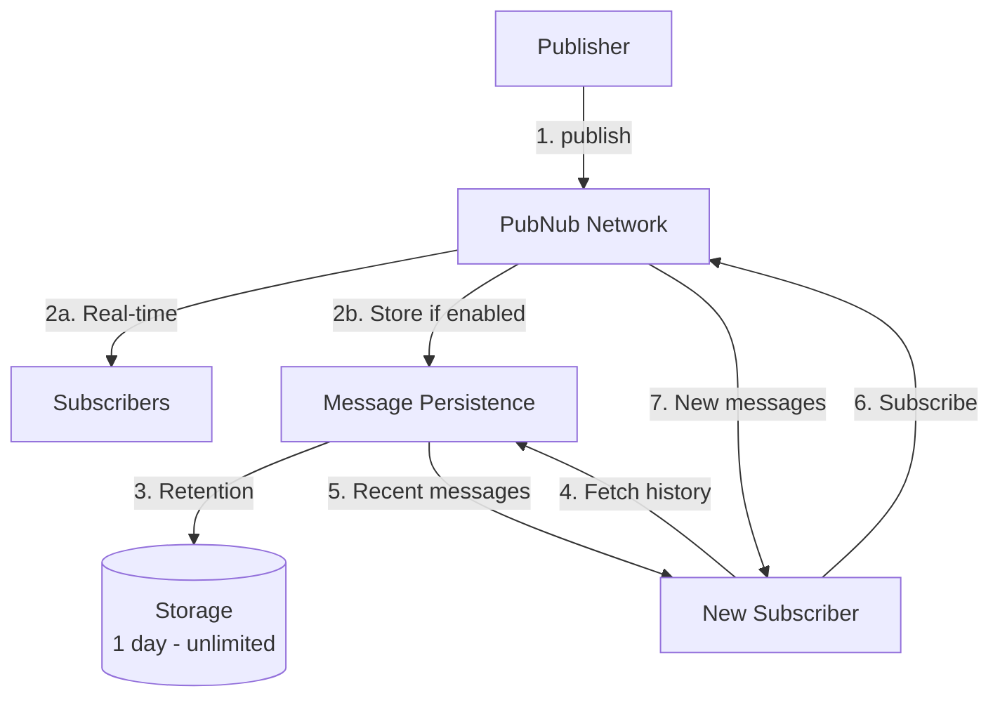
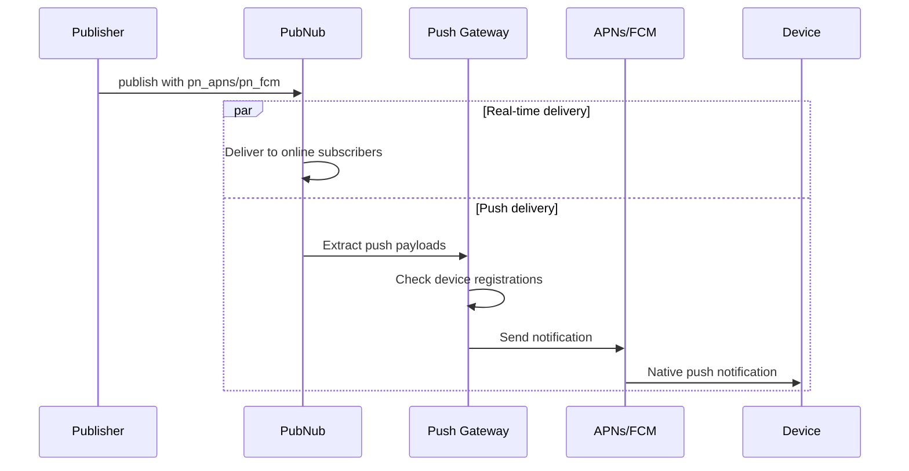
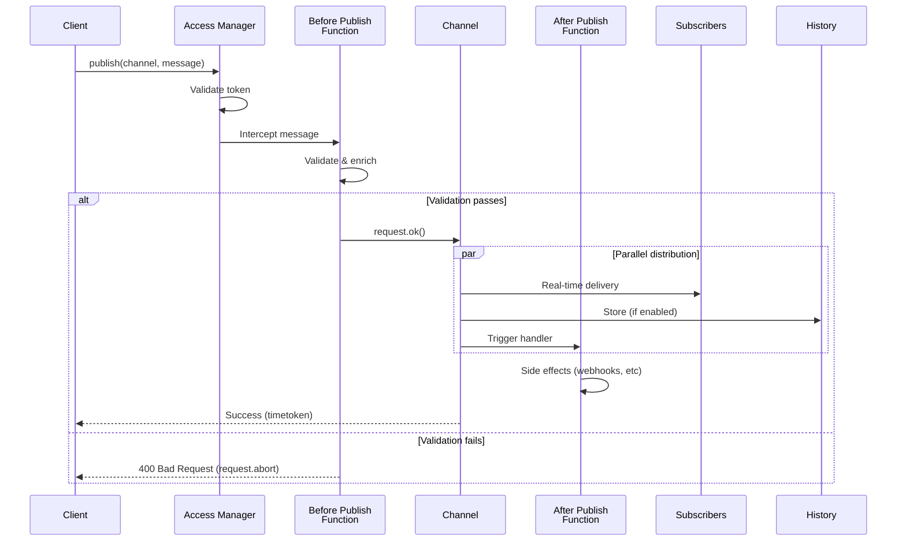
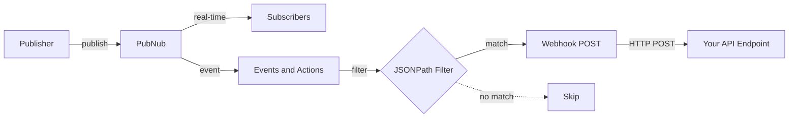
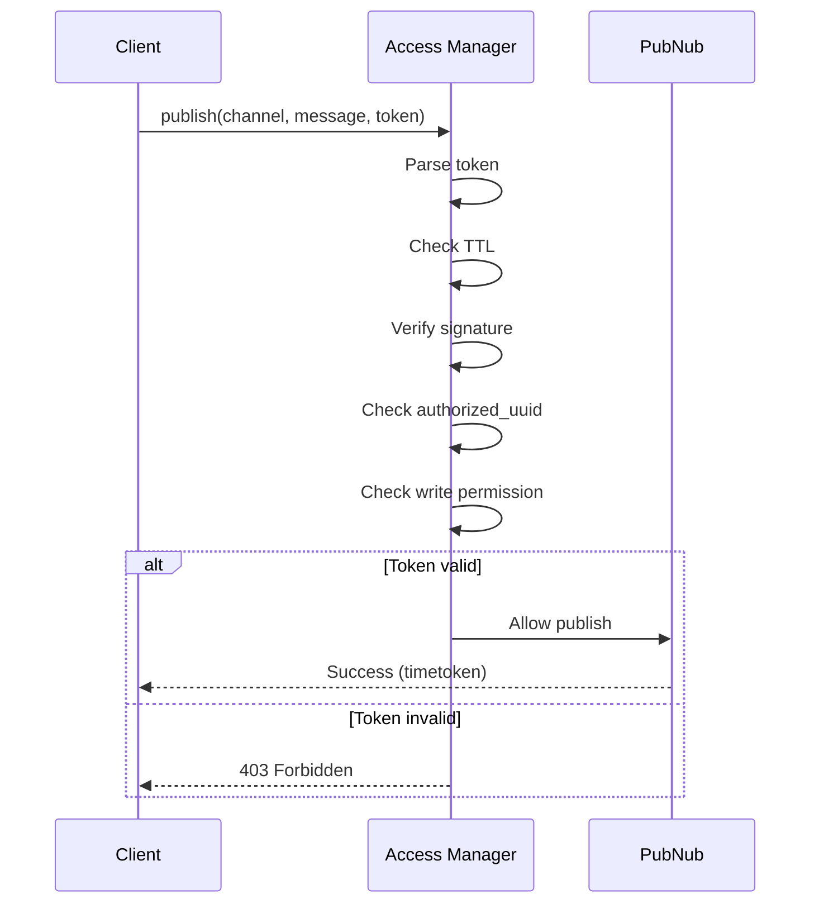
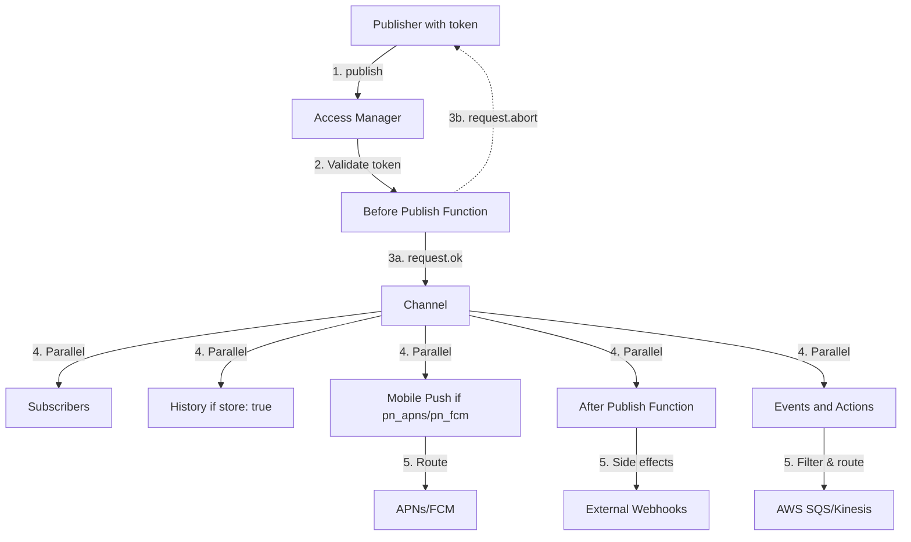

# Publish Integrations

## Introduction

Publish doesn't operate in isolation—it integrates seamlessly with other PubNub services to enable powerful real-time application patterns. This document covers how Publish works with Message Persistence (History), Mobile Push, Functions, Events and Actions, and Access Manager.

## Publish + Message Persistence (History)

### Store Flag

The `storeInHistory` parameter controls whether messages are persisted:

```javascript
// Store message in History (default if enabled on keyset)
await pubnub.publish({
  channel: 'chat.room123',
  message: chatMessage,
  storeInHistory: true  // Stored for later retrieval
});

// Don't store message (ephemeral)
await pubnub.publish({
  channel: 'typing.room123',
  message: typingIndicator,
  storeInHistory: false  // Real-time only
});
```

### Store Decision Matrix

| Message Type | Store? | Rationale |
|--------------|--------|-----------|
| **Chat messages** | Yes | History on join |
| **Typing indicators** | No | Ephemeral only |
| **Vote submissions** | Yes | Audit trail |
| **Vote results** | Yes | Historical record |
| **Cursor positions** | No | Real-time only |
| **System alerts** | Yes | Compliance |
| **Presence updates** | No | Use Presence service |
| **Game moves** | Yes | Replay capability |

### Per-Message TTL

Override keyset retention on a per-message basis:

```javascript
// Short-lived: 1 hour
await pubnub.publish({
  channel: 'session.alerts',
  message: { text: 'Session expiring' },
  storeInHistory: true,
  ttl: 60  // 60 minutes
});

// Medium-lived: 24 hours
await pubnub.publish({
  channel: 'chat.room123',
  message: { text: 'Hello!' },
  storeInHistory: true,
  ttl: 1440  // 1440 minutes = 24 hours
});

// Long-lived: 7 days
await pubnub.publish({
  channel: 'notifications.user123',
  message: { text: 'Important notice' },
  storeInHistory: true,
  ttl: 10080  // 10080 minutes = 7 days
});

// Use keyset default
await pubnub.publish({
  channel: 'chat.room123',
  message: { text: 'Default retention' },
  storeInHistory: true,
  ttl: 0  // 0 = use keyset default
});
```

### Fetching History on Join

Common pattern: Fetch recent history when user joins channel

```javascript
// User joins chat room
async function joinChatRoom(roomId, userId) {
  const channel = `chat.${roomId}`;
  
  // 1. Fetch recent history
  const history = await pubnub.fetchMessages({
    channels: [channel],
    count: 50  // Last 50 messages
  });
  
  // 2. Display history in UI
  displayMessages(history.channels[channel]);
  
  // 3. Subscribe for new messages
  pubnub.subscribe({ channels: [channel] });
  
  // 4. Set up listener for real-time messages
  pubnub.addListener({
    message: (event) => {
      if (event.channel === channel) {
        displayNewMessage(event.message);
      }
    }
  });
}
```

### History with Timetoken Ordering

```javascript
// Get messages between specific timetokens
const messages = await pubnub.fetchMessages({
  channels: ['chat.room123'],
  start: '17069000000000000',  // Older timetoken
  end: '17069876543210000',    // Newer timetoken
  count: 100
});

// Messages are ordered by timetoken (server timestamp)
messages.channels['chat.room123'].forEach(msg => {
  console.log(msg.timetoken, msg.message);
});
```

### Storage Architecture



## Publish + Mobile Push

### Push Payload Structure

Include push payloads in the message to trigger native notifications:

```javascript
await pubnub.publish({
  channel: 'inbox.user123',
  message: {
    // Standard message structure
    type: 'message.new',
    schemaVersion: '1.0',
    eventId: 'msg_abc123',
    ts: Date.now(),
    payload: {
      senderId: 'user456',
      text: 'Hello there!',
      roomId: 'room789'
    },
    
    // Apple Push Notification Service
    pn_apns: {
      aps: {
        alert: {
          title: 'New Message',
          subtitle: 'From Jane',
          body: 'Hello there!'
        },
        sound: 'default',
        badge: 1,
        'content-available': 1
      },
      customData: {
        roomId: 'room789',
        senderId: 'user456'
      }
    },
    
    // Firebase Cloud Messaging
    pn_fcm: {
      notification: {
        title: 'New Message',
        body: 'Jane: Hello there!',
        sound: 'default'
      },
      data: {
        roomId: 'room789',
        senderId: 'user456',
        messageId: 'msg_abc123'
      }
    }
  }
});
```

### Push Payload Limits

| Provider | Max Payload | Recommended |
|----------|-------------|-------------|
| **APNs (Apple)** | 2 KB | <1.5 KB |
| **FCM (Google)** | 4 KB | <3 KB |

**Important**: Push payloads count separately from the 32 KiB message limit.

### Device Registration

Devices must register with PubNub to receive push notifications:

```javascript
// Register device for push on specific channels
await pubnub.push.addChannels({
  channels: ['inbox.user123', 'chat.room456'],
  device: deviceToken,  // From APNs/FCM
  pushGateway: 'apns'   // or 'gcm'
});

// List channels registered for push
const channels = await pubnub.push.listChannels({
  device: deviceToken,
  pushGateway: 'apns'
});

// Remove channels
await pubnub.push.removeChannels({
  channels: ['chat.room456'],
  device: deviceToken,
  pushGateway: 'apns'
});

// Remove all channels (unregister)
await pubnub.push.deleteDevice({
  device: deviceToken,
  pushGateway: 'apns'
});
```

### Push Flow Diagram



### Push Notification Best Practices

1. **Always include both `pn_apns` and `pn_fcm`** for cross-platform support
2. **Keep push payloads minimal** - Title, body, identifiers only
3. **Include deep linking data** - Room ID, message ID, etc.
4. **Localize on client** - Send keys, not translated text
5. **Handle badge counts** - Update badge on each notification
6. **Test thoroughly** - Push is platform-specific

### Conditional Push

Only send push if user is offline:

```javascript
// Check if user is online
const presence = await pubnub.hereNow({
  channels: [`inbox.${userId}`]
});

const isOnline = presence.channels[`inbox.${userId}`].occupancy > 0;

// Conditionally include push payloads
const message = {
  type: 'message.new',
  eventId: 'msg_123',
  ts: Date.now(),
  payload: { text: 'Hello!' }
};

if (!isOnline) {
  // User is offline, include push payload
  message.pn_apns = { /* ... */ };
  message.pn_fcm = { /* ... */ };
}

await pubnub.publish({
  channel: `inbox.${userId}`,
  message
});
```

## Publish + Functions

### Before Publish (Validation)

Functions can intercept messages before delivery to validate, enrich, or block:

```javascript
// Function: chat-message-validator
// Trigger: Before Publish or Fire on chat.*

export default (request) => {
  const message = request.message;
  
  // 1. Validate required fields
  if (!message.type || !message.eventId || !message.payload?.text) {
    return request.abort({
      error: 'invalid_message',
      message: 'Missing required fields'
    });
  }
  
  // 2. Content moderation
  if (containsProfanity(message.payload.text)) {
    return request.abort({
      error: 'inappropriate_content',
      message: 'Message blocked by moderation'
    });
  }
  
  // 3. Rate limiting
  const userId = request.message.payload.userId || request.publisher;
  const rateLimitKey = `rate:${userId}`;
  const lastPublish = kvstore.get(rateLimitKey);
  
  if (lastPublish && Date.now() - lastPublish.timestamp < 1000) {
    return request.abort({
      error: 'rate_limit',
      message: 'Please wait before sending another message'
    });
  }
  
  kvstore.set(rateLimitKey, { timestamp: Date.now() }, 60);
  
  // 4. Enrich with server data
  message.serverTs = Date.now();
  message.verified = true;
  
  // 5. Allow message
  return request.ok();
};

function containsProfanity(text) {
  const profanityList = ['badword1', 'badword2'];
  return profanityList.some(word => 
    text.toLowerCase().includes(word.toLowerCase())
  );
}
```

### After Publish (Side Effects)

Functions can perform side effects after messages are delivered:

```javascript
// Function: notification-sender
// Trigger: After Publish or Fire on mention.*

export default async (request) => {
  const { message, channel, publisher, timetoken } = request;
  const xhr = require('xhr');
  
  // Extract mentioned users
  const mentions = message.payload.mentions || [];
  
  // Send notification to each mentioned user
  for (const userId of mentions) {
    // Call external notification service
    await xhr.fetch('https://api.yourapp.com/notifications', {
      method: 'POST',
      headers: { 'Content-Type': 'application/json' },
      body: JSON.stringify({
        userId: userId,
        type: 'mention',
        message: `${publisher} mentioned you`,
        link: message.payload.link,
        timestamp: timetoken
      })
    });
    
    // Publish to user's inbox
    await pubnub.publish({
      channel: `inbox.${userId}`,
      message: {
        type: 'notification.mention',
        eventId: `mention_${timetoken}`,
        ts: Date.now(),
        payload: {
          mentionedBy: publisher,
          text: message.payload.text,
          link: message.payload.link
        }
      }
    });
  }
  
  return request.ok();
};
```

### Complete Publish Flow with Functions



### Function Use Cases

| Use Case | Function Type | Purpose |
|----------|--------------|---------|
| **Content moderation** | Before Publish | Block profanity, spam |
| **Schema validation** | Before Publish | Ensure required fields |
| **Rate limiting** | Before Publish | Prevent abuse |
| **Message enrichment** | Before Publish | Add server timestamp, metadata |
| **External notifications** | After Publish | Send email, SMS, Slack |
| **Analytics tracking** | After Publish | Log events to external systems |
| **Webhook triggers** | After Publish | Integrate with third-party services |
| **Deduplication** | Before Publish | Check eventId in KV store |

## Publish + Events and Actions

### Event Routing Configuration

Events and Actions routes messages to external systems without requiring Functions code:

**Configuration in Admin Portal**:
1. Create Event Listener
2. Set channel pattern (e.g., `vote-submit.*`)
3. Add filters (optional JSONPath)
4. Configure actions (webhooks, AWS SQS, Kinesis)

### JSONPath Filtering

```javascript
// Publish various messages
await pubnub.publish({
  channel: 'events.room123',
  message: {
    type: 'event.bid',
    priority: 'high',
    payload: { amount: 500 }
  }
});

await pubnub.publish({
  channel: 'events.room123',
  message: {
    type: 'event.bid',
    priority: 'low',
    payload: { amount: 10 }
  }
});

// Events and Actions filter
// $.message[?(@.priority == 'high' && @.payload.amount > 100)]

// Only first message triggers webhook
```

### Webhook Action



**Webhook Payload Example**:
```json
{
  "event": "message",
  "channel": "events.room123",
  "message": {
    "type": "event.bid",
    "priority": "high",
    "payload": { "amount": 500 }
  },
  "timetoken": "17069876543210000",
  "publisher": "user123",
  "subscribeKey": "sub-c-xxx"
}
```

### AWS Integration

**Amazon SQS**:
- Queue name: `pubnub-events`
- Message contains full PubNub event
- Enables async processing at scale

**Amazon Kinesis**:
- Stream name: `pubnub-stream`
- Real-time analytics pipeline
- Integrates with AWS Lambda, Redshift

### Use Cases

| Use Case | Action | Benefit |
|----------|--------|---------|
| **Analytics** | AWS Kinesis | Real-time data pipeline |
| **Audit logs** | Webhook to database | Compliance recording |
| **Email notifications** | Webhook to SendGrid | User engagement |
| **Slack alerts** | Webhook to Slack | Team notifications |
| **Data warehouse** | AWS S3 | Long-term storage |

## Publish + Access Manager

### Token Validation Flow

Every publish is validated against Access Manager:



### Permission Requirements

To publish to a channel, the token MUST grant `write` permission:

```javascript
// Server-side token generation
const token = await pubnub.grantToken({
  ttl: 60,
  authorized_uuid: userId,
  resources: {
    channels: {
      // User can publish to submission channel
      [`vote-submit.${sessionId}`]: {
        read: false,
        write: true  // Required for publish
      },
      
      // User CANNOT publish to results (server-only)
      [`vote-results.${sessionId}`]: {
        read: true,
        write: false  // Blocks client publish
      }
    }
  }
});
```

### Client vs Server Publishing Patterns

#### Pattern 1: Client-Only Publishing

Clients publish user-generated content directly:

```javascript
// Client token with write permission
const clientToken = await grantToken({
  ttl: 60,
  authorized_uuid: userId,
  resources: {
    channels: {
      [`chat.${roomId}`]: { read: true, write: true }
    }
  }
});

// Client publishes directly
await pubnub.publish({
  channel: `chat.${roomId}`,
  message: chatMessage
});

// Before Publish Function validates
// Trigger: Before Publish on chat.*
export default (request) => {
  // Validate content, rate limit, etc.
  return request.ok();
};
```

#### Pattern 2: Server-Only Publishing

Server publishes authoritative events, clients cannot:

```javascript
// Client token: read-only
const clientToken = await grantToken({
  ttl: 60,
  authorized_uuid: userId,
  resources: {
    channels: {
      [`vote-results.${sessionId}`]: { read: true, write: false }
    }
  }
});

// Server publishes results (has secretKey)
const serverPubNub = new PubNub({
  publishKey, subscribeKey,
  secretKey: process.env.SECRET_KEY,  // Full access
  userId: 'server'
});

await serverPubNub.publish({
  channel: `vote-results.${sessionId}`,
  message: authoritativeResults
});
```

#### Pattern 3: Hybrid (Client Submits, Server Publishes Results)

Most secure pattern for voting, payments, etc.:

```javascript
// Clients publish to submission channels
const clientToken = await grantToken({
  ttl: 60,
  authorized_uuid: userId,
  resources: {
    channels: {
      [`vote-submit.${sessionId}`]: { write: true, read: false },
      [`vote-results.${sessionId}`]: { read: true, write: false }
    }
  }
});

// Client submits vote
await pubnub.publish({
  channel: `vote-submit.${sessionId}`,
  message: voteSubmission
});

// Server subscribes to submissions
serverPubNub.subscribe({
  channels: [`vote-submit.*`]
});

serverPubNub.addListener({
  message: async (event) => {
    // Process vote
    await processVote(event.message);
    
    // Calculate tally
    const tally = await calculateTally(sessionId);
    
    // Publish authoritative results
    await serverPubNub.publish({
      channel: `vote-results.${sessionId}`,
      message: { type: 'vote.tally', payload: tally }
    });
  }
});
```

### Permission Matrix

| Role | Submission Channel | Results Channel | Pattern |
|------|-------------------|-----------------|---------|
| **Viewer** | No access | Read-only | Server-only results |
| **Participant** | Write-only | Read-only | Hybrid (submit + view) |
| **Host** | Read + Write | Read + Write | Full control |
| **Server** | All permissions | All permissions | Authoritative |

## Integration Summary

### Service Interaction Matrix

| Service | Publish Integration | Key Configuration |
|---------|-------------------|-------------------|
| **History** | `storeInHistory`, `ttl` | Controls persistence |
| **Mobile Push** | `pn_apns`, `pn_fcm` | Triggers native notifications |
| **Functions (Before)** | Automatic interception | Validation, enrichment |
| **Functions (After)** | Automatic trigger | Side effects, webhooks |
| **Events and Actions** | Automatic routing | JSONPath filters |
| **Access Manager** | Token validation | `write` permission required |

### Complete Integration Flow



## Best Practices

1. **Use store: true for persistent data** - Chat, votes, transactions
2. **Use store: false for ephemeral data** - Typing, cursors, temporary states
3. **Always include push payloads** - For offline user engagement
4. **Validate in Before Publish Functions** - Block bad data at the edge
5. **Separate submission and result channels** - Client submits, server publishes results
6. **Grant minimal permissions** - Write only where needed
7. **Use Events and Actions for analytics** - No code required
8. **Set appropriate TTLs** - Match retention to use case

## Summary

Key takeaways from Publish Integrations:

- **History**: Control persistence with `storeInHistory` and `ttl`
- **Mobile Push**: Include `pn_apns` and `pn_fcm` for notifications
- **Functions**: Validate before publish, trigger side effects after
- **Events and Actions**: Route to external systems with JSONPath filters
- **Access Manager**: Enforce `write` permission, separate client/server roles
- **Best pattern**: Client submits, server publishes authoritative results

---

**Labs**: Practice these integrations with the hands-on exercises:
- [Lab 1: Basic Publish](./labs/lab-01-basic-publish.md)
- [Lab 2: Message Patterns](./labs/lab-02-message-patterns.md)
- [Lab 3: Publish at Scale](./labs/lab-03-publish-at-scale.md)
