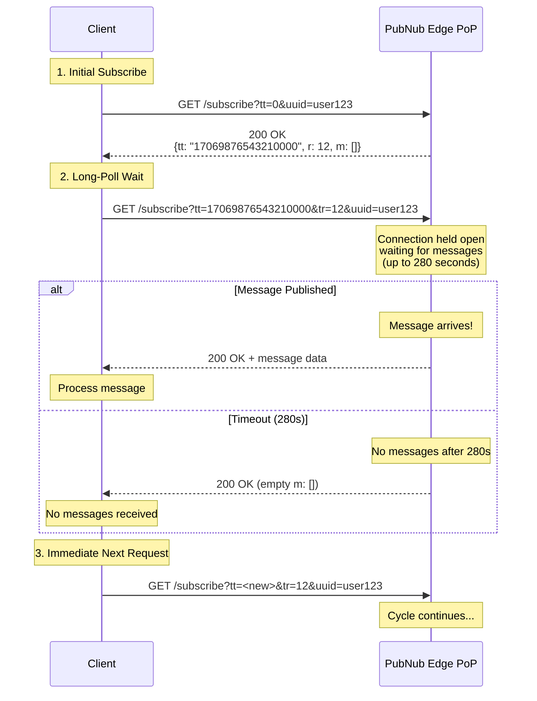

# Subscribe Fundamentals

## Introduction

The Subscribe service is the mechanism for receiving real-time messages from PubNub channels. Unlike traditional polling where clients repeatedly ask "do you have messages?", PubNub uses an HTTP/1.1 long-poll protocol where the server holds the connection open and responds immediately when messages arrive.

Understanding how Subscribe works—especially the long-poll protocol—is fundamental to building reliable real-time applications.

This document covers the essential concepts every Solution Architect needs to know about receiving messages.

## What is Subscribe?

**Subscribe** establishes a persistent connection to PubNub channels, allowing clients to receive messages in real-time as they are published through PubNub's global edge network.

### Key Characteristics

| Characteristic | Description |
|----------------|-------------|
| **Real-time delivery** | Messages delivered within milliseconds of publish |
| **Persistent connection** | Single connection receives all subscribed channels |
| **Stateful protocol** | Uses timetokens to track message sequence |
| **Automatic reconnection** | SDK handles connection failures transparently |
| **Event-driven** | Listener pattern for handling different event types |

### When to Use Subscribe

Use Subscribe when you need to:

- Receive real-time messages (chat, notifications, alerts)
- Listen for events from other users (game moves, collaboration)
- Monitor system events (status updates, sensor data)
- Receive command messages (IoT device control)
- Track user activity (typing indicators, cursor positions)

### When NOT to Use Subscribe

Don't use Subscribe for:

- **One-time data fetching** - Use Fetch/History APIs instead
- **Server-to-server sync** - Use Functions or webhooks
- **Batch processing** - Fetch history in batches
- **Short-lived operations** - Subscribe maintains persistent connection

## Subscribe API Mechanics

### SDK Method (Recommended)

```javascript
// JavaScript SDK example

// Step 1: Add listeners BEFORE subscribing
pubnub.addListener({
  message: (event) => {
    console.log('Message received:', event.message);
    console.log('From channel:', event.channel);
    console.log('Timetoken:', event.timetoken);
  },
  status: (event) => {
    console.log('Connection status:', event.category);
  }
});

// Step 2: Subscribe to channels
pubnub.subscribe({
  channels: ['chat.room123', 'notifications.user456']
});

// Later: Unsubscribe when done
pubnub.unsubscribe({
  channels: ['chat.room123']
});
```

**SDK Parameters:**

| Parameter | Required | Type | Description |
|-----------|----------|------|-------------|
| `channels` | Yes* | string[] | Array of channel names |
| `channelGroups` | Yes* | string[] | Array of channel group names |
| `withPresence` | No | boolean | Subscribe to presence events (covered in Presence module) |
| `timetoken` | No | string | Start from specific timetoken |

*Either `channels` or `channelGroups` required

### REST API Reference

For platforms without SDKs or when you need direct HTTP access, use the Subscribe REST API.

#### Endpoint Structure

```
https://ps.pndsn.com/v2/subscribe/{sub_key}/{channels}/0
       |_____________|      |______|  |_______|  |
            Host           Path Parameters (3 components)
```

**Host**: `ps.pndsn.com` - Standard global endpoint

#### Path Parameters

| Position | Parameter | Required | Description | Example Value |
|----------|-----------|----------|-------------|---------------|
| 1 | `sub_key` | Yes | Subscribe key from Admin Portal | `sub-c-xyz789...` |
| 2 | `channels` | Yes | Comma-separated channel names | `chat.room123,alerts` |
| 3 | `callback` | Yes | JSONP callback or `0` | `0` |

#### Query Parameters

| Parameter | Required | Type | Description |
|-----------|----------|------|-------------|
| `uuid` | **Yes** | string | Client identifier (max 92 characters) |
| `tt` | **Yes** | string | Timetoken from previous response (`0` for init) |
| `tr` | Conditional | number | Region from previous response (required after init) |
| `auth` | Conditional | string | Access Manager token (required if Access Manager enabled) |
| `channel-group` | No | string | Comma-separated channel group names |
| `filter-expr` | No | string | Filter expression for client-side filtering |
| `heartbeat` | No | number | Presence heartbeat interval (covered in Presence module) |

#### Initial Subscribe Request (tt=0)

```
GET https://ps.pndsn.com/v2/subscribe/sub-c-xyz789/chat.room123/0?tt=0&uuid=user123
                                      |_________|  |___________|    |__|  |______|
                                       sub_key      channel        init  client ID
```

**Response (200 OK):**

```json
{
  "t": {
    "t": "17069876543210000",  // Timetoken for next request
    "r": 12                     // Region code
  },
  "m": []  // Empty message array (initial handshake)
}
```

#### Subsequent Subscribe Request (with timetoken)

```
GET https://ps.pndsn.com/v2/subscribe/sub-c-xyz789/chat.room123/0?tt=17069876543210000&tr=12&uuid=user123
                                                                   |________________| |___| 
                                                                   Previous timetoken Region
```

**Response when messages arrive (200 OK):**

```json
{
  "t": {
    "t": "17069876543210001",
    "r": 12
  },
  "m": [
    {
      "a": "1",                              // Shard ID
      "f": 0,                                // Flags
      "i": "publisher-uuid",                 // Publisher's UUID
      "p": {
        "t": "17069876543210001",            // Publish timetoken
        "r": 12                              // Publish region
      },
      "k": "sub-c-xyz789",                   // Subscribe key
      "c": "chat.room123",                   // Channel
      "d": {                                 // Message data
        "type": "chat.message",
        "schemaVersion": "1.0",
        "eventId": "msg_123",
        "ts": 1706987654321,
        "payload": {
          "text": "Hello World!"
        }
      },
      "b": "chat.room123"                    // Channel (backwards compat)
    }
  ]
}
```

**Response when long-poll times out (200 OK):**

```json
{
  "t": {
    "t": "17069876543210000",
    "r": 12
  },
  "m": []  // Empty - no messages within 280 seconds
}
```

## Long-Poll Protocol Deep Dive

This is the **most important** section for understanding Subscribe mechanics.

### What is Long-Polling?

Long-polling is an HTTP technique where the server holds a client's request open until data is available or a timeout occurs. PubNub uses **HTTP/1.1 over TCP** (not WebSockets) for maximum compatibility.

### How the Long-Poll Cycle Works



### Step-by-Step Long-Poll Process

**Step 1: Initial Subscribe (Handshake)**

```javascript
// Client sends initial request with tt=0
GET /v2/subscribe/sub-c-xxx/chat.room123/0?tt=0&uuid=user123

// Server responds immediately with timetoken and region
{
  "t": { "t": "17069876543210000", "r": 12 },
  "m": []
}
```

**What happens:**
- Client sends `tt=0` to indicate "I want to start subscribing"
- Server returns the current timetoken and region
- No messages are returned (this is just the handshake)
- Response is immediate (not a long-poll yet)

**Step 2: Long-Poll Wait**

```javascript
// Client immediately sends next request with timetoken from Step 1
GET /v2/subscribe/sub-c-xxx/chat.room123/0?tt=17069876543210000&tr=12&uuid=user123

// Server HOLDS this connection open
// (Can wait up to 280 seconds)
```

**What happens:**
- Client sends the timetoken and region from previous response
- Server **holds the connection open** - does NOT respond immediately
- Connection remains open waiting for messages
- This is the long-poll: server is waiting to respond

**Step 3a: Message Arrives (Fast Response)**

```javascript
// A message is published to chat.room123

// Server IMMEDIATELY responds with the message
{
  "t": { "t": "17069876543210001", "r": 12 },
  "m": [{ /* message data */ }]
}
```

**What happens:**
- A message is published to the subscribed channel
- Server immediately responds with HTTP 200 + message data
- Connection closes after response
- Client processes the message
- Client immediately sends the next subscribe request

**Step 3b: Timeout (No Messages)**

```javascript
// 280 seconds pass with no messages

// Server responds with empty message array
{
  "t": { "t": "17069876543210000", "r": 12 },
  "m": []
}
```

**What happens:**
- 280 seconds elapse with no messages published
- Server responds with HTTP 200 + empty message array
- Connection closes after response
- Client immediately sends the next subscribe request
- Cycle continues

### Subscribe Transaction Types

PubNub's Subscribe has four distinct transaction types:

| Type | Description | Characteristics |
|------|-------------|-----------------|
| **Init** | Initial subscribe with `tt=0` | Returns timetoken + region, no long-poll |
| **Long-Poll Expiration** | 280s timeout, no messages | HTTP 200, empty `m: []` |
| **Client Disconnect** | Client cancels request | HTTP 499, connection dropped |
| **Message Received** | Messages delivered | HTTP 200, populated `m: [...]` |

### Protocol Timing

| Timing | Value | Notes |
|--------|-------|-------|
| **Server long-poll timeout** | 280 seconds | Fixed (cannot be changed) |
| **Client default timeout** | 310 seconds | SDK configurable via `subscribeTimeout` |
| **Init response time** | <100ms | Immediate handshake |
| **Message delivery time** | <30ms | After publish arrives at PoP |

### Why HTTP/1.1 Over TCP?

PubNub uses HTTP/1.1 long-polling over TCP instead of WebSockets for critical compatibility reasons:

**Advantages:**

1. **Firewall-Friendly**
   - Standard HTTP/HTTPS ports (80/443)
   - No special firewall rules required
   - Works in corporate environments

2. **Proxy-Compatible**
   - HTTP proxies handle long-poll connections
   - WebSockets often blocked by proxies
   - Better enterprise compatibility

3. **No Upgrade Handshake**
   - WebSocket requires HTTP→WS upgrade
   - Upgrade can fail in restricted networks
   - HTTP/1.1 works immediately

4. **Automatic Reconnection**
   - Connection drops are normal part of protocol
   - SDK automatically sends next request
   - No complex reconnection logic needed

5. **Backpressure Management**
   - Server controls when to respond
   - Client controls when to send next request
   - Natural flow control

**Why Not WebSockets?**

- Blocked by many corporate firewalls
- Proxy servers often don't support WebSocket upgrade
- More complex connection management
- PubNub's long-poll provides same real-time performance

## Timetokens and Regions

### Timetokens Explained

A **timetoken** is a 17-digit number representing a precise moment in time.

**Format:** `17069876543210000`

**Interpretation:**
- Represents 10-nanosecond intervals since Unix epoch (January 1, 1970)
- Example: `17069876543210000` = `1706987654.321` seconds = February 3, 2024, 14:34:14.321 UTC

**Purpose:**
- **Message ordering** - Messages ordered by timetoken
- **Message retrieval** - Fetch history from specific timetoken
- **Subscribe resumption** - Resume subscription from last received timetoken
- **Deduplication** - Identify duplicate messages

**Usage in Subscribe:**

```javascript
// Initial subscribe
GET /subscribe?tt=0&uuid=user123
→ Returns: { t: { t: "17069876543210000", r: 12 }, m: [] }

// Next request uses returned timetoken
GET /subscribe?tt=17069876543210000&tr=12&uuid=user123
→ Returns: { t: { t: "17069876543210001", r: 12 }, m: [...] }

// Always use the latest timetoken from the previous response
GET /subscribe?tt=17069876543210001&tr=12&uuid=user123
```

### Regions Explained

A **region** is an integer (typically 1-30) representing which PubNub Point of Presence (PoP) you're connected to.

**Purpose:**
- **Routing consistency** - Ensures subsequent requests go to the same PoP
- **State persistence** - PoP maintains your subscription state
- **Efficient delivery** - Reduces cross-region hops

**Usage:**

```javascript
// Initial subscribe (no region parameter)
GET /subscribe?tt=0&uuid=user123
→ Returns: { t: { t: "...", r: 12 }, m: [] }

// All subsequent requests MUST include the region
GET /subscribe?tt=...&tr=12&uuid=user123
                        ^^^^
                       Region from previous response
```

**Important:**
- Don't include `tr` on initial subscribe (tt=0)
- Always include `tr` on subsequent requests
- Use the region value from the previous response

## Listener Pattern

PubNub SDKs use an event-driven listener pattern for handling different message types.

### Message Listener

Handles regular published messages:

```javascript
pubnub.addListener({
  message: (event) => {
    console.log('Channel:', event.channel);
    console.log('Message:', event.message);
    console.log('Timetoken:', event.timetoken);
    console.log('Publisher:', event.publisher);
    
    // Handle different message types
    switch (event.message.type) {
      case 'chat.message':
        displayChatMessage(event.message);
        break;
      case 'vote.submit':
        recordVote(event.message);
        break;
    }
  }
});
```

**Event Object:**

| Property | Type | Description |
|----------|------|-------------|
| `channel` | string | Channel where message was published |
| `subscription` | string | Actual subscription (can be wildcard) |
| `message` | any | Published message content |
| `timetoken` | string | Server timestamp (17 digits) |
| `publisher` | string | UUID of publisher |
| `userMetadata` | any | Metadata from publish (if set) |

### Signal Listener

Handles ephemeral Signal messages (max 64 bytes):

```javascript
pubnub.addListener({
  signal: (event) => {
    console.log('Signal received:', event.message);
    // Typically used for typing indicators, cursor positions, etc.
  }
});
```

### Status Listener

Handles connection state changes:

```javascript
pubnub.addListener({
  status: (event) => {
    console.log('Status category:', event.category);
    
    switch (event.category) {
      case 'PNConnectedCategory':
        console.log('✅ Connected to PubNub');
        break;
        
      case 'PNReconnectedCategory':
        console.log('🔄 Reconnected - catching up...');
        catchUpWithHistory();
        break;
        
      case 'PNDisconnectedCategory':
        console.log('⚠️  Disconnected');
        showOfflineIndicator();
        break;
        
      case 'PNNetworkIssuesCategory':
        console.log('⚠️  Network issues - retrying...');
        break;
        
      case 'PNAccessDeniedCategory':
        console.log('🚫 Access denied - refreshing token...');
        await refreshToken();
        break;
    }
  }
});
```

**Status Categories:**

| Category | Meaning | Typical Action |
|----------|---------|----------------|
| `PNConnectedCategory` | Successfully connected | Normal operation |
| `PNReconnectedCategory` | Reconnected after disconnect | Catch up with history |
| `PNDisconnectedCategory` | Disconnected | Show offline indicator |
| `PNNetworkIssuesCategory` | Network problems detected | SDK retrying automatically |
| `PNAccessDeniedCategory` | 403 Forbidden | Refresh Access Manager token |
| `PNTimeoutCategory` | Request timeout | SDK retrying automatically |
| `PNNetworkUpCategory` | Network restored | Connection resuming |
| `PNNetworkDownCategory` | Network lost | Show offline mode |

### Object Listener (App Context Events)

Handles App Context metadata changes:

```javascript
pubnub.addListener({
  objects: (event) => {
    console.log('Object event:', event.message.type);
    
    switch (event.message.type) {
      case 'uuid':
        console.log('User metadata updated:', event.message.data);
        break;
      case 'channel':
        console.log('Channel metadata updated:', event.message.data);
        break;
      case 'membership':
        console.log('Membership changed:', event.message.data);
        break;
    }
  }
});
```

### File Listener

Handles file upload notifications:

```javascript
pubnub.addListener({
  file: (event) => {
    console.log('File uploaded:', event.file.name);
    console.log('Download URL:', event.file.url);
  }
});
```

### Complete Listener Example

```javascript
// Set up comprehensive listeners
pubnub.addListener({
  message: (event) => {
    handleMessage(event.channel, event.message);
  },
  
  signal: (event) => {
    handleSignal(event.channel, event.message);
  },
  
  status: (event) => {
    handleConnectionStatus(event.category);
  },
  
  objects: (event) => {
    handleMetadataChange(event.message);
  },
  
  file: (event) => {
    handleFileUpload(event.file);
  }
});

// Subscribe to channels
pubnub.subscribe({
  channels: ['chat.room123', 'notifications.user456']
});
```

**Note:** Presence listener covered in dedicated Presence module.

## HTTP Status Codes

Understanding HTTP status codes is critical for proper error handling.

### Success Codes

| Code | Meaning | Description |
|------|---------|-------------|
| **200 OK** | Success | Normal response (with or without messages) |

**Note:** Subscribe returns 200 even when no messages arrive (empty `m: []`). This is normal for long-poll timeouts.

### Client Error Codes

| Code | Meaning | Cause | Solution |
|------|---------|-------|----------|
| **400 Bad Request** | Malformed request | Invalid channel name, bad parameters | Validate input |
| **403 Forbidden** | Access denied | Invalid/expired token, no permissions | Refresh token |
| **499 Client Closed Request** | Client disconnect | Client canceled connection | Normal behavior |

### Server Error Codes

| Code | Meaning | Cause | Solution |
|------|---------|-------|----------|
| **500 Internal Server Error** | Server error | Temporary PubNub issue | SDK auto-retries |
| **503 Service Unavailable** | Service degraded | Temporary capacity issue | SDK auto-retries |

### Error Handling Example

```javascript
// SDKs handle retries automatically, but you should monitor status
pubnub.addListener({
  status: (event) => {
    if (event.category === 'PNAccessDeniedCategory') {
      // 403 Forbidden
      console.error('Access denied - token invalid');
      refreshTokenAndReconnect();
      
    } else if (event.category === 'PNNetworkIssuesCategory') {
      // Network problems (various HTTP errors)
      console.warn('Network issues - SDK retrying automatically');
      showRetryingIndicator();
      
    } else if (event.category === 'PNTimeoutCategory') {
      // Request timeout
      console.warn('Request timeout - SDK retrying');
    }
  }
});
```

## Common Mistakes

### 1. Subscribing Without Listeners

```javascript
// ❌ WRONG: No listeners configured
pubnub.subscribe({ channels: ['chat.room123'] });
// Messages arrive but nothing happens!

// ✅ CORRECT: Add listeners BEFORE subscribing
pubnub.addListener({
  message: (event) => handleMessage(event)
});
pubnub.subscribe({ channels: ['chat.room123'] });
```

### 2. Ignoring Status Events

```javascript
// ❌ WRONG: No status monitoring
pubnub.addListener({
  message: (event) => handleMessage(event)
});

// ✅ CORRECT: Monitor connection status
pubnub.addListener({
  message: (event) => handleMessage(event),
  status: (event) => {
    if (event.category === 'PNReconnectedCategory') {
      console.log('Reconnected - catching up');
      fetchMissedMessages();
    }
  }
});
```

### 3. Not Unsubscribing When Done

```javascript
// ❌ WRONG: Leaves connection open
function leaveRoom() {
  navigate('/home');  // Still subscribed!
}

// ✅ CORRECT: Clean up subscriptions
function leaveRoom() {
  pubnub.unsubscribe({ channels: ['chat.room123'] });
  navigate('/home');
}
```

### 4. Subscribing After Publishing

```javascript
// ❌ WRONG: Subscribe after publish - won't receive in real-time
await pubnub.publish({ channel: 'chat.room123', message: data });
pubnub.subscribe({ channels: ['chat.room123'] });

// ✅ CORRECT: Subscribe first, then publish
pubnub.subscribe({ channels: ['chat.room123'] });
await new Promise(resolve => setTimeout(resolve, 1000)); // Wait for connection
await pubnub.publish({ channel: 'chat.room123', message: data });
```

### 5. Forgetting Timetoken/Region Parameters

```javascript
// ❌ WRONG: Missing tr parameter on subsequent requests
GET /subscribe?tt=17069876543210000&uuid=user123
// Missing &tr=12

// ✅ CORRECT: Include both tt and tr
GET /subscribe?tt=17069876543210000&tr=12&uuid=user123
```

## Summary

Key takeaways from Subscribe Fundamentals:

- **Subscribe** receives real-time messages via HTTP/1.1 long-poll over TCP (not WebSockets)
- **Long-poll protocol**: Server holds connection open for 280 seconds waiting for messages
- **Initial subscribe** uses `tt=0` to get timetoken and region
- **Subsequent requests** use timetoken and region from previous response
- **Listener pattern** handles messages, signals, status events, and more
- **Status events** are critical for monitoring connection state
- **Always add listeners BEFORE subscribing** to avoid missing messages
- **Unsubscribe** when done to release connections

---

**Next**: [02. Channel Patterns](./02-channel-patterns.md) - Learn about wildcards, channel groups, and filtering

**Lab**: [Lab 1: Basic Subscribe](./labs/lab-01-basic-subscribe.md) - Practice subscribing with listeners and status monitoring
