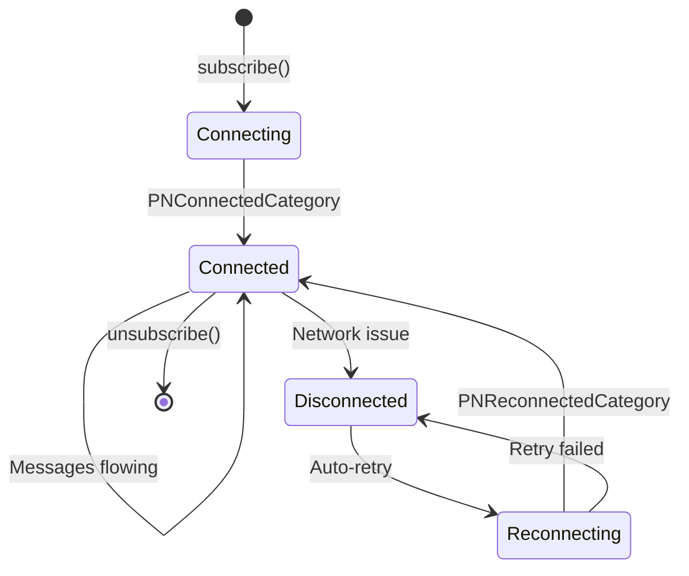
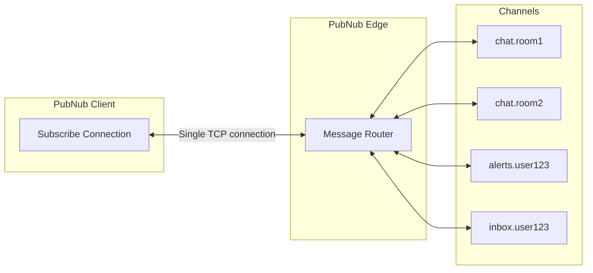

# Advanced Subscribe

## Introduction

This document covers advanced Subscribe topics including connection state management, reconnection strategies, multiplexing, and SDK configuration. These concepts are essential for building production-grade applications that handle network interruptions gracefully and optimize resource usage.

## Connection State Management

Understanding and handling connection state changes is critical for reliable real-time applications.

### Connection Lifecycle



### Status Events Deep Dive

#### PNConnectedCategory

**When:** Initial connection established successfully.

```javascript
pubnub.addListener({
  status: (event) => {
    if (event.category === 'PNConnectedCategory') {
      console.log('✅ Connected to PubNub');
      console.log('Subscribed channels:', event.subscribedChannels);
      
      // Safe to publish, display "online" indicator
      showOnlineIndicator();
      enableMessaging();
    }
  }
});
```

**What to do:**
- Display "online" or "connected" indicator
- Enable messaging features
- Normal operation

#### PNReconnectedCategory

**When:** Connection restored after disconnection.

```javascript
pubnub.addListener({
  status: (event) => {
    if (event.category === 'PNReconnectedCategory') {
      console.log('🔄 Reconnected - catching up on missed messages');
      
      // Fetch messages missed during disconnection
      const lastTimetoken = getLastReceivedTimetoken();
      fetchMissedMessages(event.subscribedChannels, lastTimetoken);
    }
  }
});
```

**What to do:**
- Fetch missed messages from history
- Update UI (remove "reconnecting" indicator)
- Resume normal operation

**Important:** Track the last received timetoken before disconnection to catch up properly.

#### PNDisconnectedCategory

**When:** Connection lost (network issue, app backgrounded, etc.).

```javascript
pubnub.addListener({
  status: (event) => {
    if (event.category === 'PNDisconnectedCategory') {
      console.log('⚠️  Disconnected from PubNub');
      
      // Show offline indicator
      showOfflineIndicator();
      disableMessaging();
      
      // SDK will automatically attempt reconnection
    }
  }
});
```

**What to do:**
- Display "offline" or "disconnected" indicator
- Disable messaging UI (or queue messages)
- SDK automatically attempts reconnection

#### PNNetworkIssuesCategory

**When:** Network problems detected during operation.

```javascript
pubnub.addListener({
  status: (event) => {
    if (event.category === 'PNNetworkIssuesCategory') {
      console.log('⚠️  Network issues detected - retrying...');
      showRetryingIndicator();
    }
  }
});
```

**What to do:**
- Show "retrying" or "poor connection" indicator
- SDK handles retries automatically
- User can continue queuing messages

#### PNAccessDeniedCategory

**When:** 403 Forbidden error (invalid Access Manager token).

```javascript
pubnub.addListener({
  status: (event) => {
    if (event.category === 'PNAccessDeniedCategory') {
      console.log('🚫 Access denied - refreshing token...');
      
      // Fetch new token from your server
      const newToken = await fetchTokenFromServer();
      pubnub.setToken(newToken);
      
      // SDK will automatically retry with new token
    }
  }
});
```

**What to do:**
- Fetch new token from your authentication server
- Call `pubnub.setToken(newToken)`
- SDK automatically retries subscription

#### PNTimeoutCategory

**When:** Request timeout (network slow or unresponsive).

```javascript
pubnub.addListener({
  status: (event) => {
    if (event.category === 'PNTimeoutCategory') {
      console.log('⏱️  Request timeout - retrying...');
      // SDK handles retry automatically
    }
  }
});
```

**What to do:**
- Log for monitoring
- SDK retries automatically
- Consider showing "slow connection" indicator

#### PNNetworkUpCategory / PNNetworkDownCategory

**When:** Mobile network state changes (iOS/Android).

```javascript
pubnub.addListener({
  status: (event) => {
    if (event.category === 'PNNetworkUpCategory') {
      console.log('📶 Network restored');
      // SDK automatically reconnects
    } else if (event.category === 'PNNetworkDownCategory') {
      console.log('📵 Network lost');
      showOfflineIndicator();
    }
  }
});
```

**What to do:**
- Update UI based on network availability
- SDK handles reconnection automatically

### Complete Status Handler

```javascript
pubnub.addListener({
  status: (event) => {
    console.log('Status:', event.category);
    
    switch (event.category) {
      case 'PNConnectedCategory':
        handleConnected();
        break;
        
      case 'PNReconnectedCategory':
        handleReconnected();
        break;
        
      case 'PNDisconnectedCategory':
        handleDisconnected();
        break;
        
      case 'PNNetworkIssuesCategory':
      case 'PNTimeoutCategory':
        handleRetrying();
        break;
        
      case 'PNAccessDeniedCategory':
        handleAccessDenied();
        break;
        
      case 'PNNetworkUpCategory':
        handleNetworkRestored();
        break;
        
      case 'PNNetworkDownCategory':
        handleNetworkLost();
        break;
        
      default:
        console.log('Unhandled status:', event.category);
    }
  }
});
```

## Reconnection Strategies

### SDK Auto-Reconnect Behavior

PubNub SDKs automatically handle reconnection with exponential backoff:

**Retry Schedule:**
1. Immediate retry
2. 1 second delay
3. 2 second delay
4. 4 second delay
5. 8 second delay
6. Continues with exponential backoff up to maximum

**No configuration needed** - the SDK handles this automatically.

### Implementing Catch-Up Pattern

When reconnected, fetch messages missed during disconnection.

#### Pattern 1: Track Last Timetoken

```javascript
let lastReceivedTimetoken = null;

pubnub.addListener({
  message: (event) => {
    // Always update last received timetoken
    lastReceivedTimetoken = event.timetoken;
    handleMessage(event);
  },
  
  status: (event) => {
    if (event.category === 'PNReconnectedCategory') {
      // Fetch messages since last received
      catchUpFromTimetoken(lastReceivedTimetoken);
    }
  }
});

async function catchUpFromTimetoken(timetoken) {
  if (!timetoken) return;
  
  const channels = pubnub.getSubscribedChannels();
  
  for (const channel of channels) {
    const history = await pubnub.fetchMessages({
      channels: [channel],
      start: timetoken,  // Start from last received (exclusive)
      count: 100
    });
    
    const messages = history.channels[channel] || [];
    console.log(`Caught up on ${messages.length} missed messages`);
    
    // Process missed messages
    messages.forEach(msg => {
      handleMessage({
        channel: channel,
        message: msg.message,
        timetoken: msg.timetoken,
        isCatchUp: true
      });
    });
  }
}
```

#### Pattern 2: Timestamp-Based Catch-Up

```javascript
let disconnectTimestamp = null;

pubnub.addListener({
  status: (event) => {
    if (event.category === 'PNDisconnectedCategory') {
      // Record when we disconnected
      disconnectTimestamp = Date.now();
      
    } else if (event.category === 'PNReconnectedCategory') {
      // Fetch messages published after disconnect time
      catchUpFromTimestamp(disconnectTimestamp);
    }
  }
});

async function catchUpFromTimestamp(timestamp) {
  if (!timestamp) return;
  
  // Convert timestamp to timetoken (milliseconds * 10000)
  const timetoken = String(timestamp * 10000);
  
  const channels = pubnub.getSubscribedChannels();
  
  const history = await pubnub.fetchMessages({
    channels: channels,
    start: timetoken,
    count: 25  // 25 per channel for multi-channel
  });
  
  // Process messages from all channels
  Object.entries(history.channels).forEach(([channel, messages]) => {
    console.log(`${channel}: ${messages.length} missed messages`);
    messages.forEach(msg => handleMessage({
      channel: channel,
      message: msg.message,
      timetoken: msg.timetoken,
      isCatchUp: true
    }));
  });
}
```

#### Pattern 3: Deduplication with Event IDs

```javascript
const processedEventIds = new Set();

pubnub.addListener({
  message: (event) => {
    const eventId = event.message.eventId;
    
    // Deduplicate messages
    if (processedEventIds.has(eventId)) {
      console.log('Duplicate message, skipping:', eventId);
      return;
    }
    
    processedEventIds.add(eventId);
    handleMessage(event);
    
    // Clean up old IDs (keep last 1000)
    if (processedEventIds.size > 1000) {
      const oldest = Array.from(processedEventIds)[0];
      processedEventIds.delete(oldest);
    }
  },
  
  status: (event) => {
    if (event.category === 'PNReconnectedCategory') {
      catchUpWithDeduplication();
    }
  }
});
```

### Background/Foreground Handling (Mobile)

Mobile apps need special handling when backgrounded/foregrounded.

```javascript
// iOS/Android: Detect app lifecycle
document.addEventListener('visibilitychange', () => {
  if (document.hidden) {
    // App backgrounded
    console.log('App backgrounded - connection may pause');
    saveLastTimetoken();
    
  } else {
    // App foregrounded
    console.log('App foregrounded - catching up');
    
    // Give SDK time to reconnect
    setTimeout(() => {
      if (pubnub.getSubscribedChannels().length > 0) {
        catchUpSinceBackground();
      }
    }, 1000);
  }
});
```

## Multiplexing

Multiplexing means managing multiple channels on a single TCP connection.

### How Multiplexing Works



**Key Points:**
- One TCP connection handles all subscribed channels
- PubNub routes messages from any channel to your connection
- Adding/removing channels doesn't create new connections

### Adding Channels Dynamically

```javascript
// Initial subscribe
pubnub.subscribe({ channels: ['chat.room1'] });

// Later: Add more channels (same connection)
pubnub.subscribe({ channels: ['chat.room2'] });
pubnub.subscribe({ channels: ['chat.room3'] });

// All channels now active on same connection
console.log(pubnub.getSubscribedChannels());
// ['chat.room1', 'chat.room2', 'chat.room3']
```

### Removing Channels Dynamically

```javascript
// Unsubscribe from specific channels
pubnub.unsubscribe({ channels: ['chat.room1'] });

// Other channels remain active
console.log(pubnub.getSubscribedChannels());
// ['chat.room2', 'chat.room3']

// Unsubscribe from all
pubnub.unsubscribeAll();
```

### Performance Considerations

| Scenario | Channels | Impact | Recommendation |
|----------|----------|--------|----------------|
| **Low volume** | 1-20 | Negligible | No optimization needed |
| **Medium volume** | 20-50 | Some CPU/memory | Monitor performance |
| **High volume** | 50-100 | Noticeable | Consider channel groups |
| **Very high** | 100+ | Significant | Use channel groups or wildcards |

### Best Practices for Multiplexing

**1. Subscribe Once, Add Dynamically**

```javascript
// ❌ BAD: Multiple subscribe calls
function joinRoom(roomId) {
  pubnub.unsubscribeAll();
  pubnub.subscribe({ channels: [`chat.${roomId}`] });
}

// ✅ GOOD: Add to existing subscription
function joinRoom(roomId) {
  pubnub.subscribe({ channels: [`chat.${roomId}`] });
}

function leaveRoom(roomId) {
  pubnub.unsubscribe({ channels: [`chat.${roomId}`] });
}
```

**2. Clean Up Unused Channels**

```javascript
// ❌ BAD: Never unsubscribe
function leaveRoom(roomId) {
  // Just navigate away - channel stays subscribed!
  navigate('/home');
}

// ✅ GOOD: Always unsubscribe
function leaveRoom(roomId) {
  pubnub.unsubscribe({ channels: [`chat.${roomId}`] });
  navigate('/home');
}
```

**3. Monitor Active Subscriptions**

```javascript
// Check current subscriptions
setInterval(() => {
  const channels = pubnub.getSubscribedChannels();
  console.log(`Active subscriptions: ${channels.length}`);
  
  if (channels.length > 50) {
    console.warn('⚠️  Many active subscriptions - consider channel groups');
  }
}, 30000);
```

## Subscribe Configuration

### Key SDK Configuration Options

```javascript
const pubnub = new PubNub({
  publishKey: 'pub-c-xxx',
  subscribeKey: 'sub-c-xxx',
  userId: 'user123',
  
  // Subscribe-specific configuration
  subscribeTimeout: 310,        // Client timeout (default: 310 seconds)
  restore: true,                 // Restore subscription after reconnect (default: false)
  keepAlive: true,               // Keep connection alive (default: false)
  suppressLeaveEvents: false,    // Suppress leave events (default: false)
  
  // Retry configuration
  retryConfiguration: {
    minimumDelay: 2,             // Min retry delay in seconds (default: 2)
    maximumDelay: 150,           // Max retry delay in seconds (default: 150)
    maximumRetry: Infinity       // Max retry attempts (default: Infinity)
  }
});
```

### subscribeTimeout

Controls how long the client waits before considering the request timed out.

**Default:** 310 seconds (server timeout is 280s)

```javascript
// Shorter timeout for testing
const pubnub = new PubNub({
  subscribeKey: 'sub-c-xxx',
  userId: 'user123',
  subscribeTimeout: 30  // 30 seconds for faster testing
});
```

**When to change:**
- Testing (use shorter timeout)
- Unreliable networks (use longer timeout)
- Generally: Leave at default (310s)

### restore

Automatically restore subscriptions after reconnection.

**Default:** false

```javascript
const pubnub = new PubNub({
  subscribeKey: 'sub-c-xxx',
  userId: 'user123',
  restore: true  // Automatically restore subscription state
});
```

**When to enable:**
- Apps that should automatically resume subscriptions
- Mobile apps that background/foreground frequently

**When to disable:**
- You want manual control over reconnection
- Custom catch-up logic needed

### suppressLeaveEvents

Suppress presence leave events when unsubscribing.

**Default:** false

```javascript
const pubnub = new PubNub({
  subscribeKey: 'sub-c-xxx',
  userId: 'user123',
  suppressLeaveEvents: true  // Don't send leave events on unsubscribe
});
```

**Note:** Presence configuration covered in dedicated Presence module.

### Retry Configuration

Control automatic retry behavior:

```javascript
const pubnub = new PubNub({
  subscribeKey: 'sub-c-xxx',
  userId: 'user123',
  retryConfiguration: {
    minimumDelay: 1,           // Start with 1s delay
    maximumDelay: 60,          // Max 60s delay
    maximumRetry: 10           // Stop after 10 attempts
  }
});
```

**Defaults are good** for most use cases. Customize for:
- Testing (faster retries)
- Unreliable networks (more aggressive retries)
- Resource-constrained devices (fewer retries)

## Advanced Patterns

### Pattern: Subscribe on Demand

Only subscribe when user is viewing content:

```javascript
class RoomManager {
  constructor(pubnub) {
    this.pubnub = pubnub;
    this.activeRooms = new Set();
  }
  
  enterRoom(roomId) {
    if (!this.activeRooms.has(roomId)) {
      this.pubnub.subscribe({ channels: [`chat.${roomId}`] });
      this.activeRooms.add(roomId);
      console.log(`Subscribed to room ${roomId}`);
    }
  }
  
  leaveRoom(roomId) {
    if (this.activeRooms.has(roomId)) {
      this.pubnub.unsubscribe({ channels: [`chat.${roomId}`] });
      this.activeRooms.delete(roomId);
      console.log(`Unsubscribed from room ${roomId}`);
    }
  }
  
  cleanup() {
    const channels = Array.from(this.activeRooms).map(id => `chat.${id}`);
    this.pubnub.unsubscribe({ channels });
    this.activeRooms.clear();
  }
}

// Usage
const roomManager = new RoomManager(pubnub);
roomManager.enterRoom('room123');   // Subscribe
roomManager.leaveRoom('room123');   // Unsubscribe
```

### Pattern: Message Queue During Disconnection

Queue messages during disconnection, send when reconnected:

```javascript
class MessageQueue {
  constructor(pubnub) {
    this.pubnub = pubnub;
    this.queue = [];
    this.isConnected = false;
    
    pubnub.addListener({
      status: (event) => {
        if (event.category === 'PNConnectedCategory' || 
            event.category === 'PNReconnectedCategory') {
          this.isConnected = true;
          this.flushQueue();
        } else if (event.category === 'PNDisconnectedCategory') {
          this.isConnected = false;
        }
      }
    });
  }
  
  async send(channel, message) {
    if (this.isConnected) {
      // Send immediately
      await this.pubnub.publish({ channel, message });
    } else {
      // Queue for later
      console.log('Queuing message for', channel);
      this.queue.push({ channel, message });
    }
  }
  
  async flushQueue() {
    if (this.queue.length === 0) return;
    
    console.log(`Flushing ${this.queue.length} queued messages`);
    
    while (this.queue.length > 0) {
      const { channel, message } = this.queue.shift();
      try {
        await this.pubnub.publish({ channel, message });
      } catch (error) {
        console.error('Failed to send queued message:', error);
        // Put back in queue
        this.queue.unshift({ channel, message });
        break;
      }
    }
  }
}

// Usage
const messageQueue = new MessageQueue(pubnub);
await messageQueue.send('chat.room123', { text: 'Hello!' });
```

### Pattern: Lazy Loading Channels

Load channels as user scrolls:

```javascript
class LazyChannelLoader {
  constructor(pubnub) {
    this.pubnub = pubnub;
    this.loadedChannels = new Set();
  }
  
  onChannelVisible(channelId) {
    if (!this.loadedChannels.has(channelId)) {
      console.log(`Loading channel ${channelId}`);
      
      // Fetch history first
      this.fetchHistory(channelId);
      
      // Then subscribe for real-time
      this.pubnub.subscribe({ channels: [channelId] });
      this.loadedChannels.add(channelId);
    }
  }
  
  onChannelHidden(channelId) {
    // Optionally unsubscribe when scrolled away
    if (this.loadedChannels.has(channelId)) {
      this.pubnub.unsubscribe({ channels: [channelId] });
      this.loadedChannels.delete(channelId);
    }
  }
  
  async fetchHistory(channelId) {
    const history = await this.pubnub.fetchMessages({
      channels: [channelId],
      count: 25
    });
    displayHistory(history.channels[channelId]);
  }
}
```

## Summary

Key takeaways from Advanced Subscribe:

- **Status events** are critical for connection monitoring
- **PNReconnectedCategory** - Always implement catch-up logic
- **SDK handles retries** - Exponential backoff built-in
- **Multiplexing** - Single connection handles all channels
- **Dynamic subscription** - Add/remove channels without reconnecting
- **Track timetokens** - Essential for catching up after disconnection
- **Mobile considerations** - Handle background/foreground transitions
- **Configuration** - Default settings work for most use cases

---

**Next**: [04. Publish-Subscribe Flow](./04-publish-subscribe-flow.md) - End-to-end message flow and timing

**Lab**: [Lab 2: Subscribe Loop](./labs/lab-02-subscribe-loop.md) - Implement the long-poll protocol from scratch
