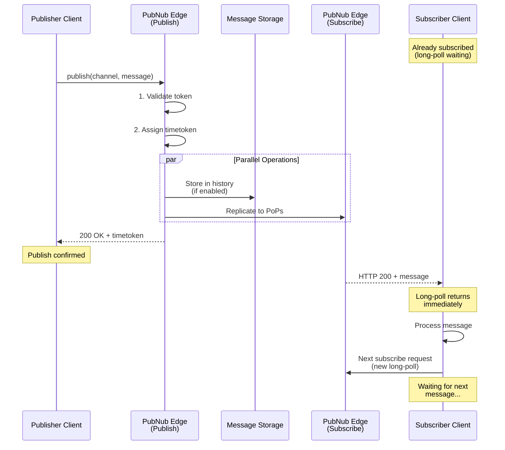
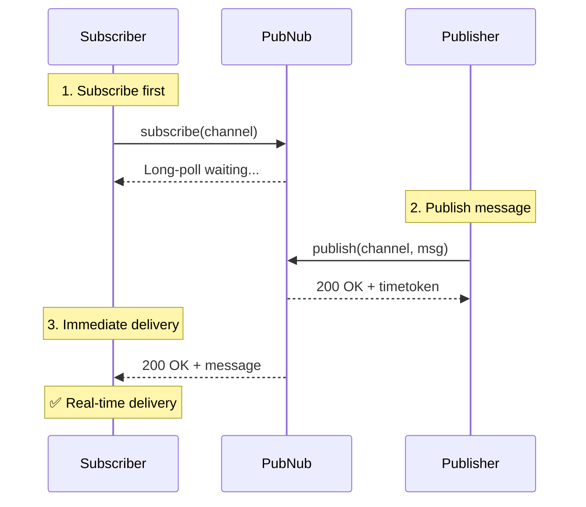
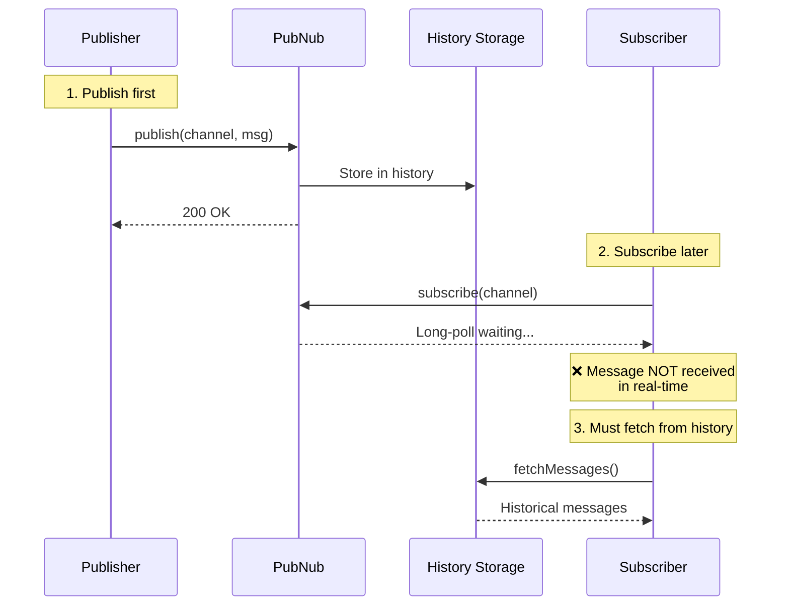
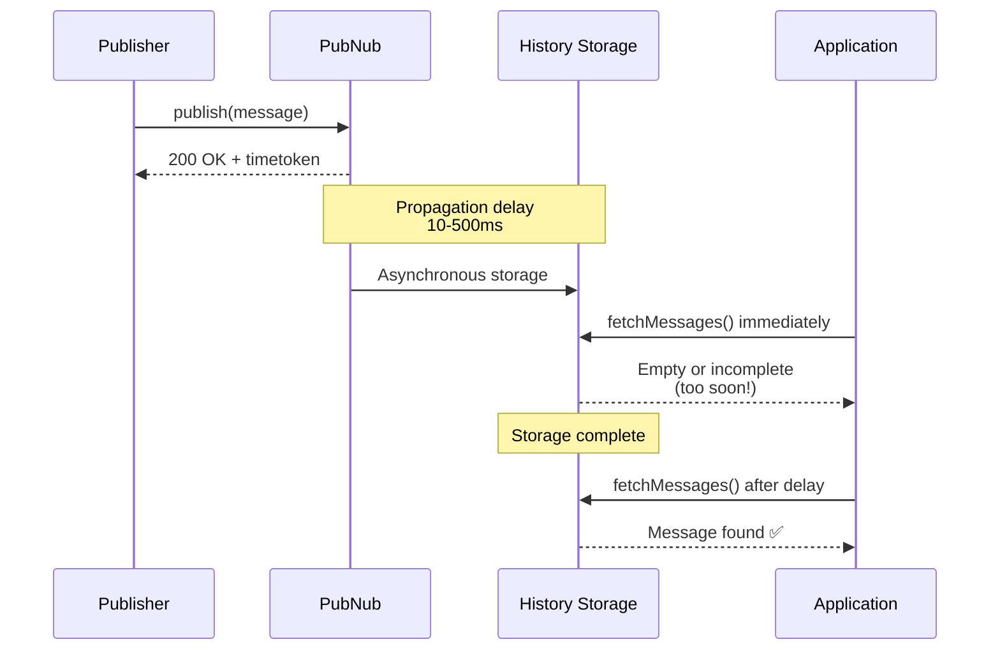

# Publish-Subscribe Flow

## Introduction

Understanding how Publish and Subscribe work together is essential for building reliable real-time applications. This document explains the end-to-end message flow, timing relationships, delivery guarantees, and common integration patterns.

## End-to-End Message Flow

### The Complete Journey



### Step-by-Step Breakdown

**Step 1: Publisher Sends Message**

```javascript
// Publisher
const result = await pubnub.publish({
  channel: 'chat.room123',
  message: {
    type: 'chat.message',
    schemaVersion: '1.0',
    eventId: 'msg_abc123',
    ts: Date.now(),
    payload: { text: 'Hello!' }
  }
});

console.log('Published:', result.timetoken);
```

**Step 2: PubNub Validates and Assigns Timetoken**

- Access Manager validates token (if enabled)
- Server assigns 17-digit timetoken
- Message prepared for distribution

**Step 3: Parallel Operations**

- **Storage**: Message stored in history (if `storeInHistory: true`)
- **Replication**: Message replicated to all Points of Presence globally

**Step 4: Publisher Receives Confirmation**

```javascript
// Response: { timetoken: '17069876543210000' }
```

- HTTP 200 OK with timetoken
- This is your confirmation the message was published
- Timetoken represents the exact moment PubNub received the message

**Step 5: Subscriber Receives Message**

```javascript
// Subscriber (already in long-poll wait)
pubnub.addListener({
  message: (event) => {
    console.log('Received:', event.message);
    console.log('Timetoken:', event.timetoken);  // Matches publish timetoken
  }
});
```

- Long-poll connection returns immediately with HTTP 200
- Message delivered in real-time (<30ms typical)

**Step 6: Subscriber Sends Next Request**

```javascript
// SDK automatically sends next subscribe request
// Cycle continues indefinitely
```

## Timing Relationships

### Subscribe Before Publish (Real-Time Delivery)



**Key Points:**
- Subscriber establishes long-poll **before** publish
- Message delivered immediately when published
- Typical latency: <30ms

### Publish Before Subscribe (Missed Message)



**Key Points:**
- Subscriber was **not** subscribed when message published
- Message **not** delivered in real-time (no active long-poll)
- Must use History API to retrieve message
- This is **expected behavior** - not a bug!

### Storage Propagation Delay

Messages are **not immediately available** in history after publish.



**Important:**
- Publish returns immediately (HTTP 200 + timetoken)
- Storage happens **asynchronously**
- Typical delay: 10-500ms
- **Never** use history to verify publish success
- Use the timetoken response as confirmation

See [History Fundamentals - Storage Propagation Timing](../history/01-history-fundamentals.md#critical-concept-storage-propagation-timing) for more details.

## Message Delivery Guarantees

### At-Least-Once Delivery

PubNub guarantees **at-least-once delivery** to subscribers:

- If subscribed when message published → Will receive message
- Network issues or reconnections → May receive duplicate
- Use `eventId` for client-side deduplication

```javascript
const seenEventIds = new Set();

pubnub.addListener({
  message: (event) => {
    const eventId = event.message.eventId;
    
    // Deduplicate
    if (seenEventIds.has(eventId)) {
      console.log('Duplicate message, ignoring');
      return;
    }
    
    seenEventIds.add(eventId);
    processMessage(event.message);
  }
});
```

### Message Ordering

**Reality:** Message ordering is **highly likely but NOT guaranteed**.

**Why mostly ordered:**
- 17-digit timetoken precision (10-nanosecond intervals)
- Timetoken collisions are extremely rare
- Messages typically delivered in timetoken order

**When out-of-order can occur:**
- **Very high publish rates** (>1000 msgs/sec from multiple publishers)
- **Multiple publishers** publishing simultaneously
- **Network variations** across different routes

**Example:**

```javascript
// Publisher 1 publishes at time 1706987654321000000
await pubnub.publish({ 
  channel: 'chat.room123', 
  message: { text: 'Message A' }
});
// Timetoken: 1706987654321000000

// Publisher 2 publishes at nearly same time
await pubnub.publish({ 
  channel: 'chat.room123', 
  message: { text: 'Message B' }
});
// Timetoken: 1706987654321000001 (1 nanosecond later)

// Usually delivered in order (A then B)
// But NOT guaranteed at extreme scale
```

**Best Practice:**

If strict ordering is critical:
- Use application-level sequence numbers
- Single authoritative publisher (server-side)
- Client-side ordering logic based on sequence field

```javascript
// Include sequence in message
{
  type: 'chat.message',
  eventId: 'msg_123',
  sequence: 42,  // Application-level sequence
  payload: { text: 'Hello' }
}

// Client sorts by sequence number
messages.sort((a, b) => a.sequence - b.sequence);
```

### Fire Mode (No Delivery Guarantee)

When using Fire (`norep: true`):

```javascript
await pubnub.fire({
  channel: 'analytics.events',
  message: { event: 'pageview' }
});
```

**Characteristics:**
- **No subscriber delivery** - Only Functions/Illuminate receive message
- **Not stored** in history
- **Lowest latency** (~10-20ms vs ~30ms for normal publish)
- **Use case:** Backend processing, analytics, ephemeral data

## Common Integration Patterns

### Pattern 1: History-On-Join

Most common pattern for chat applications.

```javascript
async function joinChatRoom(roomId) {
  const channel = `chat.${roomId}`;
  
  // Step 1: Fetch recent history
  const history = await pubnub.fetchMessages({
    channels: [channel],
    count: 50
  });
  
  // Step 2: Display historical messages
  const messages = history.channels[channel] || [];
  messages.forEach(msg => {
    displayMessage(msg.message, { isHistorical: true });
  });
  
  // Step 3: Subscribe for new messages
  pubnub.subscribe({ channels: [channel] });
  
  console.log('✅ Joined room with history');
}
```

**Order matters:**
1. Fetch history **first**
2. Subscribe **second**

This ensures no gap between history and real-time.

### Pattern 2: Offline Catch-Up

Retrieve messages missed while offline.

```javascript
let lastSeenTimetoken = loadLastSeenTimetoken();

pubnub.addListener({
  message: (event) => {
    // Always update last seen
    lastSeenTimetoken = event.timetoken;
    saveLastSeenTimetoken(event.timetoken);
    
    displayMessage(event.message);
  },
  
  status: (event) => {
    if (event.category === 'PNReconnectedCategory') {
      catchUpSinceDisconnect(lastSeenTimetoken);
    }
  }
});

async function catchUpSinceDisconnect(timetoken) {
  const channels = pubnub.getSubscribedChannels();
  
  for (const channel of channels) {
    const history = await pubnub.fetchMessages({
      channels: [channel],
      start: timetoken,  // Start from last seen (exclusive)
      count: 100
    });
    
    const messages = history.channels[channel] || [];
    console.log(`Caught up on ${messages.length} messages in ${channel}`);
    
    messages.forEach(msg => {
      displayMessage(msg.message, { isCatchUp: true });
    });
  }
}
```

### Pattern 3: Request-Response (Not Recommended)

While possible, this is **not recommended** for most use cases.

```javascript
// ❌ NOT RECOMMENDED: Using pub/sub for request-response

async function requestData(requestId) {
  const responseChannel = `response.${requestId}`;
  
  // Subscribe to response channel
  return new Promise((resolve, reject) => {
    const timeout = setTimeout(() => {
      pubnub.unsubscribe({ channels: [responseChannel] });
      reject(new Error('Request timeout'));
    }, 5000);
    
    pubnub.addListener({
      message: (event) => {
        if (event.channel === responseChannel) {
          clearTimeout(timeout);
          pubnub.unsubscribe({ channels: [responseChannel] });
          resolve(event.message);
        }
      }
    });
    
    pubnub.subscribe({ channels: [responseChannel] });
    
    // Send request
    pubnub.publish({
      channel: 'requests',
      message: { requestId, type: 'getData' }
    });
  });
}

// ✅ BETTER: Use HTTP API or Functions for request-response
async function requestData() {
  const response = await fetch('/api/data');
  return response.json();
}
```

**Why not recommended:**
- Inefficient (subscribe overhead for single request)
- Complex timeout handling
- Better solved with HTTP APIs
- Functions On Request feature is better alternative

### Pattern 4: Optimistic UI Updates

Update UI immediately, reconcile with server confirmation.

```javascript
async function sendMessage(text) {
  const tempId = `temp_${Date.now()}`;
  const message = {
    type: 'chat.message',
    eventId: tempId,
    ts: Date.now(),
    payload: { text }
  };
  
  // 1. Optimistic update (immediate UI feedback)
  displayMessage(message, { 
    pending: true,
    tempId: tempId
  });
  
  try {
    // 2. Publish to PubNub
    const result = await pubnub.publish({
      channel: 'chat.room123',
      message: message
    });
    
    // 3. Mark as confirmed
    markMessageConfirmed(tempId, result.timetoken);
    
  } catch (error) {
    // 4. Mark as failed
    markMessageFailed(tempId);
    console.error('Failed to send:', error);
  }
}

// Listener deduplicates own messages
pubnub.addListener({
  message: (event) => {
    // Skip if this is our own optimistic message
    if (event.message.eventId.startsWith('temp_')) {
      return; // Already displayed optimistically
    }
    displayMessage(event.message);
  }
});
```

### Pattern 5: Bidirectional Communication

Two clients, each publishing and subscribing.

```javascript
// Client A and Client B both run:

const myUserId = 'user123';  // Different for each client

pubnub.addListener({
  message: (event) => {
    // Skip own messages (received via subscribe)
    if (event.publisher === myUserId) {
      return; // Already displayed when we published
    }
    
    displayMessage(event.message);
  }
});

pubnub.subscribe({ channels: ['chat.room123'] });

// Send message
async function sendMessage(text) {
  // Display immediately (optimistic)
  displayMessage({ text }, { isOwn: true });
  
  // Publish
  await pubnub.publish({
    channel: 'chat.room123',
    message: { text }
  });
}
```

## When Messages Are Missed

Understanding why and when messages aren't received.

### Reason 1: Not Subscribed

```javascript
// ❌ Message missed - not subscribed yet
await pubnub.publish({ channel: 'chat.room123', message: data });
pubnub.subscribe({ channels: ['chat.room123'] });

// ✅ Receive real-time - subscribe first
pubnub.subscribe({ channels: ['chat.room123'] });
await new Promise(resolve => setTimeout(resolve, 1000)); // Wait
await pubnub.publish({ channel: 'chat.room123', message: data });
```

**Solution:** Always subscribe before expecting messages.

### Reason 2: Network Disconnection

```javascript
pubnub.addListener({
  status: (event) => {
    if (event.category === 'PNDisconnectedCategory') {
      console.log('⚠️  Disconnected - messages may be missed');
      saveDisconnectTime();
    }
    
    if (event.category === 'PNReconnectedCategory') {
      console.log('✅ Reconnected - catching up');
      catchUpFromDisconnectTime();
    }
  }
});
```

**Solution:** Track last timetoken, catch up with history on reconnect.

### Reason 3: App Backgrounded (Mobile)

```javascript
// Mobile app moved to background
document.addEventListener('visibilitychange', () => {
  if (document.hidden) {
    saveLastSeenTimetoken();
  } else {
    // App foregrounded
    setTimeout(() => catchUpSinceLast(), 1000);
  }
});
```

**Solution:** Save timetoken when backgrounded, catch up when foregrounded.

### Reason 4: Long-Poll Gap

```javascript
// If client doesn't send next request quickly enough
// (SDK bug, client frozen, etc.)

// Gap in long-poll coverage:
// [Request 1]____[timeout]____[Request 2]
//                 ^^^^^^^^^
//                 Messages during gap are missed

// Solution: SDK handles this automatically
// If you implement custom client: send next request immediately
```

**Solution:** SDK handles this. Custom implementations must avoid gaps.

## Integration Testing

### Test Scenario 1: Publish then Subscribe

```javascript
// Test that messages before subscribe are NOT received real-time
async function testPublishThenSubscribe() {
  const channel = 'test.timing';
  
  // Publish first
  await pubnub.publish({ 
    channel, 
    message: { text: 'Message 1' }
  });
  
  let received = false;
  pubnub.addListener({
    message: (event) => {
      if (event.message.text === 'Message 1') {
        received = true;
      }
    }
  });
  
  // Subscribe after
  pubnub.subscribe({ channels: [channel] });
  
  // Wait
  await new Promise(resolve => setTimeout(resolve, 2000));
  
  console.assert(received === false, 'Should NOT receive Message 1');
  
  // But should receive new messages
  await pubnub.publish({ 
    channel, 
    message: { text: 'Message 2' }
  });
  
  await new Promise(resolve => setTimeout(resolve, 2000));
  
  // Cleanup
  pubnub.unsubscribe({ channels: [channel] });
}
```

### Test Scenario 2: Subscribe then Publish

```javascript
// Test that messages after subscribe ARE received
async function testSubscribeThenPublish() {
  const channel = 'test.timing2';
  
  let received = false;
  pubnub.addListener({
    message: (event) => {
      if (event.channel === channel) {
        received = true;
        console.log('✅ Received:', event.message);
      }
    }
  });
  
  // Subscribe first
  pubnub.subscribe({ channels: [channel] });
  
  // Wait for connection
  await new Promise(resolve => setTimeout(resolve, 1000));
  
  // Publish after
  await pubnub.publish({ 
    channel, 
    message: { text: 'Test message' }
  });
  
  // Wait for delivery
  await new Promise(resolve => setTimeout(resolve, 2000));
  
  console.assert(received === true, 'Should receive message');
  
  pubnub.unsubscribe({ channels: [channel] });
}
```

## Summary

Key takeaways from Publish-Subscribe Flow:

- **Subscribe must be active** before publish for real-time delivery
- **Long-poll waiting** - Subscriber must have connection open when message published
- **Timetoken response** - Publish confirmation, don't check history immediately
- **Storage propagation** - 10-500ms delay before message in history
- **Ordering** - Highly likely but not guaranteed (use sequence numbers if critical)
- **At-least-once delivery** - May receive duplicates, use eventId for deduplication
- **History-on-join** - Standard pattern: fetch history, then subscribe
- **Catch-up on reconnect** - Track last timetoken, fetch missed messages
- **Fire mode** - No subscriber delivery, lowest latency

---

**Next Steps:**
- Complete [Lab 3: Pub/Sub Integration](./labs/lab-03-pubsub-integration.md) to practice these patterns
- Review [History Fundamentals](../history/01-history-fundamentals.md) for catch-up patterns
- Explore [Publish Fundamentals](../publish/01-publish-fundamentals.md) for message design
